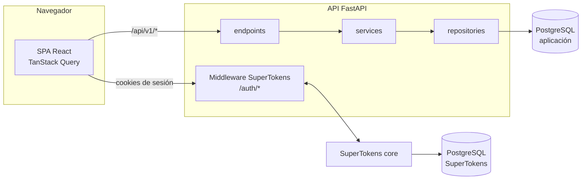

<div align="center">


# Applications Tracker

**Todas tus candidaturas, su historia y tu próximo paso, en un solo sitio.**

Un cuaderno de bitácora para la búsqueda de empleo: registra cada solicitud, cómo avanza (cambios de estado y entrevistas) y qué toca hacer después, para que ninguna candidatura se quede olvidada.

[](https://github.com/iMiguel10/applications-tracker/actions/workflows/ci.yml)


</div>

---

> [!NOTE]
> **Estado del proyecto:** el **MVP está completo** (fases F0–F6 y F8) y se usa de verdad en una búsqueda de empleo real. La **v2** (CVs, IA, notificaciones por email, calendario…) está **especificada y diseñada**; ya están construidas su infraestructura (correo, cola de trabajos, almacén de ficheros y PDF) y su manual de producción, y la primera de sus funcionalidades (F11) está en marcha: ya se puede recuperar o cambiar la contraseña por email y verificar el email. La puesta en producción (F7) está en espera de servidor. Detalle en [fases del proyecto](docs/producto/especificacion.md#11-alcance-por-fases).

## Contenido

- [Funcionalidades](#funcionalidades)
- [Hoja de ruta (v2)](#hoja-de-ruta-v2)
- [Arquitectura](#arquitectura)
- [Stack](#stack)
- [Puesta en marcha](#puesta-en-marcha)
- [Configuración](#configuración)
- [Desarrollo](#desarrollo)
- [Calidad y pruebas](#calidad-y-pruebas)
- [Documentación](#documentación)
- [Estructura del repositorio](#estructura-del-repositorio)
- [Contribuir](#contribuir)
- [Seguridad](#seguridad)
- [Licencia](#licencia)

## Funcionalidades

| | |
|---|---|
| **Solicitudes y empresas** | Alta, edición, archivado y borrado. Listado con búsqueda, filtros (estado, modalidad, fuente, archivadas; y por empresa desde su ficha), orden y paginación **en la URL**, así que un filtro se puede compartir o recuperar con el botón atrás. Empresas reutilizables entre solicitudes, creables sin salir del formulario. |
| **Ciclo de vida** | Cada solicitud recorre una máquina de estados (guardada → enviada → en revisión → entrevistas → oferta → aceptada, o descartada / retirada). Cada cambio queda en un historial con la fecha en que ocurrió de verdad, y el último se puede **deshacer**. |
| **Entrevistas y recordatorios** | Entrevistas por solicitud (tipo, formato, resultado) y recordatorios con fecha límite, ligados o no a una solicitud, con avisos de vencidos. |
| **Dashboard** | Solicitudes por estado, envíos por semana, tasa de respuesta, próximas entrevistas, recordatorios pendientes y solicitudes sin actividad. |
| **Métricas honestas** | Cada porcentaje indica sobre cuántas solicitudes se calcula y no se muestra con menos de 5. El sistema **nunca** da por descartada una candidatura que solo lleva tiempo sin respuesta. |
| **Datos** | Exportación completa a CSV. Borrado de la cuenta y de todos sus datos. |
| **Preferencias** | Idioma de la interfaz, umbral de "sin actividad" y tema claro u oscuro. |
| **Interfaz** | Español e inglés, diseño adaptable a móvil, estados de carga y vacío cuidados, y accesibilidad trabajada (contraste AA medido, navegación por teclado, errores enlazados a sus campos). |

## Hoja de ruta (v2)

Especificada en la [especificación](docs/producto/especificacion.md) y diseñada en la [arquitectura de la v2](docs/arquitectura/v2.md). De momento están construidos la infraestructura (F9) y el manual de producción (F10), y F11 está en construcción.

| Fase | Contenido |
|---|---|
| ✔ F9 | Infraestructura nueva: cola de trabajos, generación de PDF, almacenamiento de ficheros y email |
| ✔ F10 | Documentación de producción (Docusaurus, es + en): despliegue, manual de uso y referencia de la API |
| F11 | Recuperación de contraseña, verificación de email y límites visibles (hechos) y rate limiting |
| F12 | Notificaciones por email: recordatorios, entrevistas, resumen semanal y solicitudes sin actividad |
| F13 | Biblioteca de CVs y cartas en PDF, asociados a cada solicitud |
| F14 | Perfil profesional y generación de CVs con varios diseños |
| F15 | IA que adapta el CV y la carta a una oferta **sin inventar experiencia**, con cuota gratuita y clave propia del usuario |
| F16 | Tablero Kanban |
| F17 | Calendario con suscripción desde Google Calendar, Outlook o Apple |

## Arquitectura



Decisiones destacadas:

- **Capas verificables.** `endpoints → services → repositories`, resumidas en una regla: *si habla con la base de datos, vive en `repositories/`; si decide, vive en `services/` o `domain/`*.
- **Máquina de estados con historial append-only.** Las transiciones solo las valida el backend; la API le dice al frontend cuáles ofrecer. El historial se ordena por una secuencia de la base de datos, no por fechas, que pueden ser pasadas o sufrir saltos de reloj.
- **Aislamiento entre usuarios en dos capas:** filtro obligatorio por usuario en cada consulta y claves foráneas compuestas que impiden, desde la propia base de datos, enlazar datos de otro usuario. Un recurso ajeno responde 404, nunca 403.
- **Autenticación delegada en SuperTokens:** cookies httpOnly, rotación del refresh token y protección anti-CSRF, con el core aislado en su propia base de datos.
- **Documentación que no envejece:** la referencia de la API se genera del contrato OpenAPI y un test comprueba que está al día.

Cada decisión, con la alternativa descartada y el porqué, está en la [documentación de arquitectura](docs/arquitectura/index.md).

## Stack

| Capa | Tecnologías |
|---|---|
| **Backend** | Python 3.12 · FastAPI · SQLAlchemy 2 (async) · Alembic · Pydantic · uv |
| **Base de datos** | PostgreSQL 17 |
| **Autenticación** | SuperTokens (core propio con su base de datos) |
| **Frontend** | React 19 · TypeScript · Vite · TanStack Query · react-hook-form + zod · Tailwind CSS v4 · shadcn/ui · i18next · Recharts |
| **Infraestructura** | Docker · Docker Compose |
| **Calidad** | pytest · Vitest + Testing Library · ruff · mypy · ESLint · GitHub Actions |
| **Segundo plano** | SAQ sobre Valkey · WeasyPrint · aiosmtplib |
| **Documentación** | MkDocs Material (desarrollo) · Docusaurus (producción, es + en) · Mermaid · OpenAPI |

## Puesta en marcha

### Requisitos

- [Docker](https://docs.docker.com/get-docker/) con Docker Compose v2.
- Nada más: Python, Node y PostgreSQL corren dentro de los contenedores.

### Arrancar

```bash
git clone https://github.com/iMiguel10/applications-tracker.git
cd applications-tracker
cp .env.example .env
docker compose up --build
```

La primera vez se construyen las imágenes y el backend aplica las migraciones al arrancar. Cuando todo esté levantado:

| Servicio | URL |
|---|---|
| Aplicación | http://localhost:5173 |
| API (OpenAPI interactivo) | http://localhost:8000/docs |
| Documentación de desarrollo | http://localhost:8001 |
| Manual de uso, despliegue y API | http://localhost:3001 |
| Correo capturado (Mailpit) | http://localhost:8025 |

Crea una cuenta desde la pantalla de registro y ya puedes empezar a registrar solicitudes.

> [!IMPORTANT]
> Usa siempre `localhost`, nunca `127.0.0.1`. Para el navegador son sitios distintos: las cookies de sesión no viajarían y el inicio de sesión parecería no funcionar, sin ningún error.

## Configuración

Toda la configuración va en variables de entorno (`.env`, a partir de [`.env.example`](.env.example)). Los valores de ejemplo solo sirven para desarrollo.

| Variable | Para qué |
|---|---|
| `POSTGRES_DB`, `POSTGRES_USER`, `POSTGRES_PASSWORD`, `DATABASE_URL` | Base de datos de la aplicación |
| `SUPERTOKENS_DB_NAME`, `SUPERTOKENS_DB_USER`, `SUPERTOKENS_DB_PASSWORD` | Base de datos exclusiva del core de SuperTokens |
| `SUPERTOKENS_CONNECTION_URI`, `SUPERTOKENS_API_KEY` | Conexión de la API con el core (clave de 20 caracteres o más) |
| `API_DOMAIN`, `WEBSITE_DOMAIN` | Dominios de la API y del frontend, para las cookies de sesión |
| `CORS_ORIGINS` | Orígenes permitidos por la API |
| `VITE_API_URL` | URL de la API que usa el frontend |
| `VALKEY_URL`, `FILES_ROOT` | Cola de trabajos y almacén de ficheros |
| `SMTP_*`, `EMAIL_FROM` | Servidor de correo (opcional: sin él, la aplicación no envía emails). En desarrollo, Mailpit |

Qué hace cada una, cuáles son obligatorias y qué pasa si faltan está en el [manual de despliegue](manual/docs/despliegue/variables.md).

Los secretos nunca se versionan: `.env` y `.env.test` están en `.gitignore`.

## Desarrollo

Los comandos se ejecutan dentro de los contenedores. Los más habituales:

```bash
# Backend: estilo, tipos y migraciones
docker compose exec api ruff check .
docker compose exec api mypy app tests
docker compose exec api alembic revision --autogenerate -m "descripcion"

# Frontend: lint, tipos, tests y build
docker compose exec frontend npm run lint
docker compose exec frontend npx tsc -b
docker compose exec frontend npm run test
docker compose exec frontend npm run build

# Tests del backend contra una base de datos aislada
cp .env.test.example .env.test
docker compose -f compose.test.yml up --build --abort-on-container-exit --exit-code-from api-test
docker compose -f compose.test.yml down -v
```

> [!TIP]
> Las dependencias se instalan **dentro del contenedor en marcha** (`docker compose exec api uv add …`, `docker compose exec frontend npm install …`), nunca con `run`: los volúmenes de dependencias no se actualizan al reconstruir la imagen. La lista completa de comandos, convenciones y trampas conocidas está en [CLAUDE.md](CLAUDE.md).

## Calidad y pruebas

- **Backend:** pruebas de repositories, services y API contra PostgreSQL real, cada una dentro de una transacción que se revierte al terminar. Incluyen **pruebas adversas**: un usuario intenta leer, editar y borrar los recursos de otro por cada endpoint (la lista de endpoints se lee del OpenAPI, así que un endpoint nuevo queda cubierto solo), transiciones de estado inválidas, cuotas y el borrado completo de una cuenta.
- **Frontend:** Vitest y Testing Library para schemas, utilidades, hooks y componentes con lógica.
- **Autenticación:** una prueba de humo contra el core real de SuperTokens.
- **Rendimiento:** un script mide el listado y el dashboard con 2 000 solicitudes por usuario contra su presupuesto (300 ms y 500 ms en p95).

La integración continua ([`ci.yml`](.github/workflows/ci.yml)) corre en cada push y pull request con cinco jobs: lint y tipos del backend, tests del backend, frontend (lint, tipos, tests y build), construcción estricta de la documentación de desarrollo y construcción del manual (con la comprobación de que cada página existe en los dos idiomas).

## Documentación

Hay dos sitios, cada uno para un público:

- **Manual** ([`manual/`](manual/), Docusaurus, `http://localhost:3001` en local), en español y en inglés, para quien **usa**, **despliega** o **se integra** con la aplicación: una página por tarea, el despliegue paso a paso y la referencia de la API generada del contrato OpenAPI.
- **Documentación de desarrollo** ([`docs/`](docs/), MkDocs, `http://localhost:8001`), para quien trabaja en el código:

| Sección | Contenido |
|---|---|
| [Especificación](docs/producto/especificacion.md) | Requisitos numerados, ciclo de vida, límites, fases y riesgos |
| [Arquitectura](docs/arquitectura/index.md) | Decisiones con la alternativa descartada, modelo de datos, flujos e invariantes |
| [Servicios y estructura](docs/arquitectura/servicios-y-estructura.md) | Servicios, estructura de carpetas y reglas de capas |
| [Autenticación](docs/arquitectura/autenticacion.md) | Integración con SuperTokens y sus trampas |
| [Arquitectura de la v2](docs/arquitectura/v2.md) | Diseño de la siguiente versión, con sus documentos por tema |
| [Guía de la API](docs/guias/documentar-la-api.md) | Cómo se documenta un endpoint y cómo probar la API desde Swagger |
| [Decisiones](docs/decisiones/index.md) | Bitácora de los cambios de rumbo durante el desarrollo |

La referencia completa de la API está en el manual, en `http://localhost:8000/docs` y, versionada, en [`docs/referencia/openapi.json`](docs/referencia/openapi.json): las tres salen del mismo contrato.

## Estructura del repositorio

```
applications-tracker/
├── backend/                 API FastAPI
│   ├── app/
│   │   ├── api/v1/          endpoints y dependencias (sesión, services)
│   │   ├── services/        reglas de negocio y transacciones
│   │   ├── repositories/    todo el acceso a datos
│   │   ├── domain/          reglas puras: estados y transiciones
│   │   ├── infra/           cola, correo, ficheros y PDF, cada uno tras una interfaz
│   │   ├── jobs/            trabajos del worker (segundo plano)
│   │   ├── models/          tablas SQLAlchemy
│   │   └── schemas/         entrada y salida (Pydantic)
│   ├── migrations/          migraciones de Alembic
│   └── tests/               repositories, services, API y dominio
├── frontend/                SPA React
│   └── src/
│       ├── features/        una carpeta por funcionalidad
│       ├── pages/           una página por ruta
│       └── shared/          UI, formularios, layout, i18n y utilidades
├── docs/                    documentación de desarrollo (MkDocs)
├── manual/                  manual de uso, despliegue y API (Docusaurus, es + en)
├── .github/workflows/       integración continua
├── compose.yml              entorno de desarrollo
└── compose.test.yml         entorno de pruebas del backend
```

## Contribuir

- Commits con el formato `tipo: descripción` (`feat`, `fix`, `docs`, `test`, `refactor`, `chore`), en español.
- Código en inglés; interfaz, comentarios y documentación en español.
- Cada cambio llega con sus pruebas y con su documentación **en el mismo commit**.
- Antes de subir, `ruff`, `mypy`, ESLint, `tsc` y las pruebas deben pasar sin errores; el CI lo comprueba.

Las convenciones completas, las reglas de capas y los invariantes que no se pueden romper están en [CLAUDE.md](CLAUDE.md).

## Seguridad

Las sesiones las gestiona SuperTokens, cada consulta se filtra por el usuario de la sesión y hay pruebas adversas de aislamiento entre usuarios en el CI. Si encuentras una vulnerabilidad, **no abras un issue público**: contacta con el autor a través de [su perfil de GitHub](https://github.com/iMiguel10).

## Licencia

Este repositorio todavía **no tiene licencia**. Mientras no se añada, el código está disponible para consulta, pero se reservan todos los derechos.

---

<div align="center">

Hecho por [Miguel Jiménez Cazorla](https://github.com/iMiguel10)

</div>
