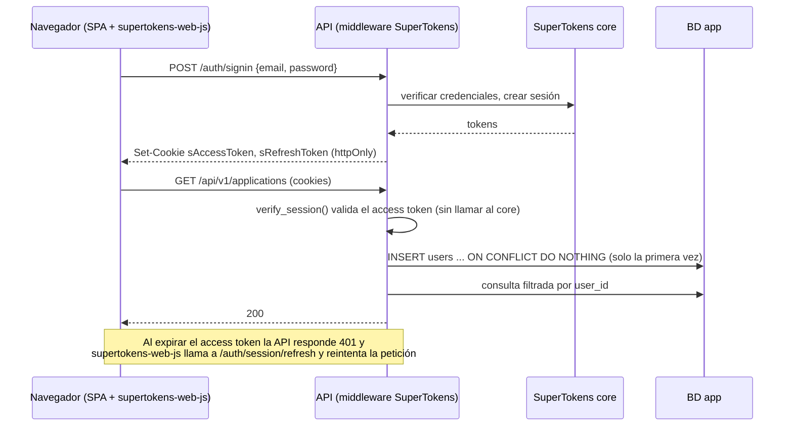

# Autenticación

> Estado: **v2, implementado en F1** · Fecha: 2026-09-22 · Depende de la [arquitectura](index.md) y de [servicios y estructura](servicios-y-estructura.md)
>
> Versiones verificadas al implementar: `supertokens-python` 0.31.3 (CDI 5.4), core `supertokens-postgresql:12.2.0` (admite la CDI 5.4, comprobado con su `/apiversion`) y `supertokens-web-js` 0.16.0. Los nombres de funciones y eventos de este documento están comprobados contra esas versiones.

## 1. Punto de partida

`task-manager-api` tenía autenticación propia con JWT y `frontend_gestpro` usaba Supabase Auth. Aquí se sustituyen ambas por SuperTokens (decisión A11), con email y contraseña.

| Qué falta respecto a un JWT propio | Consecuencia si no se resuelve |
|---|---|
| Refresco del token de acceso | Hay que elegir entre tokens de larga duración (una sesión robada vale días) o expulsar al usuario cada pocos minutos |
| Rotación del refresh token con detección de robo | Un refresh token robado sirve indefinidamente |
| Revocación de sesiones (logout real) | "Cerrar sesión" solo borra el token del navegador; el token sigue siendo válido |
| Almacenamiento seguro en el navegador | Un token en `localStorage` es legible por cualquier XSS |
| Protección anti-CSRF | Con cookies y sin anti-CSRF, otra web puede disparar peticiones autenticadas |

SuperTokens resuelve todo esto a cambio de dos servicios más (core y su BD) y de respetar su forma de trabajar, que es lo que recoge este documento.

**Qué no se hereda de `task-manager-api`:** `core/security.py`, `services/auth_service.py`, `endpoints/auth.py`, `schemas/auth.py`, el `users.hashed_password` y las dependencias `pyjwt`, `python-jose` y `pwdlib`. El fixture `auth_headers` de los tests tampoco, porque aquí no hay cabecera `Authorization` sino cookies.

## 2. Piezas



| Pieza | Dónde | Qué hace |
|---|---|---|
| Core | Contenedor `supertokens` + `supertokens-db` | Guarda usuarios, hashes de contraseñas y sesiones. Solo accesible desde la red interna. |
| SDK backend | `supertokens-python`, inicializado en `app/core/supertokens.py` | Expone `/auth/*` (signup, signin, signout, refresh) mediante un middleware y valida sesiones |
| Dependencia | `app/api/v1/deps.py` → `get_current_user` | Única puerta de entrada: sesión → usuario propio → `CurrentUser` |
| SDK frontend | `supertokens-web-js`, inicializado en `shared/lib/supertokens.ts` | Llama a `/auth/*`, intercepta `fetch` para añadir lo necesario y refrescar la sesión, y expone `Session.doesSessionExist()` |
| UI | `features/auth/` | Formularios propios de login y registro (react-hook-form + zod + shadcn) |

## 3. Backend

### Inicialización

```python
# app/core/supertokens.py
init(
    app_info=InputAppInfo(
        app_name="Applications Tracker",
        api_domain=settings.api_domain,          # http://localhost:8000
        website_domain=settings.website_domain,  # http://localhost:5173
        api_base_path="/auth",
    ),
    supertokens_config=SupertokensConfig(
        connection_uri=settings.supertokens_connection_uri,  # http://supertokens:3567
        api_key=settings.supertokens_api_key,
    ),
    framework="fastapi",
    recipe_list=[session.init(), emailpassword.init()],
    mode="asgi",
    telemetry=False,
)
```

- **Cookies y Bearer** ([decisión 0003](../decisiones/0003-autenticacion-por-cookie-y-bearer.md)). El navegador usa cookies httpOnly: el frontend fija `tokenTransferMethod: "cookie"` de forma explícita. Las integraciones y Swagger usan `Authorization: Bearer`: un login con `st-auth-mode: header`, **o sin esa cabecera**, devuelve los tokens en las cabeceras de respuesta. Hasta la decisión 0003 el backend solo aceptaba cookies. Cómo autenticarse en cada caso: [Documentar y usar la API](../guias/documentar-la-api.md).
- **`telemetry=False`**: por defecto el SDK envía datos de uso a SuperTokens. En una app de datos personales no aporta nada.
- **Versión del core fijada** (`12.2.0`, nunca `latest`). SDK y core hablan un protocolo versionado (CDI). Antes de subir cualquiera de los dos, hay que comprobar que la CDI del SDK (`supertokens_python.constants.SUPPORTED_CDI_VERSIONS`) aparece en el `/apiversion` del core.
- **Access token de 5 minutos** (`ACCESS_TOKEN_VALIDITY: 300` en el core). Ver [decisión 0002](../decisiones/0002-access-token-de-5-minutos.md).

Variables nuevas en `.env`: `API_DOMAIN`, `WEBSITE_DOMAIN`, `SUPERTOKENS_CONNECTION_URI`, `SUPERTOKENS_API_KEY` (el core exige al menos 20 caracteres), `SUPERTOKENS_DB_NAME`, `SUPERTOKENS_DB_USER` y `SUPERTOKENS_DB_PASSWORD`. En `Settings` no tienen valor por defecto: si falta alguna, la API no arranca.

### Middleware y CORS

```python
# app/main.py: el orden importa
app.add_middleware(get_middleware())      # SuperTokens: se añade primero
app.add_middleware(                        # CORS: se añade después y queda por fuera
    CORSMiddleware,
    allow_origins=settings.cors_origins_list,
    allow_credentials=True,
    allow_methods=["*"],
    allow_headers=["Content-Type", *get_all_cors_headers()],
)
```

> **Trampa — orden de los middlewares.** En Starlette, el **último** `add_middleware` es el más externo, es decir, el primero en ver la petición y el último en tocar la respuesta.
>
> - **Qué pasa si se invierte el orden.** El de SuperTokens queda por fuera: responde directamente a `/auth/signin` y la respuesta nunca pasa por CORS. La petición `OPTIONS` previa sí recibe las cabeceras, porque la atiende CORS, así que todo parece bien configurado. Pero la respuesta real llega sin `Access-Control-Allow-Origin` y el navegador la bloquea, aunque el servidor devolvió 200 y creó la sesión.
> - **El síntoma engaña.** Parece "CORS mal configurado", cuando la configuración es correcta y el problema es el orden.
> - **Cómo se detecta.** Hay una prueba que comprueba la cabecera en la respuesta de `POST /auth/signin`.

> **Trampa — cabeceras de SuperTokens en CORS.** `supertokens-web-js` añade sus propias cabeceras a las peticiones (`rid`, `fdi-version`, `st-auth-mode`, `anti-csrf`…). Si `allow_headers` no las incluye, falla la petición `OPTIONS` previa de **solo** las rutas que las llevan. Esto da un fallo intermitente: unas llamadas funcionan y otras no. `get_all_cors_headers()` devuelve la lista exacta de la versión instalada; nunca se escribe a mano.

`allow_credentials=True` es obligatorio para que el navegador envíe las cookies, y es incompatible con `allow_origins=["*"]`: los orígenes se enumeran siempre.

### `get_current_user`

```python
async def get_current_user(
    session: SessionContainer = Depends(verify_session()),
    users: UserService = Depends(get_user_service),
) -> CurrentUser:
    return await users.get_or_create(session.get_user_id())
```

- `verify_session()` responde 401 si no hay sesión válida. El frontend lo interpreta como "intenta refrescar y, si no, al login".
- `get_or_create` hace `INSERT … ON CONFLICT (supertokens_user_id) DO NOTHING` + `SELECT`. Es idempotente y seguro ante peticiones concurrentes (arquitectura §4).
- **Ningún endpoint usa `verify_session()` directamente**: todos dependen de `get_current_user`. Así la sesión y el usuario propio siempre van juntos, y en las pruebas basta con sustituir una sola dependencia.
- `UserRepository.get_or_create` hace primero un `SELECT`: casi todas las peticiones son de usuarios que ya existen y no deben escribir nada. Solo si no existe hace el `INSERT … ON CONFLICT DO NOTHING`.
- El email se lee con `IdentityRepository.get_email()`, el único punto que consulta usuarios al SDK. Aplica la regla de capas: SuperTokens es el almacén de identidades, así que su acceso vive en `repositories/`. En los tests se sustituye por un doble sin red.

### Router protegido por construcción

```python
# app/api/v1/router.py
router.include_router(health.router)                    # pública

protected = APIRouter(dependencies=[Depends(get_current_user)])
protected.include_router(me.router)
protected.include_router(applications.router)
router.include_router(protected)
```

La invariante 8 no depende de acordarse de añadir la dependencia en cada endpoint: todo lo que se incluye en `protected` exige sesión. Los endpoints que necesitan el usuario lo siguen pidiendo como parámetro (`current_user: CurrentUser = Depends(get_current_user)`). FastAPI resuelve la dependencia una sola vez por petición.

### Endpoints

| Ruta | Quién la sirve | Para qué |
|---|---|---|
| `POST /auth/signup` | Middleware | Registro |
| `POST /auth/signin` | Middleware | Login |
| `POST /auth/signout` | Middleware | Revoca la sesión y borra las cookies |
| `POST /auth/session/refresh` | Middleware | Rota los tokens (la llama el SDK, nunca nuestro código) |
| `GET /auth/signup/email/exists` | Middleware | Comprueba si un email ya está registrado |
| `GET /api/v1/me` | Nuestro endpoint | Devuelve `{id, email}`. El email se pide a SuperTokens en ese momento (A12). |
| `DELETE /api/v1/me` | Nuestro endpoint | Borra la cuenta (RNF-40, F8): primero los datos propios, después la identidad en SuperTokens. Ver la trampa más abajo. |

Las rutas `/auth/*` aparecen en el OpenAPI (`/docs`) gracias a `app/api/auth_docs.py`, un router que las declara **solo para documentarlas**: el middleware responde antes de que la petición llegue a él. `get_current_user` declara además los esquemas `BearerAuth` y `CookieAuth` (con `auto_error=False`, así que no validan nada) para que Swagger muestre *Authorize* y el candado en cada ruta protegida.

> **Trampa — borrar la cuenta no invalida al instante el access token ya emitido.** Es la misma trampa que el logout (§6, T7): `verify_session()` valida el access token sin consultar al core, así que una copia sigue sirviendo hasta que caduca (máximo 5 minutos, [decisión 0002](../decisiones/0002-access-token-de-5-minutos.md)). Si llegase una petición con ese token durante esos minutos, `get_current_user` volvería a ejecutar `get_or_create` y crearía una fila nueva y vacía en `users` para un `supertokens_user_id` que ya no existe en SuperTokens: inofensivo (no hay ninguna identidad real detrás, y esa fila cae si algún día se repite el borrado), pero real. Por eso el frontend cierra la sesión del navegador justo después de borrar la cuenta, en la misma mutación: no evita el token ya emitido, pero corta cualquier reintento posterior con él.

## 4. Frontend

### Inicialización

`shared/lib/supertokens.ts` llama a `SuperTokens.init({ appInfo: { appName, apiDomain: VITE_API_URL, apiBasePath: "/auth" }, recipeList: [Session.init({...}), EmailPassword.init()] })`, y `main.tsx` lo importa **antes** que cualquier otra cosa que pueda hacer peticiones.

> **Trampa — inicializar tarde.** `supertokens-web-js` funciona interceptando `fetch`: añade las cabeceras que el backend exige y, ante un 401, refresca la sesión y reintenta. Si alguna petición se lanza antes de `SuperTokens.init()`, por ejemplo desde un módulo que hace un prefetch al importarse, sale sin interceptar. Recibe un 401 que nadie refresca y el usuario es expulsado aunque su sesión fuera válida. El fallo solo aparece a veces, según el orden en que el bundler evalúa los módulos.

### Sesión y rutas

- `routes/AuthLoaders.ts` usa `await Session.doesSessionExist()`. Hay dos loaders:
  - `requireAuthLoader`: sin sesión, redirige a `/login?redirect=<ruta>`.
  - `redirectIfAuthenticatedLoader`: redirige desde `/login` y `/register` si ya hay sesión.
- **Sin `AuthProvider`** (cambio respecto al borrador v1). En GestPro, el provider guardaba la sesión de Supabase en un contexto de React. Aquí la sesión la gestiona el SDK y los datos de `GET /me` los guarda TanStack Query, así que un contexto solo duplicaría ese estado. En su lugar, `features/auth/hooks/` expone `useMe` (con `staleTime: Infinity`), `useSignIn`, `useSignUp` y `useSignOut`, sobre `features/auth/services/auth.service.ts`, que traduce los estados del SDK a un resultado propio (`ok`, `wrong_credentials`, `field_errors`, `error`).
- `apiClient` envía `credentials: "include"`. **No gestiona el 401**: esa es tarea del interceptor del SDK.
- **`?redirect=` solo acepta rutas internas** (`features/auth/lib/safeRedirect.ts`): empieza por `/`, pero no por `//` ni por `/\`. Si no, `/login?redirect=https://malo.example` llevaría al usuario recién autenticado a una web externa (*open redirect*).
- Cada ruta con `loader` declara `HydrateFallback`: es lo que React Router pinta en la primera carga mientras el loader comprueba la sesión.

> **Trampa — refrescar la sesión a mano.** Si `apiClient` reintentase por su cuenta tras un 401 llamando a `/auth/session/refresh`, habría dos refrescos a la vez: el suyo y el del SDK. O varios, si hay varias peticiones en paralelo o varias pestañas. SuperTokens rota el refresh token en cada uso. Cuando llega un refresh con un token ya rotado, lo interpreta como un **robo de token** y revoca la sesión entera. El resultado es un usuario al que se cierra la sesión al azar, casi siempre al volver a una pestaña tras un rato, que es cuando varias peticiones caducadas salen juntas. El SDK coordina el refresco entre peticiones y pestañas con un bloqueo; por eso la regla es que **solo el SDK refresca**.

- Cuando la sesión ya no se puede recuperar, el SDK lo notifica en el `onHandleEvent` de `Session.init` con el evento `UNAUTHORISED`. Ese evento limpia la caché y navega a `/login?redirect=…`, salvo que ya se esté en una página pública. `SIGN_OUT` también limpia la caché.

!!! note "Dos cosas que parecen fallos y no lo son"
    - **Cookies legibles desde JavaScript.** `document.cookie` muestra `sFrontToken` y `st-last-access-token-update`. `sFrontToken` es una copia en Base64 de la *carga* del access token **sin la firma**: el SDK la usa para saber si hay sesión sin preguntar al servidor, y no sirve para autenticarse. Las credenciales (`sAccessToken`, `sRefreshToken`) son httpOnly y no aparecen.
    - **`POST /auth/session/refresh → 401` al abrir el login sin sesión.** `doesSessionExist()` no puede ver el refresh token (es httpOnly). Si no encuentra `sFrontToken`, intenta refrescar para comprobarlo, y el 401 significa "no hay sesión". El navegador lo registra en consola como recurso fallido, pero es la respuesta esperada.

> **Trampa — la caché sobrevive al logout.** TanStack Query guarda en memoria las respuestas de la sesión anterior. Si el usuario A cierra sesión y B inicia sesión en el mismo navegador, B ve durante un instante los datos de A mientras las queries se revalidan. Si alguna query tiene `staleTime` alto (como `/me`), los sigue viendo hasta recargar. Por eso `signOut()` y el evento de sesión expirada ejecutan `queryClient.clear()` **antes** de navegar.

### Formularios

- Tanto el login como el registro envían `formFields: [{id: "email"}, {id: "password"}]`. La respuesta trae un `status` que se traduce con i18n:
  - `OK`: se navega al `redirect` o a `/`.
  - `WRONG_CREDENTIALS_ERROR`: se muestra "email o contraseña incorrectos", un mensaje único que no revela cuál de los dos falla.
  - `FIELD_ERROR`: se muestra el error en el campo correspondiente (email ya registrado, contraseña que no cumple la política).
- **La política de contraseñas vive solo en el backend.** Por defecto: al menos 8 caracteres, con letras y números. El schema zod del frontend solo comprueba que el email tenga formato válido y que la contraseña no esté vacía. Los errores de política llegan como `FIELD_ERROR` y se traducen por el `id` del campo. Es el mismo principio que las transiciones de estado (A8): una regla duplicada acaba divergiendo.

## 5. Cookies y dominios

| Entorno | Frontend | API | ¿Mismo sitio? | Cookies |
|---|---|---|---|---|
| Desarrollo | `http://localhost:5173` | `http://localhost:8000` | Sí (el puerto no cuenta para "sitio") | `SameSite=Lax`, sin `Secure` |
| Producción (F7) | `https://app.<dominio>` | `https://api.<dominio>` | Sí (mismo dominio registrable) | `SameSite=Lax`, `Secure` |

Con los dos en el mismo sitio, las cookies viajan en las peticiones `fetch` sin necesidad de `SameSite=None`, y SuperTokens puede usar la protección anti-CSRF por defecto, que se basa en `SameSite`. **Condición de despliegue:** el frontend y la API deben compartir dominio registrable. Si algún día no lo comparten, hace falta `SameSite=None; Secure` y anti-CSRF por cabecera, y eso merece una entrada en la bitácora.

> **Trampa — `localhost` frente a `127.0.0.1`.** Para el navegador son sitios **distintos**. Si se abre el frontend en `http://127.0.0.1:5173` mientras `VITE_API_URL` apunta a `http://localhost:8000`:
>
> - El login responde 200 y la API envía las cookies de sesión.
> - El navegador no las reenvía en las peticiones siguientes, porque son peticiones cross-site con `SameSite=Lax`.
> - Cada petición recibe 401, el SDK intenta refrescar, el refresco tampoco lleva cookie, y se vuelve al login.
>
> Parece que "el login no funciona" cuando todo está bien configurado. **Regla:** en desarrollo siempre `localhost`, en la barra del navegador, en `VITE_API_URL`, en `API_DOMAIN` y en `WEBSITE_DOMAIN`.

## 6. Pruebas

La mayoría de las pruebas de API **no usan SuperTokens**: sustituyen `get_current_user` con `app.dependency_overrides` por un usuario de prueba creado en la BD. Fixtures de `tests/conftest.py`:

- **`client`**: autenticado como `user`, el caso por defecto.
- **`anonymous_client`**: sin sesión.
- **`as_user(otro)`**: cambia el usuario dentro de una misma prueba.

Pruebas adversas, que son las que demuestran que el diseño funciona:

| # | Prueba | Qué demuestra |
|---|---|---|
| T1 | Petición a `/api/v1/*` sin cookies → 401 | Ningún endpoint queda sin proteger. Las rutas se leen del **esquema OpenAPI**, no de una lista escrita a mano ni de `app.routes` (FastAPI ya no copia ahí las rutas de los routers incluidos), para que un endpoint nuevo quede cubierto automáticamente. Una prueba de control falla si el recorrido encuentra menos de 3 rutas: sin ella, T1 pasaría en verde sin comprobar nada. |
| T2 | Usuario B lee, edita y borra un recurso de A → 404 en todos los casos | Aislamiento entre usuarios (arquitectura §7) |
| T3 | Usuario B crea una solicitud con la empresa de A → 404, y la BD no contiene la fila | La FK compuesta y el filtro por `user_id` |
| T4 | Dos llamadas simultáneas a `get_or_create` con el mismo `supertokens_user_id` → una sola fila en `users` | Idempotencia ante concurrencia |
| T5 | `POST /auth/signin` desde el origen permitido → la respuesta incluye `Access-Control-Allow-Origin` | Orden de los middlewares (§3) |
| T6 | `OPTIONS` desde un origen no permitido → sin cabeceras CORS | La lista de orígenes no está abierta |
| T7 | *(humo, con el core real)* registro → `GET /me` → se copian las cookies → logout → `POST /auth/session/refresh` con las cookies copiadas responde 401 | El logout revoca el refresh token: la sesión no se puede renovar. El access token copiado sigue valiendo hasta caducar, 5 min como máximo ([decisión 0002](../decisiones/0002-access-token-de-5-minutos.md)). |
| T8 | *(frontend)* `useSignOut` vacía la caché de TanStack Query | No hay fuga de datos entre usuarios del mismo navegador |

La prueba T7 necesita el core de SuperTokens, así que `compose.test.yml` incorpora `supertokens-test` y `supertokens-db-test`, esta última en `tmpfs`, sin datos persistentes.

!!! success "Las pruebas detectan el fallo que dicen cubrir"
    Al implementar F1 se provocó a propósito cada fallo y se comprobó que la prueba se ponía en rojo:

    - **T5.** Con el orden de middlewares invertido, la respuesta del login es 200 **sin** `Access-Control-Allow-Origin`: es exactamente la trampa de §3.
    - **T8.** Sin el `queryClient.clear()`, la caché conserva 2 entradas.

## 7. Lo que no se hace todavía

| Funcionalidad | Estado | Costura que lo permitirá |
|---|---|---|
| **Recuperación de contraseña** (RF-03) | **Diseñada para la v2 (F11)**, ver [§8](#8-ampliacion-de-la-v2-verificacion-y-recuperacion) | La receta `emailpassword` ya la incluye. |
| Verificación de email | **Diseñada para la v2 (F11)**, ver [§8](#8-ampliacion-de-la-v2-verificacion-y-recuperacion) | Receta `emailverification` de SuperTokens, sin cambios en nuestro modelo |
| Cambiar email o contraseña | Contraseña: **desde F11**, con el enlace de recuperación enviado a la dirección de la cuenta desde las preferencias (RF-03). Email: `[C]` | API de SuperTokens. Como `users` no copia el email, no hay nada que sincronizar. |
| Login social (Google…) | `[C]` | Receta `thirdparty`. El usuario propio se enlaza por `supertokens_user_id` igual que ahora. |
| Limitar intentos de login | **Diseñado para la v2 (F11)**: rate limit por IP y por email en `/auth/*` ([límites y abuso](limites-y-abuso.md#2-rate-limiting-rnf-04)), además del proxy de F7 | — |
| MFA | Evolución documentada, no se construye | Recetas de SuperTokens |

Registro con enumeración de emails: `FIELD_ERROR` "email ya registrado" revela que una dirección tiene cuenta. Es el comportamiento estándar del registro y se acepta para el MVP.

**Dependencia con script de instalación denegado.** `supertokens-web-js` trae `browser-tabs-lock`, el bloqueo entre pestañas que coordina el refresco. Su `postinstall` solo imprime un mensaje de agradecimiento, así que está denegado en `package.json` (`"allowScripts": {"browser-tabs-lock": false}`). npm moderno no ejecuta scripts de instalación sin aprobación explícita.

## 8. Ampliación de la v2: verificación y recuperación

> Estado: **construida** (F11): recuperación de contraseña y verificación de email, comprobadas contra `supertokens-python` 0.31.3 y `supertokens-web-js` 0.16. Los nombres de recetas, overrides y *claims* de esta sección son los reales del SDK.

### Recetas

| Receta | Modo | Qué aporta |
|---|---|---|
| `emailpassword` (ya existe) | — | La recuperación de contraseña viene incluida: generar el enlace y consumirlo |
| `emailverification` **[nuevo]** | `OPTIONAL` (A38) | Enviar el enlace, consumirlo y el *claim* `EmailVerificationClaim` en la sesión |

`OPTIONAL` significa que la sesión es válida esté o no verificado el email. Lo que exige verificación lo decide **nuestro backend** endpoint por endpoint, con `require_verified_email` (RF-06).

### Entrega de los emails

Las dos recetas envían sus emails a través de **nuestro** `EmailSender` (A37), sustituyendo su entrega por defecto: mismas plantillas, mismo idioma de la cuenta y el mismo SMTP de RNF-34. La entrega **encola** el envío en el `worker` y vuelve enseguida; si el encolado falla, se registra y el usuario puede volver a pedirlo.

**Construido para la recuperación (F11):**

- `core/auth_emails.py`: `QueuedPasswordResetEmail` es el servicio de `email_delivery` de `emailpassword` (`EmailDeliveryConfig(service=…)`). Encola `send_password_reset_email` con un intento (`max_attempts=1`) y, si Valkey no responde, registra el error sin cambiar la respuesta. La cola la recibe `init_supertokens(job_queue=…)` como función, porque se crea después, en el `lifespan`. El `worker` inicializa el SDK sin cola: allí la entrega lanza un error, porque nunca atiende `/auth/*`.
- `jobs/auth_emails.py` → `services/auth_email_service.py`: pide al core el email y el enlace, elige el idioma y envía con `EmailSender`. Un fallo del envío se registra con el id del usuario, sin la dirección, y no se reintenta: el usuario puede volver a pedirlo. Sin SMTP no se llega a generar el token.
- **Idioma:** el de la cuenta (`users.language`). Si no lo fijó, el primero soportado del `Accept-Language` de la petición que pidió el email, que viaja en el trabajo. Si no hay ninguno, español. Es el mismo orden que sigue la interfaz. El frontend fija esa cabecera con el idioma **de la interfaz** (`preAPIHook` de `EmailPassword` en `shared/lib/supertokens.ts`) y no deja la del sistema, porque en las pantallas de acceso se puede elegir otro idioma (RF-08).
- **Plantillas:** `templates/email/<tipo>/<idioma>.txt` y `.html` (A36), renderizadas con `infra/email/templates.py`. El asunto es un `` de la plantilla de texto, así que cada traducción está entera en su carpeta.
- `website_base_path="/"` en `appInfo`: solo sirve para construir estos enlaces, y así apuntan a `/reset-password` junto a `/login`, no a `/auth/reset-password`.

> **Trampa — el token de recuperación, escrito en Valkey.** SuperTokens entrega a su servicio de email el enlace ya hecho, con el token dentro. Pasarlo tal cual como argumento del trabajo lo dejaría en Valkey, que guarda los trabajos en disco (`appendonly`) y conserva un tiempo los ya terminados. Ese token da acceso a la cuenta durante una hora. El trabajo lleva solo ids (`supertokens_user_id`, `tenant_id`) y el `worker` genera **otro** enlace al enviar (`create_reset_password_link`). El primero nunca sale del proceso de la API y caduca solo. Una prueba comprueba que los argumentos del trabajo son exactamente esos ids y el idioma.

Los enlaces los construye SuperTokens a partir del `website_domain` de su `appInfo` y apuntan a rutas del frontend, que la v2 añade:

| Ruta del frontend | Qué hace |
|---|---|
| `/reset-password?token=…` | Formulario de contraseña nueva; consume el token |
| `/verify-email?token=…` | Consume el token al cargar y muestra el resultado |
| `/forgot-password` | Pide el enlace de recuperación (oculto si `email_enabled = false`) |

> **Trampa — enlaces que apuntan a `localhost` en producción.** El dominio de los enlaces sale de la configuración de SuperTokens (`website_domain`), no de la petición. Si en producción se queda el valor de desarrollo, todos los emails llegan bien pero con un enlace a `http://localhost:5173` que no lleva a ninguna parte, y desde el servidor todo parece funcionar. En la v2, todos los enlaces de los emails (también los de las notificaciones y el feed ICS) salen de `WEBSITE_DOMAIN`, la misma variable que ya alimenta el `website_domain` de SuperTokens desde F1, y el manual de despliegue lo marca como obligatorio. (El diseño preveía una variable aparte, `PUBLIC_APP_URL`; al construir F11 se descartó: tendría siempre el mismo valor, y si alguna vez no coincidieran, los enlaces de SuperTokens y los nuestros apuntarían a sitios distintos.)

> **Trampa — el enlace lleva más de un parámetro.** Los enlaces de SuperTokens incluyen, además del `token`, un `tenantId`. Una página que lea solo el `token` y construya a mano la llamada de consumo pierde el otro parámetro y el consumo falla. Las páginas usan las funciones de `supertokens-web-js`, que leen la URL completa.

### Recuperación de contraseña (RF-03)

1. `/forgot-password` → el SDK pide el enlace. **La respuesta es la misma exista o no la cuenta**: no se puede usar para averiguar qué emails están registrados. El registro sí lo revela (§7), y eso se sigue aceptando: esconderlo en un sitio y no en el otro no protege nada, pero no revelarlo aquí evita que la recuperación sea un oráculo **sin rate limit de registro**.
2. El token es de **un solo uso** y caduca (1 hora por defecto en el core).
3. Al consumirlo, la contraseña nueva pasa la misma política que el registro (`FIELD_ERROR`).
4. **Después de cambiarla, se revocan todas las sesiones del usuario.**

> **Trampa — recuperar la contraseña no echa al intruso.** Por defecto, cambiar la contraseña no cierra las demás sesiones. Si alguien robó una sesión y la víctima, al notarlo, recupera su contraseña, el intruso sigue dentro. El backend sustituye la función de recuperación para revocar **todas** las sesiones del usuario al completarla. Aun así, un access token ya emitido sigue siendo válido hasta 5 minutos ([decisión 0002](../decisiones/0002-access-token-de-5-minutos.md)), igual que tras un logout; lo que se corta es la renovación.
>
> Construido como override de la API `password_reset_post` (`revoke_sessions_after_password_reset` en `core/auth_emails.py`), que llama a `revoke_all_sessions_for_user` cuando el resultado es `OK`. Al construirlo se comprobó que la trampa es real: sin el override, la sesión copiada **se renueva** (200) después de cambiar la contraseña, y la prueba T11 se pone en rojo. En el frontend, tras guardar la contraseña también se cierra la sesión local, si la hay, para que este navegador no aparente seguir dentro durante esos 5 minutos.

### Verificación de email (RF-05, RF-06)

- **Envío automático al registrarse**: el backend lo dispara tras el registro, sin depender de que el frontend lo pida, para que cualquier cliente de la API lo reciba igual.
- **Reenvío**: desde el aviso de la interfaz, con rate limit ([límites y abuso §2](limites-y-abuso.md#2-rate-limiting-rnf-04)).
- **Cuentas anteriores a la v2**: nacieron sin verificar. No se las bloquea (el modo es `OPTIONAL`): ven el aviso y verifican cuando quieran.

**`require_verified_email`** es una dependencia de `deps.py` construida sobre la sesión que ya obtiene `get_current_user`, así que se mantiene el invariante 8 (ningún endpoint llama a `verify_session()` directamente). Lee el *claim* y, si dice "no verificado", vuelve a pedírselo al core antes de responder `403 email_not_verified`.

> **Trampa — verificado, pero la sesión dice que no.** El estado de verificación viaja **dentro del access token** como un *claim*, calculado cuando se emitió. Si el usuario verifica su email desde el móvil, la sesión del ordenador sigue llevando "no verificado" hasta que se renueva el token, y las funciones con coste le responden `email_not_verified` justo después de haber verificado. Dos medidas:
>
> - en el backend, `require_verified_email` no se fía de un "no" del token y vuelve a consultar al core antes de rechazar (un "sí" sí se da por bueno);
> - en el frontend, tras verificar en esa misma sesión, se fuerza la actualización del *claim*.
>
> Al construirlo se comprobó que la trampa es real: sin la segunda consulta al core, la prueba T12 (verificar directamente en el core y llamar con el token antiguo) responde 403 a quien ya ha verificado.

**Construido (F11):**

- **Receta** `emailverification.init(mode="OPTIONAL")`, con `QueuedVerificationEmail` como servicio de `email_delivery`: el reenvío (`POST /auth/user/email/verify/token`) encola `send_verification_email` igual que la recuperación, con solo ids.
- **Envío al registrarse:** override de la API `sign_up_post` de `emailpassword` (`emailpassword_api_overrides` en `core/auth_emails.py`, el mismo que revoca las sesiones tras recuperar la contraseña). Encola el trabajo directamente, sin pedir antes un token que se descartaría.
- **`worker`:** `AuthEmailService.send_verification` pide el enlace con `create_email_verification_link`. Si el email ya está verificado, el core no da enlace y no se envía nada: un reenvío que llega tarde no molesta.
- **`require_verified_email`** (`deps.py`) comparte con `get_current_user` la misma instancia de `verify_session()`. FastAPI solo cachea una dependencia por petición si es el mismo objeto; con `verify_session()` escrito en cada sitio, la sesión se validaría dos veces. Si el core dice "sí" cuando el token decía "no", se actualiza el *claim* (`fetch_and_set_claim`) y las siguientes peticiones ya no preguntan. Todavía no la usa ninguna ruta, porque las funciones con coste llegan desde F12. Se prueba en una app mínima con el mismo middleware (`tests/api/test_email_verification.py`).
- **Frontend:** el aviso `EmailVerificationBanner`, bajo la cabecera de la aplicación, con **Reenviar enlace**. Pregunta con `EmailVerification.isEmailVerified()`, que también actualiza el *claim* de esta sesión, y vuelve a preguntar al recuperar el foco, así que desaparece al volver de verificar en otra pestaña o dispositivo. En Preferencias, la tarjeta `EmailVerificationCard` muestra siempre el estado (Verificado / Sin verificar) y, mientras falte, el mismo reenvío (añadida a petición del usuario). La página `/verify-email` consume el token al cargar, con o sin sesión.

> **Trampa — el token de un solo uso y el doble montaje de React.** En desarrollo, `StrictMode` monta dos veces los efectos. Una página que consume el token del enlace en un `useEffect` lo haría dos veces: la primera verifica y la segunda recibe "enlace no válido", que es lo que se pinta. `VerifyEmailPage` guarda en un `useRef` que ya lo lanzó. En producción no pasa, así que sin esa guarda el fallo solo se vería en desarrollo y parecería un fallo del backend.

### Sin SMTP configurado

Las recetas se inicializan igual, pero la entrega no envía nada (la implementación desactivada de `EmailSender`) y `GET /api/v1/meta` publica `email_enabled = false`. El frontend oculta "¿Olvidaste tu contraseña?", la tarjeta de cambiar la contraseña lo explica, y **el aviso de verificación no se muestra**. El diseño preveía que el aviso explicara que la instalación no envía emails; al construirlo se descartó, porque sería un aviso permanente para todos los usuarios sin nada que puedan hacer. Cuando existan funciones con coste, su error `email_not_verified` será el que lo explique.

> **Pendiente de decidir antes de F13:** sin correo nadie puede verificar su email, así que, tal como está, `require_verified_email` bloquearía para siempre subir ficheros y usar la IA en esa instalación. Las opciones son dejarlo así (sin correo no hay funciones con coste), no exigir la verificación cuando `email_enabled` es falso, o que quien despliega marque cuentas como verificadas con un script. Si alguien llama a la API de recuperación directamente, recibe la misma respuesta de siempre y ningún email: es inevitable y no filtra nada.

### Pruebas adversas nuevas

| # | Prueba | Qué demuestra |
|---|---|---|
| T9 | Pedir la recuperación para un email registrado y para uno que no existe da exactamente la misma respuesta | Sin oráculo de cuentas |
| T10 | Usar dos veces el mismo token de recuperación: la segunda falla | Un solo uso |
| T11 | Tras recuperar la contraseña, el refresco de una sesión anterior falla | Se revocan las sesiones |
| T12 | Verificar el email por otra vía y llamar a una función con coste con el token antiguo: funciona sin renovar la sesión | El *claim* se vuelve a consultar ante un "no" |
| T13 | Una función con coste con el email sin verificar → `403 email_not_verified`; el resto de la API sigue respondiendo | `OPTIONAL` + dependencia del backend |
| T14 | Los enlaces de los emails de recuperación y verificación empiezan por `WEBSITE_DOMAIN` | Dominio de los enlaces |
| T15 | Con la entrega de prueba, el email de verificación sale en el idioma de la cuenta | Un solo canal de email con i18n |
