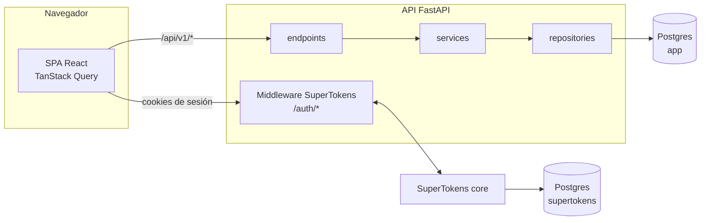
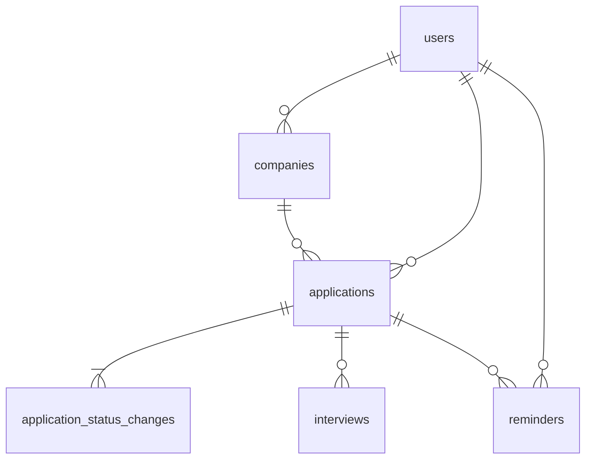

# Arquitectura

> Estado: **v1 construida** · Fecha: 2026-09-22 · Depende de la [especificación de producto](../producto/especificacion.md)
>
> La v2 (F9–F17) se diseña en [Arquitectura de la v2](v2.md), que continúa estas decisiones desde A18 sin repetirlas.

## 1. Decisiones

| # | Decisión | Elección | Alternativa descartada y por qué |
|---|---|---|---|
| A1 | Forma del sistema | Monolito: una API FastAPI y una SPA React en el mismo repositorio | **Microservicios**: un solo dominio pequeño y un solo desarrollador; solo añadirían red, despliegue y consistencia distribuida sin ningún beneficio. |
| A2 | Capas del backend | `endpoints → services → repositories → db` | **Services que consultan directamente** (como en `task-manager-api`): mezcla reglas de negocio con SQL, y probar una regla obliga a montar consultas. Con repositories, las reglas se leen y se prueban aparte. |
| A3 | Transacciones | Las abre y confirma **el service** (`commit`); los repositories solo hacen `add`/`flush` | **Commit en el repository**: un cambio de estado escribe en dos tablas (solicitud + historial) y tiene que ser atómico. Si cada repository confirmase lo suyo, un fallo entre ambas escrituras dejaría el estado y el historial desincronizados. |
| A4 | Identificadores | UUID v4 generados por la base de datos (`gen_random_uuid()`) | **Enteros autoincrementales** (plantilla): revelan el volumen ("solicitud 1532") y convierten cualquier fallo de propiedad en explotable con solo sumar 1. A este volumen, lo que ocupa de más un índice UUID es irrelevante. |
| A5 | Enumerados | `varchar` + `CHECK` en BD + `StrEnum` en Python | **Enum nativo de Postgres**: Alembic no detecta los cambios de sus valores con autogenerate, y añadir o quitar valores exige migraciones manuales (`ALTER TYPE`, sin poder quitar valores). Con `CHECK`, el cambio es una restricción que se sustituye. |
| A6 | Fechas | `timestamptz` en UTC para instantes y `date` para días (`applied_at`) | **`DateTime` sin zona** (plantilla, que además quita el `tzinfo` a mano): el error de "un día menos" aparece en cuanto el servidor y el navegador están en zonas distintas. `applied_at` es un día del calendario, no un instante. |
| A7 | Estado de la solicitud | Columna `status` en `applications` **más** historial append-only en `application_status_changes`, escritos en la misma transacción | **Solo historial** (el estado se deriva del último cambio): cada listado y cada filtro necesitaría una subconsulta. **Solo columna**: se pierden fechas, tiempos y la posibilidad de deshacer. Ver [§4](#4-consistencia-entre-almacenes). |
| A8 | Reglas de transición | Viven **solo en el backend**; la API devuelve `allowed_transitions` en el detalle | **Duplicarlas en el frontend**: dos copias de una máquina de estados divergen en cuanto una cambia, y la del frontend no protege nada. |
| A9 | Propiedad de los datos | `user_id` en las tablas raíz + FKs compuestas `(id, user_id)` para enlazar entre raíces | **Solo comprobarlo en código**: un olvido permitiría enlazar la empresa de otro usuario. Con la FK compuesta, la base de datos lo rechaza aunque el código falle. |
| A10 | Recurso ajeno | Responder **404**, igual que si no existiera | **403**: confirma que ese id existe y pertenece a otro. |
| A11 | Autenticación | SuperTokens con core propio y **su propia instancia de Postgres**; sesiones por cookies | **JWT propio** (plantilla): refresco, rotación, revocación y anti-CSRF hechos a mano son justo lo que se implementa mal. **BD compartida**: mezclaría las tablas de SuperTokens con las de Alembic, que intentaría borrarlas en cada autogenerate. |
| A12 | Usuario en nuestra BD | Tabla `users` mínima (`id`, `supertokens_user_id`, `created_at`) **sin copiar datos de identidad**: el email se pide a SuperTokens cuando hace falta. Se crea de forma perezosa e idempotente en la primera petición autenticada | **Sin tabla, guardando `supertokens_user_id` en cada tabla**: se pierde el `ON DELETE CASCADE` y el sitio donde colgar preferencias futuras (zona horaria, idioma, canal de avisos). **Copiar el email**: obliga a sincronizarlo cuando cambie. **Crearla en el hook de registro**: si el alta en SuperTokens va bien y el insert en nuestra BD falla, queda un usuario que puede iniciar sesión pero no existe para la API. La creación perezosa se autorrepara. Ver [§4](#4-consistencia-entre-almacenes). |
| A13 | UI de auth | Formularios propios (react-hook-form + zod + shadcn) sobre `supertokens-web-js` | **UI prediseñada de `supertokens-auth-react`**: no encaja con shadcn ni con nuestro i18n, y personalizarla cuesta más que escribir dos formularios. |
| A14 | Paginación | `page`/`limit` con `total` y `pages` (heredado de la plantilla) | **Keyset/cursor**: con un máximo de 5 000 filas por usuario, `OFFSET` no es un problema, y el paginado numerado es el que espera un listado. |
| A15 | Búsqueda de texto | `ILIKE` sobre puesto y nombre de empresa | **`pg_trgm` o búsqueda full-text**: innecesario a este volumen (ver RNF-10, validado en F8 con `app/scripts/check_performance.py`: p95 = 9.9 ms con 2 000 solicitudes, muy por debajo del presupuesto de 300 ms). Se reconsiderará solo si mediciones futuras lo piden. |
| A16 | Estado de filtros del listado | Parámetros de la URL | **Estado local**: se pierde al recargar, no se puede compartir un enlace y el botón atrás no funciona. |
| A17 | Documentación | MkDocs Material fijado a la versión 9, con diagramas Mermaid y referencia de la API generada desde OpenAPI | **Docusaurus**: metería un segundo ecosistema Node solo para documentar. **Wiki externa**: se separa del código y envejece. *Acotada en la v2 a la documentación de desarrollo: la de producción usa Docusaurus (A42, [0010](../decisiones/0010-docusaurus-para-la-documentacion-de-produccion.md)).* |

> **Aclaraciones:**
>
> - "Services" significa **lógica de negocio**, no microservicios.
> - La FK compuesta de A9 no sustituye al filtro por `user_id` en las consultas: lo complementa. El filtro evita **leer** datos ajenos; la FK evita **enlazarlos**.

## 2. Vista general



- El navegador **solo habla con la API**. El core de SuperTokens no se expone: la API hace de proxy de `/auth/*` mediante el middleware.
- Cada petición a `/api/v1/*` protegida pasa por `get_current_user`. Esta dependencia verifica la sesión, obtiene o crea el usuario propio y entrega su `id` al endpoint.

## 3. Estructura del repositorio

```
applications-tracker/
├── compose.yml / compose.test.yml     entornos de desarrollo y de tests
├── mkdocs.yml, docs/                  este sitio
├── backend/app/
│   ├── api/v1/endpoints/              HTTP: validación de entrada, códigos de estado. Sin lógica.
│   ├── services/                      reglas de negocio y límites de transacción
│   ├── repositories/                  TODO acceso a la BD
│   ├── models/  schemas/              SQLAlchemy / Pydantic
│   └── core/  db/                     configuración, excepciones, sesión de BD
└── frontend/src/
    ├── features/<feature>/            types → schemas → services → keys → hooks → components
    ├── pages/  routes/                una página por ruta, loaders de auth
    └── shared/                        ui (shadcn), form, layout, lib (apiClient)
```

**La regla estructural que más importa:** *si algo habla con la base de datos, vive en `repositories/`.* El detalle de capas (qué puede importar qué) está en [Servicios y estructura](servicios-y-estructura.md).

## 4. Consistencia entre almacenes

Hay dos pares de datos duplicados. Para cada uno se fija cuál manda.

### Estado actual ↔ historial de estados

| Aspecto | Regla |
|---|---|
| Quién manda | El **historial**. `applications.status` es una copia desnormalizada del `to_status` del último cambio. |
| Escritura | Solo desde `ApplicationStatusService`, que en **una transacción** inserta el cambio y actualiza `status` y `last_activity_at`. |
| Creación | Crear una solicitud inserta también su primer cambio (`from_status = NULL`). Ninguna solicitud existe sin historial. |
| Deshacer | Se borra el último cambio y `status` se fija al `to_status` del anterior. No se puede deshacer el cambio inicial. |
| "Último" | El cambio con el **`seq` más alto** ([decisión 0004](../decisiones/0004-secuencia-para-ordenar-el-historial.md)): una columna `bigint GENERATED ALWAYS AS IDENTITY`, que siempre crece y no depende del reloj. **No** se ordena por `changed_at` (la declara el usuario) ni por `created_at` (viene del reloj del sistema, que puede retroceder). |
| Detección de desviación | Una prueba de repository comprueba, tras cada operación, que `status == último to_status`. |

> **Trampa — ordenar el historial por una fecha.**
>
> - **`changed_at` no sirve**: es la fecha que declara el usuario.
> - **`created_at` tampoco**: depende del reloj del sistema, que puede retroceder (NTP, una máquina virtual que se reanuda). Si retrocede entre dos cambios, *deshacer* borraría el equivocado ([decisión 0004](../decisiones/0004-secuencia-para-ordenar-el-historial.md)).
>
> El caso concreto de `changed_at`:
>
> **Trampa — ordenar por `changed_at`.** `changed_at` es la fecha que **declara** el usuario, y puede ser pasada (RF-30). Si se registra hoy un rechazo con fecha de la semana pasada, y ya existía un cambio de hace tres días, ordenar por `changed_at` haría "último" al de hace tres días. Deshacer eliminaría entonces el cambio equivocado. `created_at` refleja el orden real en que se escribieron las filas. Para evitar historias imposibles, el service además rechaza un `changed_at` anterior al del último cambio o posterior a ahora.

### Usuario de SuperTokens ↔ usuario propio

| Aspecto | Regla |
|---|---|
| Quién manda | **SuperTokens** para la identidad (credenciales, email). `users` es una tabla de **enlace**, no una copia: guarda solo `id`, `supertokens_user_id` y `created_at`, y existe para las FKs y el `ON DELETE CASCADE`. |
| Escritura | `get_current_user` hace un `INSERT … ON CONFLICT (supertokens_user_id) DO NOTHING` y después lee. Es idempotente y seguro ante peticiones concurrentes del mismo usuario recién registrado. |
| Si falla | Una petición que no consigue crear el usuario propio devuelve 500 y la siguiente lo reintenta: no hay estado roto que reparar. |
| Email | **No se copia**, así que no hay nada que sincronizar. Quien lo necesite (la cabecera de la UI, el futuro canal de email) lo pide a SuperTokens con `get_user(supertokens_user_id)` en ese momento. |
| Borrado | Implementado en F8 (`DELETE /me`, `UserService.delete_account`). Primero se borran los datos propios (`UserRepository.delete()`, todo lo demás cae por `ON DELETE CASCADE`) y se confirma esa transacción; solo entonces se borra el usuario de SuperTokens (`IdentityRepository.delete()`), porque al revés quedarían datos huérfanos imposibles de reclamar. Es borrado inmediato: el periodo de gracia antes de purgar de verdad sigue `[C]` (ver [decisión 0008](../decisiones/0008-borrado-de-cuenta-en-f8.md)). |

## 5. Modelo de datos



Todas las tablas tienen `id uuid PK DEFAULT gen_random_uuid()`, `created_at timestamptz NOT NULL DEFAULT clock_timestamp()` ([decisión 0001](../decisiones/0001-clock-timestamp-en-created-at.md): `now()` daría la misma hora a todas las filas de una transacción) y, salvo las inmutables (`users` y `application_status_changes`), `updated_at`.

| Tabla | Para qué | Propiedad |
|---|---|---|
| `users` | Enlace con SuperTokens | Raíz |
| `companies` | Empresas del usuario | `user_id` |
| `applications` | Solicitudes | `user_id`, con FK compuesta a `companies` |
| `application_status_changes` | Historial append-only | vía `application_id` |
| `interviews` | Entrevistas | vía `application_id` |
| `reminders` | Recordatorios | `user_id`, con FK compuesta opcional a `applications` |

### Las tablas que hay que acertar a la primera

**`applications`**. Todo cuelga de ella y la leen todas las pantallas.

| Columna | Tipo | Notas |
|---|---|---|
| `user_id` | `uuid NOT NULL` | FK `users` `ON DELETE CASCADE` |
| `company_id` | `uuid NOT NULL` | FK compuesta `(company_id, user_id) → companies(id, user_id)` `ON DELETE RESTRICT` (RF-12) |
| `position_title` | `varchar(200) NOT NULL` | |
| `job_url` | `varchar(2000)` | |
| `location` | `varchar(200)` | |
| `work_mode` | `varchar(20)` | `CHECK IN ('onsite','hybrid','remote')` |
| `source` | `varchar(30)` | `CHECK IN ('linkedin','infojobs','indeed','company_website','referral','recruiter','other')` |
| `origin` | `varchar(30) NOT NULL DEFAULT 'manual'` | `CHECK IN ('manual')`. Costura para la importación. |
| `status` | `varchar(20) NOT NULL` | Los 8 estados de la especificación. Copia del historial (§4). |
| `applied_at` | `date` | `CHECK (status IN ('saved','withdrawn') OR applied_at IS NOT NULL)` |
| `salary_min` / `salary_max` | `integer` | Bruto anual. `CHECK (salary_min <= salary_max)` y ambos `>= 0` |
| `salary_currency` | `varchar(3) NOT NULL DEFAULT 'EUR'` | `CHECK IN ('EUR','USD','GBP','CHF')` (A5): lista cerrada, no cualquier código ISO 4217, sin conversión (R5, resuelto en F8) |
| `notes` | `text` | `CHECK (char_length(notes) <= 5000)` |
| `archived_at` | `timestamptz` | `NULL` = activa (RF-24) |
| `last_activity_at` | `timestamptz NOT NULL` | La actualizan los services al cambiar de estado o tocar entrevistas. Alimenta el aviso "sin actividad" (RF-64). |

Restricciones e índices:
- `UNIQUE (id, user_id)`, destino de la FK compuesta de `reminders`.
- `(user_id, status)`
- `(user_id, applied_at DESC)`
- `(user_id, company_id)`
- `(user_id, last_activity_at)`

**`application_status_changes`**. Es append-only y su orden es la fuente de verdad.

| Columna | Tipo | Notas |
|---|---|---|
| `application_id` | `uuid NOT NULL` | FK `ON DELETE CASCADE` |
| `from_status` | `varchar(20)` | `NULL` solo en el cambio inicial |
| `to_status` | `varchar(20) NOT NULL` | |
| `changed_at` | `timestamptz NOT NULL` | Fecha declarada por el usuario |
| `note` | `text` | |
| `created_at` | `timestamptz NOT NULL DEFAULT clock_timestamp()` | Cuándo se registró. Informativo: **no** se usa para ordenar ([0004](../decisiones/0004-secuencia-para-ordenar-el-historial.md)). Sin `updated_at`: la fila no se edita. |
| `seq` | `bigint GENERATED ALWAYS AS IDENTITY` | **El orden del historial** ([0004](../decisiones/0004-secuencia-para-ordenar-el-historial.md)). Siempre creciente y ajeno al reloj. Es único por tabla, no por solicitud: nunca se muestra como "cambio número N". |

Índice: `(application_id, seq DESC)`.

!!! info "Una secuencia y dos fechas, con significados distintos"
    | Campo | Quién lo pone | Qué significa | Para qué se usa |
    |---|---|---|---|
    | `seq` | La secuencia de Postgres, al insertar | **En qué orden** se registraron los cambios | Ordenar el historial y decidir cuál es el último para **deshacer** (§4) |
    | `created_at` | La base de datos (`clock_timestamp()`) | **Cuándo se registró** el cambio en el sistema | Informativo y para auditar |
    | `changed_at` | El usuario (por defecto, ahora) | **Cuándo ocurrió** de verdad | Métricas de tiempos ("tardaron 9 días en responder") y la línea de tiempo que se muestra |

    Si hoy se apunta que la empresa rechazó la candidatura el lunes, `created_at` es hoy y `changed_at` es el lunes.

    El `updated_at` de `applications` **no sirve** para deshacer: cambia con cualquier edición (notas, salario) y no guarda el estado anterior.

### Resto de tablas

- **`users`**
  - Columnas: `supertokens_user_id varchar(128) UNIQUE NOT NULL`, más `created_at`. Sin `updated_at`: la fila no se modifica.
  - No guarda email ni ningún otro dato de identidad (§4).
  - **Preferencias (F8):** `language varchar(2)`, con `CHECK` de enumerado que admite `NULL` (igual que `work_mode`) — `NULL` significa "seguir el idioma del navegador", no un valor por defecto fijo. `stale_after_days smallint NOT NULL DEFAULT 14` (el valor de `STALE_AFTER_DAYS` en `app/domain/dashboard.py`), con `CHECK BETWEEN 1 AND 90`: personaliza el umbral de "sin actividad" de RF-64 por usuario. No son datos de identidad, así que no rompen A12: son preferencias propias de la cuenta en esta aplicación.
- **`companies`**
  - Columnas: `user_id` (FK con cascade), `name varchar(200) NOT NULL`, `website varchar(500)`, `location varchar(200)`, `notes text`.
  - `UNIQUE (id, user_id)`.
  - Índice único `(user_id, lower(name))`: evita "Acme" y "acme" duplicadas (RF-10).
- **`interviews`**
  - Columnas: `application_id` (FK con cascade), `scheduled_at timestamptz NOT NULL`, `duration_minutes smallint`, `interviewers varchar(500)`, `notes text`.
  - `interview_type`: `screening`, `technical`, `hr`, `cultural`, `final`, `other`.
  - `format`: `online`, `onsite`, `phone`.
  - `outcome`: `pending`, `passed`, `failed`, `cancelled`, con `pending` por defecto.
  - Índice `(application_id, scheduled_at)`.
- **`reminders`**
  - Columnas: `user_id` (FK con cascade), `application_id` (opcional), `title varchar(200) NOT NULL`, `due_at timestamptz NOT NULL`, `sent_at timestamptz`, `completed_at timestamptz`.
  - `channel` con `in_app` por defecto; es la costura para otros canales.
  - `status`: `pending`, `done`, `dismissed`.
  - FK compuesta `(application_id, user_id) → applications(id, user_id)` con `ON DELETE CASCADE`.
  - Índice parcial `(user_id, due_at) WHERE status = 'pending'`.

## 6. Servicios externos

| Servicio | Detrás de qué | En desarrollo y pruebas |
|---|---|---|
| SuperTokens core | SDK `supertokens-python` inicializado en `core/supertokens.py`; el resto del código solo ve `get_current_user` | En pruebas de API, `get_current_user` se sustituye por `dependency_overrides` con un usuario de prueba. Una prueba de humo usa el core real. |
| Canal de notificaciones | Interfaz `NotificationChannel` en `services/notifications/` | Implementación única `InAppChannel`, que no envía nada. |

## 7. Aislamiento entre usuarios

No hay multi-tenancy de organizaciones, pero cada usuario es su propio inquilino. Se protege en dos capas:

1. **Aplicación.**
   - Todo método de repository que lea o escriba datos de usuario recibe `user_id` como **parámetro obligatorio** y filtra por él.
   - Las tablas hijas (`interviews`, historial) se filtran haciendo join con `applications`.
   - Ningún repository expone un `get_by_id(id)` sin `user_id`.
2. **Base de datos.**
   - Las FKs compuestas de A9 impiden enlazar recursos entre usuarios.
   - Row-Level Security de Postgres queda descartada para el MVP: exige fijar el usuario en cada conexión (`SET app.user_id`), algo propenso a fugas con un pool asíncrono, y el filtro obligatorio por parámetro cubre el caso.

**Prueba que lo verifica:**
- Se crean dos usuarios.
- Por cada endpoint que recibe un id, el usuario B intenta leer, editar y borrar el recurso de A, y espera 404.
- Se intenta crear una solicitud de B con la empresa de A y se espera 404.

## 8. Flujos principales

### Cambiar de estado (RF-30…33)

| Paso | Qué hace | Cómo falla |
|---|---|---|
| 1 | `POST /applications/{id}/status-changes` con `to_status`, `changed_at?` y `note?` | 422 si el cuerpo no es válido |
| 2 | El repository carga la solicitud con `SELECT … FOR UPDATE`, filtrando por `user_id` | 404 si no existe o es de otro usuario |
| 3 | El service valida la transición contra la tabla de estados | 409 `invalid_transition` |
| 4 | El service valida `changed_at`: entre el último cambio y ahora | 422 |
| 5 | Inserta el cambio y actualiza `status`, `last_activity_at` y, si pasa a `applied` sin fecha, `applied_at` | — |
| 6 | Un solo `commit` y la respuesta con el detalle y `allowed_transitions` | Si algo falla antes, rollback completo |

> **El paso que se suele saltar: el `FOR UPDATE`.** Dos pestañas abiertas cambian el estado a la vez. Las dos leen `interviewing`, las dos validan su transición e insertan. El historial queda con dos cambios que salen del mismo estado, y `status` refleja solo el último en escribirse. Bloquear la fila serializa los cambios: el segundo verá el estado que dejó el primero y se validará contra él.

### Deshacer el último cambio (RF-34)

1. `DELETE /applications/{id}/status-changes/last`.
2. Se bloquea la solicitud y se leen los dos últimos cambios por `seq` descendente.
3. Si solo hay uno (el inicial), se responde 409.
4. Si no, se borra el último, se fija `status` al `to_status` del anterior y se confirma.

### Petición autenticada

1. El middleware de SuperTokens valida y, si hace falta, refresca la sesión desde las cookies.
2. `get_current_user` llama a `verify_session()`; sin sesión, responde 401 (el frontend redirige al login).
3. Obtiene o crea el usuario propio (§4) y entrega un objeto `CurrentUser(id, supertokens_user_id)` al endpoint.

### Dashboard (RF-60…66)

`GET /dashboard` responde con `DashboardService.get`, que agrega en una sola llamada el recuento por estado (RF-60, con los 8 estados presentes aunque estén a cero), los envíos por semana de las últimas 12 semanas (RF-61), la tasa de respuesta (RF-62, `null` si `sent_count` no llega a `MIN_SAMPLE_FOR_RATE = 5`, por RF-66), las próximas entrevistas y los recordatorios pendientes o vencidos (RF-63) y las solicitudes sin actividad (RF-64). Es de solo lectura: no abre ninguna transacción de escritura.

> **El umbral de "sin actividad" es por usuario desde F8, no una constante.** `DashboardService.get` carga el `User` con `UserRepository` y usa su `stale_after_days` (1–90, por defecto `STALE_AFTER_DAYS = 14` de `app/domain/dashboard.py`) en vez de la constante directamente. `STALE_AFTER_DAYS` sigue existiendo, pero ahora es solo el valor por defecto de la columna en la migración, no el que aplica el service en cada petición. Se gestiona con `GET`/`PATCH /me/preferences`. Cada lista trae un vistazo de 5 elementos (`WIDGET_LIST_LIMIT`) y su total; el listado completo de recordatorios, con sus acciones, vive en `/reminders`.

> **Por qué unas métricas incluyen las solicitudes archivadas y otras no.** Las que retratan el **estado actual** de la búsqueda (recuento por estado, solicitudes sin actividad) **excluyen** las archivadas: archivar es la señal explícita del usuario de "esto ya no lo sigo", y mezclarlo con lo activo distorsionaría la foto de ahora mismo. Las que retratan **lo ocurrido** (envíos por semana, tasa de respuesta) **incluyen** las archivadas: que una solicitud se archivara después no borra que se enviara esa semana o que la empresa llegara a responder. La regla está en el docstring de `app/domain/dashboard.py`.

RNF-11 (menos de 500 ms con 2 000 solicitudes) se cumple con varias consultas ligeras, ya cubiertas por los índices de §5 (`(user_id, status)`, `(user_id, last_activity_at)`, etc.), no con una única consulta SQL monolítica ni una tabla materializada.

> **RNF-10 y RNF-11, validados en F8.** `app/scripts/check_performance.py` siembra 2 000 solicitudes, corre 20 iteraciones del listado por defecto y de `DashboardService.get`, y mide el percentil 95 de cada uno. Resultado en este equipo (2026-09-24): listado p95 = 9.9 ms (presupuesto 300 ms), dashboard p95 = 28.3 ms (presupuesto 500 ms). Ambos muy por debajo del presupuesto, a la escala que pide la especificación. Es un chequeo manual (no corre en CI ni en `pytest`): se relanza a mano cuando conviene revalidar.

### Exportar a CSV (RF-70)

`GET /applications/export` vuelca **todas** las solicitudes del usuario a CSV, archivadas incluidas: es un volcado completo, no la vista filtrada y paginada del listado. Está registrado en el router **antes** de `GET /applications/{application_id}`, para que `export` no se intente interpretar como un UUID. Las columnas usan los **códigos en crudo** de los enumerados (`status`, `work_mode`, `source`, `origin`), no las etiquetas traducidas de la UI, para que el fichero sea estable entre idiomas y, en el futuro, reimportable (`origin=csv_import`, evolución documentada en la [especificación](../producto/especificacion.md#7-matriz-de-entradas), `[C]`).

## 9. Frontend

- El patrón de feature se hereda de `frontend_gestpro`. La diferencia es que los `services/` llaman a la API mediante `shared/lib/apiClient.ts` (con `credentials: "include"` al integrar SuperTokens) en vez de a Supabase.
- Los loaders de React Router usan `Session.doesSessionExist()` de `supertokens-web-js`.

Las pantallas con dificultad real:

1. **Listado de solicitudes.** Los filtros, la ordenación y la página se sincronizan con la URL (A16). La query key incluye los filtros, así que cambiar un filtro es cambiar de query y la caché funciona sola.
2. **Detalle de la solicitud.** Muestra la línea de tiempo del historial, las entrevistas y los recordatorios de esa solicitud. El diálogo de cambio de estado ofrece **solo** las `allowed_transitions` que llegan de la API (A8). Tras cambiar o deshacer, se invalidan el detalle, el listado y el dashboard. Al crear una entrevista sobre una solicitud en `applied` o `screening`, un toast propone (sin forzar) pasarla a `interviewing` (RF-42): comprueba `allowed_transitions`, no una regla propia.
3. **Formulario de solicitud.** Tiene un combobox de empresa que permite crear una nueva sin salir del formulario (RF-13).

**Recordatorios: embebidos en F4, globales desde F5.** En F4 el frontend no tenía ruta ni página propia para `reminders`: se creaban y se listaban solo filtrados por `application_id`, desde el detalle de la solicitud. Fue una acotación de alcance deliberada, no un olvido: ver [decisión 0005](../decisiones/0005-recordatorios-sin-pagina-global-en-f4.md). F5 cerró ese hueco: `pages/RemindersPage.tsx` en `/reminders`, con su entrada en `shared/config/navigation.ts`, filtro por estado (URL, A16), paginación y crear/completar/descartar — el mismo alcance que ya tenía la API desde F4, sin editar ni borrar. `ReminderFormDialog` pasó de exigir siempre un `applicationId` fijo a aceptarlo opcional: si se omite (el listado global), ofrece un `FormAsyncCombobox` para ligar una solicitud o dejarlo sin ligar (RF-50). El backend no cambió: ya estaba listo para esta vista desde F4.

**El dashboard es la página de inicio desde F5.** `/` redirige a `/dashboard`, que sustituye a `/applications` como primera pantalla tras iniciar sesión.

**Idioma: detección del navegador, con preferencia de servidor desde F8.** i18next detecta el idioma del navegador como siempre. Al cargar `AppLayout`, un efecto lee `GET /me/preferences` y, si `language` no es `NULL`, lo fija por encima de esa detección; si es `NULL` ("seguir el navegador"), borra la clave `i18nextLng` de `localStorage` y deja que i18next vuelva a detectar, para que elegir "seguir el navegador" sea reversible y no se quede pegado al último idioma fijado a mano. La preferencia vive en `users.language` (§5); las reglas de validación y los límites siguen sin tener nada que ver con esto.

## 10. Entorno y despliegue

- **Desarrollo:** `docker compose up`. En F1 se añaden `supertokens` y `supertokens-db` a `compose.yml`. Los servicios son `db`, `supertokens-db`, `supertokens`, `api`, `frontend` y `docs`.
- **Preparado para desplegar (F7):**
  - `compose.prod.yml`.
  - Imagen del frontend con Nginx y `ARG VITE_API_URL`.
  - API sin `--reload` y con migraciones en el entrypoint.
  - Core de SuperTokens sin puertos publicados.
- El despliegue real es `[C]`.

## 11. Pruebas

| Nivel | Herramienta | Qué cubre |
|---|---|---|
| Repositories | pytest contra Postgres real (`compose.test.yml`) | Filtros, paginación, restricciones de BD (FKs compuestas, `CHECK`) y consistencia del estado con el historial |
| Services | pytest con BD real | Reglas: transiciones válidas e inválidas, validación de `changed_at`, deshacer, límites y cuotas |
| API | pytest + httpx, con `get_current_user` sustituido | Contrato HTTP, códigos de estado y **aislamiento entre usuarios** (§7) |
| Auth (humo) | pytest contra el core real | Registro → login → petición protegida → logout |
| Frontend | Vitest + Testing Library | Schemas zod, utilidades y componentes con lógica (diálogo de estado, filtros ↔ URL) |
| E2E | Playwright | `[C]` |

Cada prueba corre dentro de una transacción que se revierte al terminar: no quedan datos entre pruebas y el orden no importa.

## 12. Orden de implementación

| Fase | En concreto |
|---|---|
| **F0** | Migración de `applications` mínima (puesto + empresa en texto, sin usuario) → model → repository → service → `POST`/`GET /applications` → service, hook y página del frontend. **Se desecha** al empezar F2. |
| **F1** | Servicios SuperTokens en compose. `core/supertokens.py`, middleware, CORS con las cabeceras de SuperTokens, tabla `users`, `get_current_user`, formularios de login y registro, loaders y layout protegido. |
| **F2** | `companies` y `applications` completas (sin historial todavía, estado inicial fijo), CRUD, filtros, paginación, archivado y pruebas de aislamiento. |
| **F3** | `application_status_changes`, `ApplicationStatusService`, `allowed_transitions`, deshacer y diálogo de estado en el frontend. |
| **F4** | `interviews` y `reminders`, `NotificationChannel`/`InAppChannel` y avisos de vencidos. |
| **F5** | Endpoint `GET /dashboard` y exportación CSV. |
| **F6–F7** | CI y preparación para despliegue. |

## 13. Invariantes

La violación de cualquiera de estas reglas es un fallo, no una diferencia de criterio:

1. Todo método de repository sobre datos de usuario recibe `user_id` y filtra por él.
2. `applications.status` es igual al `to_status` del cambio con el `seq` más alto de su historial ([0004](../decisiones/0004-secuencia-para-ordenar-el-historial.md)).
3. El estado solo cambia a través de `ApplicationStatusService`. `PATCH /applications/{id}` no acepta `status`.
4. Toda solicitud tiene al menos un cambio en su historial.
5. Un recurso de otro usuario responde 404, nunca 403.
6. Los instantes se guardan como `timestamptz` en UTC; `applied_at` es `date`.
7. Las transacciones las confirma el service; un repository nunca hace `commit`.
8. El frontend no contiene reglas de transición: usa `allowed_transitions`.

## 14. Riesgos de esta arquitectura

| Riesgo | Mitigación |
|---|---|
| La copia del estado (A7) se desincroniza del historial | Una única vía de escritura (invariante 3), `FOR UPDATE` y una prueba de consistencia |
| Arranque más pesado en desarrollo: dos Postgres y el core de SuperTokens | Healthchecks y `depends_on`. El core consume poco (~200 MB). |
| Las FKs compuestas complican los modelos de SQLAlchemy | Se declaran con `ForeignKeyConstraint` en `__table_args__`. Se prueba en F2. |
| `OFFSET` degrada con volúmenes grandes | Hay límite de 5 000 solicitudes por usuario; la paginación queda aislada en el repository si hay que cambiarla. |
| Mermaid se carga desde un CDN: sin internet, los diagramas del sitio no se dibujan | Aceptado: solo afecta a la documentación local. |
| **Sobreingeniería** (FKs compuestas, canales, historial) para un proyecto de uso propio | Cada pieza está justificada por un requisito numerado. Lo que no lo está queda como `[C]`. |
