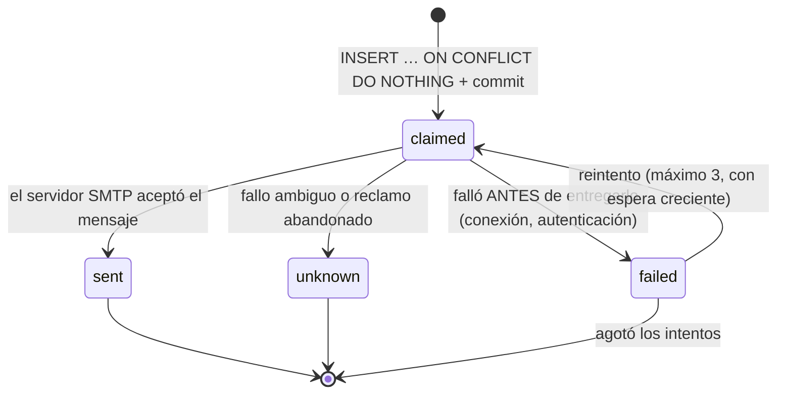

# Trabajo en segundo plano y emails

> Estado: **diseño, en construcción** (F9, F12). Construido: la cola, el `worker` y la anatomía de un trabajo (§2), y `EmailSender` (§4 y §5) · Fecha: 2026-09-24 · Depende de la [arquitectura de la v2](v2.md) (A18–A20, A35–A37) y de [servicios y estructura §8](servicios-y-estructura.md#8-ampliacion-de-la-v2)
>
> Las APIs de SAQ que aparecen aquí se comprueban contra la versión que se fije al construir F9; lo que no cambia son las reglas.

## 1. Piezas

| Pieza | Qué es | Dónde |
|---|---|---|
| Cola | SAQ sobre Valkey (A18) | `infra/queue/`: `JobQueue` (interfaz), `SaqJobQueue`, `InMemoryJobQueue` |
| Worker | Proceso SAQ con la misma imagen que `api` | `worker.py` (cablea), `jobs/` (funciones finas) |
| Barridos | Tareas programadas que leen la BD y deciden qué hacer | `jobs/notifications.py`, `jobs/maintenance.py` → `services/` |
| Envío de email | `EmailSender` con SMTP (`aiosmtplib`) y plantillas Jinja2 | `infra/email/`, `templates/email/` |
| Canal | `EmailChannel`, segunda implementación de `NotificationChannel` (costura de F4) | `services/notifications/email.py` |
| Registro de entregas | `notification_deliveries` (A20) | repository propio |

## 2. Anatomía de un trabajo

Un trabajo es una función asíncrona que recibe **solo ids** y sigue siempre el mismo patrón:

```python
async def generate_document(ctx, *, document_id: str, user_id: str) -> None:
    async with ctx["session_factory"]() as session:
        service = CvGenerationService(session, storage=ctx["storage"], pdf=ctx["pdf"])
        await service.render_pending(document_id=UUID(document_id), user_id=UUID(user_id))
```

- La sesión se abre en el trabajo; el `commit` lo hace el service (invariante 6).
- El service carga la fila **por id y `user_id`** y, si ya no está pendiente, **termina sin hacer nada**. Eso hace inocuo encolar dos veces o reencolar desde un barrido.
- Las dependencias de `infra/` (almacén, generador de PDF, proveedor de IA, email) las crea `worker.py` una vez al arrancar (`startup`) y viajan en el `ctx`, tipado como `WorkerContext` (`jobs/context.py`) para que mypy compruebe cada clave.
- `startup` también inicializa el SDK de SuperTokens: los trabajos piden el email del destinatario al core (A12), y el SDK no está inicializado en un proceso que no sea la API.
- En la API, la cola se crea en el `lifespan` de `main.py` y `deps.get_job_queue` la entrega. No se crea al importar: SAQ guarda primitivas de `asyncio` que quedan ligadas al primer event loop que las usa.

### Tiempos y reintentos por tipo de trabajo

| Trabajo | Timeout del trabajo | Intentos en la cola (`max_attempts`) | Si se queda atascado |
|---|---|---|---|
| Generar PDF | 60 s | 3 | El barrido lo **reencola**: generar es gratis e idempotente |
| Propuesta de IA | 180 s (y el cliente HTTP del proveedor, 150 s) | **1** | El barrido lo marca `failed` (`ai_interrupted`), **no** lo reencola |
| Enviar un email | 30 s | **1** | Lo decide la máquina de estados de las entregas (§4) |
| Barridos | 50 s | 1 | Se vuelven a ejecutar en la siguiente pasada |

> **Trampa — los reintentos de la cola rompen "nunca dos veces".** Si un trabajo de email falla por un corte de red *después* de que el servidor aceptara el mensaje, un reintento automático de la cola lo enviaría otra vez. Por eso los trabajos de email y de IA tienen **un solo intento** en la cola (`max_attempts=1`), y quien decide si se reintenta es el código que sabe **dónde** falló.

> **Trampa — en SAQ, `retries` son intentos, no reintentos** (descubierto en F9). SAQ repite un trabajo mientras `retries > attempts`, y `attempts` ya vale 1 al empezar el primero: `retries=1`, su valor por defecto, es **un solo intento**, y `retries=0` significa lo mismo. Pedir "0 reintentos" o "2 reintentos" con esa palabra da un número equivocado. `JobQueue.enqueue` habla de `max_attempts` (el primer intento incluido) y `SaqJobQueue` lo traduce.

> **Trampa — opciones y argumentos en el mismo saco.** `Queue.enqueue` de SAQ reparte su `**kwargs`: lo que se llama como un campo de `Job` (`timeout`, `key`, `retries`, `scheduled`…) es una opción del trabajo y el resto, argumento de la función. Un trabajo con un argumento llamado `timeout` perdería el argumento y cambiaría su timeout sin avisar. `SaqJobQueue` pasa siempre los argumentos en `kwargs=`, y una prueba lo comprueba.

> **Trampa — un trabajo puede ejecutarse dos veces al arrancar un worker** (visto en F9 con SAQ 0.26). Al arrancar, el `worker` barre la lista de trabajos activos a la vez que saca el primero de la cola, y puede tomar por abandonado uno que acaba de empezar: lo marca abortado y, si le quedan intentos, lo reencola. Es otra razón para la regla de §2: todo trabajo es idempotente (comprueba el estado de su fila al empezar) y lo que no debe repetirse (un email) pasa por un reclamo en la BD, no por la cola.

> **Trampa — la marca de aborto de SAQ no distingue colas.** Tras abortar un trabajo, SAQ guarda `saq:abort:<key>` unos segundos, sin el nombre de la cola: encolar otra vez esa misma clave, en cualquier cola, no hace nada y `enqueue` devuelve `False`. Con claves derivadas del id de la fila no es un problema; con claves fijas, sí.

> **Trampa — encolar falla después del commit** (descubierto en F9). Con Valkey caído, encolar tarda unos 4 s y lanza un error. `SaqJobQueue` lo traduce a `QueueUnavailableError` para que el service decida, y lo correcto tras confirmar una fila `pending` es **registrarlo y responder igual**: la fila ya existe y el barrido de pendientes la reencola ([arquitectura §3](v2.md#3-consistencia-entre-almacenes)). Convertirlo en un 500 haría que el usuario lo repitiera y dejara dos filas. El `worker` sí se recupera solo cuando Valkey vuelve, y lo encolado sobrevive a un reinicio de Valkey gracias a `--appendonly yes`.

> **Trampa — el timeout del trabajo más corto que el de la llamada.** Si la cola corta el trabajo a los 60 s mientras el cliente HTTP espera 120 s al proveedor de IA, el trabajo muere a mitad de una llamada que el proveedor **sí** va a cobrar, y la fila se queda en `running`. Si luego un barrido la reencolara, se pagaría dos veces. Regla: el timeout del cliente HTTP es siempre menor que el del trabajo, y las propuestas de IA atascadas se marcan como fallidas en vez de reencolarse. El usuario puede volver a pedirla a mano.

### Cuántos workers

**Decisión (F9): un solo proceso `worker` para todos los trabajos**, con `concurrency: 10`. Casi todos los trabajos pasan el tiempo esperando (SMTP, proveedor de IA, BD), y un proceso asíncrono lleva diez a la vez. El PDF, que sí calcula, se genera en un hilo para no parar a los demás, y lo medido en F9 muestra que se reparte bien entre núcleos ([ficheros §7](ficheros.md#fuentes)).

Se descartó **un worker por tipo de trabajo**: cuatro o cinco procesos casi siempre ociosos, a unos 150–180 MB cada uno, en un VPS de 2–4 GB. Se revisa si aparece alguna de estas señales:

| Señal | Qué se hace |
|---|---|
| Emails o barridos que llegan con retraso mientras hay propuestas de IA o PDFs en marcha | **Dos colas y dos procesos**: ligeros (email, barridos) y pesados (PDF, IA). Es el mismo servicio de compose con otra configuración de SAQ; los services no cambian, solo a qué cola encola cada tipo |
| Propuestas de IA que esperan hueco (los 10 ocupados durante minutos) | Subir la concurrencia de la cola de IA: es espera, no cálculo. El límite pasa a ser el del proveedor |
| PDFs que tardan en salir con carga real | Más procesos para los pesados (`saq --workers N`), hasta los núcleos del VPS |
| Varios servidores | S3 como segunda implementación de `FileStorage` (A21) |

## 3. Barridos programados

| Barrido | Cada | Qué hace |
|---|---|---|
| Recordatorios vencidos (RF-80) | 1 min | Recordatorios `pending` con `due_at` en `[ahora − 24 h, ahora]` |
| Entrevistas próximas (RF-81) | 5 min | Entrevistas `pending` que empiezan dentro de la antelación del usuario |
| Resumen semanal (RF-82) | 1 h | Usuarios para los que, en su zona horaria, es lunes y ya pasó la hora de envío |
| Solicitudes sin actividad (RF-83) | 1 h | Solicitudes que acaban de cruzar el umbral del usuario |
| Reencolar pendientes | 5 min | Documentos `pending` con más de 5 minutos (propuestas de IA atascadas: se marcan como fallidas) |
| Reclamos sin resultado | 5 min | Entregas `claimed` con más de 10 minutos pasan a `unknown` (§4) |
| Ficheros huérfanos | 1 día | Ver [ficheros](ficheros.md#5-huerfanos) |

Reglas comunes:

- Cada barrido recibe **"ahora" como parámetro**, así se prueba con fechas fijas.
- Solo considera usuarios con **email verificado** y ese tipo de aviso activado. Un usuario sin verificar no genera ni reclamos: si verifica más tarde, no recibe de golpe todo lo acumulado.
- Trabaja por lotes acotados (por ejemplo, 200 candidatos por pasada) sobre índices parciales. Lo que no cabe en una pasada, entra en la siguiente.

> **Trampa — el primer despliegue inunda la bandeja.** Si el barrido de recordatorios buscara "todos los pendientes con `due_at` anterior a ahora", el día que se activa el canal de email se enviaría un correo por cada recordatorio vencido desde que el usuario empezó a usar la aplicación, meses atrás. La ventana de 24 h lo evita: solo avisa de lo que venció recientemente. Lo mismo con la inactividad: el primer barrido encuentra decenas de solicitudes paradas, y por eso se envía **un solo email por usuario y pasada** con la lista, no uno por solicitud (aunque cada solicitud tiene su propio reclamo, para no repetirla).

> **Trampa — varios workers ejecutan el mismo barrido.** Si algún día hay dos procesos `worker`, cada uno puede disparar su tarea programada a la misma hora. El diseño no depende de que la cola lo deduplique: los barridos son seguros por construcción, porque todo envío pasa por un reclamo con clave única (§4). Dos barridos simultáneos compiten por insertar el mismo reclamo y solo uno gana.

## 4. "Nunca dos veces": la máquina de estados de una entrega



| Resultado del envío | Estado | ¿Se reintenta? | Por qué |
|---|---|---|---|
| El servidor respondió `250` al final de los datos | `sent` | — | Entregado |
| No se pudo conectar, TLS falló, autenticación rechazada, `4xx`/`5xx` **antes** de enviar los datos | `failed` | Sí | Con seguridad no salió nada |
| Se cortó la conexión **después** de enviar los datos, o no llegó la respuesta final | `unknown` | **No** | Puede que el servidor lo aceptara |
| El proceso murió con el reclamo en `claimed` | `unknown` (barrido de reclamos) | **No** | No se sabe en qué punto murió |

> **Trampa — "mejor esfuerzo con reintentos" y "nunca dos veces" tiran en direcciones opuestas.** Reintentar lo que falló es justo lo que produce duplicados cuando el fallo fue ambiguo: el servidor recibió el mensaje, pero la confirmación no llegó. La salida es clasificar **dónde** falló. Si no se puede saber, se pierde el email, que es lo que la especificación acepta (RF-87).

**Dónde está la frontera** (construido en F9). `SmtpEmailSender` no usa el envío de una sola llamada de `aiosmtplib`: conversa paso a paso (conexión y login, `MAIL`, `RCPT`, `DATA`) para saber en qué punto falló. Cualquier fallo antes de `DATA`, y cualquier **código de error** del servidor (también al final de `DATA`, que es un rechazo explícito), lanza `EmailNotSentError`: seguro reintentar. Un corte o un timeout durante `DATA` lanza `EmailDeliveryUnknownError`: no se reintenta. Las pruebas usan un servidor SMTP falso escrito a mano (`tests/infra/fake_smtp.py`) que falla justo en cada uno de esos puntos.

Dos reglas más del envío: con `SMTP_SECURITY` en `starttls` o `tls`, si el servidor no ofrece cifrado **no se envía en claro** (falla como no enviado); y una dirección con caracteres no ASCII (`josé@…`) solo se envía si el servidor anuncia SMTPUTF8 (RFC 6531), y si no, es un "no enviado" más, no un error sin clasificar.

> **Trampa — preguntar por las extensiones antes del saludo.** `aiosmtplib` envía el `EHLO` (el saludo en el que el servidor lista sus extensiones) de forma perezosa, con el primer comando. Justo después de conectar, sin login ni STARTTLS, la lista está vacía y `supports_extension("smtputf8")` responde que no aunque el servidor sí lo admita. `SmtpEmailSender` saluda explícitamente antes de consultarla.

La `dedupe_key` define qué es "el mismo motivo":

| Tipo | `dedupe_key` | Efecto |
|---|---|---|
| Recordatorio vencido | `reminder:<id>` | Un aviso por recordatorio, para siempre |
| Entrevista próxima | `interview:<id>:<scheduled_at>` | Si el usuario **mueve** la entrevista, el nuevo aviso es otro motivo |
| Resumen semanal | `digest:<año>-W<semana ISO local>` | Uno por semana aunque el barrido pase varias veces esa mañana |
| Sin actividad | `stale:<application_id>:<last_activity_at>` | Si la solicitud vuelve a moverse y a quedarse quieta, es un periodo nuevo |

## 5. Emails

### Plantillas e idioma

- `templates/email/<tipo>/<idioma>.html` y `.txt`: siempre las dos partes (multipart). Muchos filtros de spam desconfían de un email solo HTML.
- El idioma es el de la cuenta (preferencia de F8) o español si sigue al navegador (RF-86). Las fechas se formatean en la **zona horaria del usuario** (RF-07), nunca en UTC.
- Autoescape de Jinja2 **activado**: el título de un recordatorio lo escribe el usuario.

### Direcciones

El email del destinatario **no está en nuestra BD** (A12): el barrido lo pide a SuperTokens en el momento del envío. Si el usuario borró su cuenta entre el barrido y el envío, no hay dirección y la entrega pasa a `failed` sin reintentos.

### Darse de baja (RF-85)

- Cada email lleva un enlace de baja **de ese tipo** y las cabeceras `List-Unsubscribe` y `List-Unsubscribe-Post: List-Unsubscribe=One-Click` (RFC 8058), que los clientes de correo modernos muestran como un botón.
- El token es una **firma HMAC** con `APP_SECRET` de `(user_id, tipo)`. No se guarda en la BD y no caduca: un enlace de baja de hace un año debe seguir funcionando.
- `POST /notifications/unsubscribe` (público, en la lista blanca) aplica la baja. `GET` con el mismo token **no** la aplica: abre una página de la aplicación que pide confirmarla.

> **Trampa — los escáneres de enlaces dan de baja a la gente.** Muchos servidores de correo corporativos siguen automáticamente cada enlace de un email entrante para analizarlo. Si un `GET` al enlace de baja la aplicara, el usuario quedaría dado de baja sin haber hecho clic. Por eso el `GET` solo muestra una confirmación, y la baja real es un `POST`, que es lo que hace el botón de un clic de RFC 8058 y lo que no hace un escáner.

### Sin SMTP configurado (RNF-34)

`EmailSender` se construye a partir de la configuración (`build_email_sender`). Sin `SMTP_HOST`, se usa una implementación **desactivada** (`DisabledEmailSender`): su `enabled` es `False` y `send` **falla** con `EmailDisabledError` en lugar de descartar el email en silencio, para que quien llame sin consultar `enabled` no dé por enviado algo que no salió, y la aplicación publica `email_enabled = false` en su endpoint de capacidades ([límites y abuso](limites-y-abuso.md#4-endpoints-publicos)). Los barridos de notificaciones ni se programan, y el frontend oculta la recuperación de contraseña y explica por qué no se pueden usar las funciones que exigen email verificado.

### Emails de SuperTokens

Verificación y recuperación de contraseña se envían con este mismo `EmailSender` (A37): mismas plantillas, idiomas y SMTP. El detalle está en [autenticación §8](autenticacion.md#8-ampliacion-de-la-v2-verificacion-y-recuperacion).

## 6. Zona horaria y horario de verano

- Los instantes (`due_at`, `scheduled_at`) están en UTC desde la v1 (A6), así que "24 h antes de la entrevista" es una resta en UTC y no sufre el cambio de hora.
- Lo que **sí** depende de la zona es lo que se expresa en tiempo de calendario: "el lunes a las 8:00" del resumen. Se calcula con `zoneinfo` y el nombre IANA del usuario (A39), nunca con un desfase fijo.

> **Trampa — el lunes del cambio de hora.** Con un desfase fijo guardado en verano (`+02:00`), en invierno el resumen llegaría a las 7:00. Y si se programara con un intervalo de "cada 7×24 h", el cambio de hora lo desplazaría una hora dos veces al año. El barrido horario con la hora **local** calculada en cada pasada no depende de nada de eso.

## 7. Pruebas que demuestran el diseño

| # | Prueba | Qué demuestra |
|---|---|---|
| B1 | Encolar dos veces el mismo documento: el segundo trabajo termina sin hacer nada | Idempotencia de los trabajos |
| B2 | Un trabajo con un `user_id` que no es el dueño de la fila no la toca | Aislamiento en el worker |
| B3 | Dos barridos simultáneos sobre el mismo recordatorio: un único reclamo y un único envío | "Nunca dos veces" sin depender de la cola |
| B4 | `EmailSender` de prueba que falla **después** de aceptar el mensaje: la entrega queda `unknown` y no se reintenta | La clasificación de fallos |
| B5 | Falla **antes** de entregar: `failed`, se reintenta hasta 3 veces y después para | Reintentos solo donde es seguro |
| B6 | Un reclamo abandonado en `claimed` pasa a `unknown` y no se reenvía | Proceso muerto a mitad |
| B7 | Recordatorios vencidos hace 3 meses no generan email al activar el canal | La ventana del primer despliegue |
| B8 | Mover una entrevista genera un aviso nuevo; no moverla, ninguno más | La `dedupe_key` |
| B9 | Resumen semanal para un usuario en `America/New_York` y otro en `Europe/Madrid`, con "ahora" en el lunes del cambio de hora | Zona horaria y horario de verano |
| B10 | `GET` al enlace de baja no la aplica; `POST` sí; un token firmado para otro usuario no sirve | Baja segura |
| B11 | Sin `SMTP_HOST`, la aplicación arranca, no programa barridos y publica `email_enabled = false` | RNF-34 |
| B12 | Una propuesta de IA atascada en `running` se marca como fallida y **no** se reencola | No pagar dos veces |

## 8. Lo que no se hace todavía

| Funcionalidad | Estado | Costura que lo permitirá |
|---|---|---|
| Telegram, push u otros canales | Evolución documentada | Otra implementación de `NotificationChannel`; los barridos y la deduplicación no cambian |
| Varios workers o workers en otra máquina | No hace falta con un VPS | Los barridos ya son seguros con varios procesos; los ficheros exigirían S3 ([ficheros](ficheros.md)) |
| Panel de administración de la cola | `[C]` | SAQ trae una interfaz web propia que se podría publicar solo en local |
| Rebotes y quejas del servidor de correo (bounces) | `[C]` | Un webhook del proveedor que marque la dirección como no entregable |
