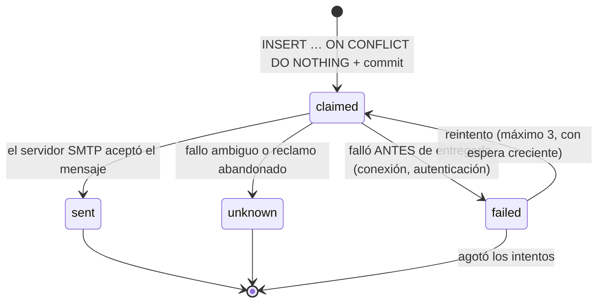

# Trabajo en segundo plano y emails

> Estado: **diseño, en construcción** (F9, F12 y F13 construidas; falta lo de F14–F15). Construido: la cola, el `worker` y la anatomía de un trabajo (§2), `EmailSender` (§4 y §5) y, de F12, las entregas con su máquina de estados, el barrido de reclamos abandonados, las preferencias de aviso, los cuatro avisos y la baja con un clic (§4 y §5) y, de F13, el barrido diario de ficheros huérfanos (§5) · Fecha: 2026-09-30 · Depende de la [arquitectura de la v2](v2.md) (A18–A20, A35–A37) y de [servicios y estructura §8](servicios-y-estructura.md#8-ampliacion-de-la-v2)
>
> Las APIs de SAQ que aparecen aquí se comprueban contra la versión que se fije al construir F9; lo que no cambia son las reglas.

## 1. Piezas

| Pieza | Qué es | Dónde |
|---|---|---|
| Cola | SAQ sobre Valkey (A18) | `infra/queue/`: `JobQueue` (interfaz), `SaqJobQueue`, `InMemoryJobQueue` |
| Worker | Proceso SAQ con la misma imagen que `api` | `worker.py` (cablea), `jobs/` (funciones finas) |
| Barridos | Tareas programadas que leen la BD y deciden qué hacer | `jobs/notifications.py` (`CronJob` de SAQ), `jobs/maintenance.py` → `services/` |
| Envío de email | `EmailSender` con SMTP (`aiosmtplib`) y plantillas Jinja2 | `infra/email/`, `templates/email/` |
| Aviso | Barrido y compositor de cada tipo (sin `EmailChannel`: el canal va en la entrega, [0012](../decisiones/0012-el-canal-de-aviso-va-en-la-entrega.md)) | `services/notifications/<tipo>.py` |
| Registro de entregas | `notification_deliveries` (A20) | repository propio |

## 2. Anatomía de un trabajo

Un trabajo es una función asíncrona que recibe **solo ids** y sigue siempre el mismo patrón:

```python
async def generate_document(ctx, *, document_id: str, user_id: str) -> None:
    async with ctx["session_factory"]() as session:
        await CvGenerationService(
            session, storage=ctx["storage"], renderer=ctx["pdf_renderer"]
        ).render_pending(UUID(user_id), UUID(document_id))
```

- La sesión se abre en el trabajo; el `commit` lo hace el service (invariante 6).
- El service carga la fila **por id y `user_id`** y, si ya no está pendiente, **termina sin hacer nada**. Eso hace inocuo encolar dos veces o reencolar desde un barrido.
- Las dependencias de `infra/` (almacén, generador de PDF, proveedor de IA, email) las crea `worker.py` una vez al arrancar (`startup`) y viajan en el `ctx`, tipado como `WorkerContext` (`jobs/context.py`) para que mypy compruebe cada clave.
- `startup` también inicializa el SDK de SuperTokens: los trabajos piden el email del destinatario al core (A12), y el SDK no está inicializado en un proceso que no sea la API.
- En la API, la cola se crea en el `lifespan` de `main.py` y `deps.get_job_queue` la entrega. No se crea al importar: SAQ guarda primitivas de `asyncio` que quedan ligadas al primer event loop que las usa.

### Tiempos y reintentos por tipo de trabajo

| Trabajo | Timeout del trabajo | Intentos en la cola (`max_attempts`) | Si se queda atascado |
|---|---|---|---|
| Generar PDF **[construido en F14]** | 60 s | 3 | El barrido lo **reencola**: generar es gratis e idempotente. Pasada una hora lo da por fallido (`render_failed`), para que un fallo que no es de la maquetación (el disco) no lo reencole para siempre |
| Propuesta de IA | 180 s (y el cliente HTTP del proveedor, 150 s) | **1** | El barrido lo marca `failed` (`ai_interrupted`), **no** lo reencola |
| Enviar un email | 30 s | **1** | Lo decide la máquina de estados de las entregas (§4) |
| Barridos | 50 s | 1 | Se vuelven a ejecutar en la siguiente pasada |

> **Trampa — los reintentos de la cola rompen "nunca dos veces".** Si un trabajo de email falla por un corte de red *después* de que el servidor aceptara el mensaje, un reintento automático de la cola lo enviaría otra vez. Por eso los trabajos de email y de IA tienen **un solo intento** en la cola (`max_attempts=1`), y quien decide si se reintenta es el código que sabe **dónde** falló.

> **Trampa — en SAQ, `retries` son intentos, no reintentos** (descubierto en F9). SAQ repite un trabajo mientras `retries > attempts`, y `attempts` ya vale 1 al empezar el primero: `retries=1`, su valor por defecto, es **un solo intento**, y `retries=0` significa lo mismo. Pedir "0 reintentos" o "2 reintentos" con esa palabra da un número equivocado. `JobQueue.enqueue` habla de `max_attempts` (el primer intento incluido) y `SaqJobQueue` lo traduce.

> **Trampa — opciones y argumentos en el mismo saco.** `Queue.enqueue` de SAQ reparte su `**kwargs`: lo que se llama como un campo de `Job` (`timeout`, `key`, `retries`, `scheduled`…) es una opción del trabajo y el resto, argumento de la función. Un trabajo con un argumento llamado `timeout` perdería el argumento y cambiaría su timeout sin avisar. `SaqJobQueue` pasa siempre los argumentos en `kwargs=`, y una prueba lo comprueba.

> **Trampa — un trabajo puede ejecutarse dos veces al arrancar un worker** (visto en F9 con SAQ 0.26). Al arrancar, el `worker` barre la lista de trabajos activos a la vez que saca el primero de la cola, y puede tomar por abandonado uno que acaba de empezar: lo marca abortado y, si le quedan intentos, lo reencola. Es otra razón para la regla de §2: todo trabajo es idempotente (comprueba el estado de su fila al empezar) y lo que no debe repetirse (un email) pasa por un reclamo en la BD, no por la cola.

> **Trampa — la marca de aborto de SAQ no distingue colas.** Tras abortar un trabajo, SAQ guarda `saq:abort:<key>` unos segundos, sin el nombre de la cola: encolar otra vez esa misma clave, en cualquier cola, no hace nada y `enqueue` devuelve `False`. Con claves derivadas del id de la fila no es un problema; con claves fijas, sí.

> **Trampa — SAQ recuerda la clave de un trabajo terminado** (descubierto en F14). Un trabajo acabado se queda en Valkey unos minutos (su `ttl`, 600 s por defecto) con su clave, y mientras tanto encolar otro con la misma clave no hace nada. Con la clave `document:{id}`, reintentar un CV que acaba de fallar se descartaba sin avisar y el documento se quedaba `pending` hasta el barrido. La clave lleva también el `updated_at` de la fila (`document:{id}:{updated_at}`), que cambia cada vez que el documento vuelve a `pending`: dos encolados del mismo intento se siguen deduplicando, y un reintento es otro trabajo.

> **Trampa — encolar falla después del commit** (descubierto en F9). Con Valkey caído, encolar tarda unos 4 s y lanza un error. `SaqJobQueue` lo traduce a `QueueUnavailableError` para que el service decida, y lo correcto tras confirmar una fila `pending` es **registrarlo y responder igual**: la fila ya existe y el barrido de pendientes la reencola ([arquitectura §3](v2.md#3-consistencia-entre-almacenes)). Convertirlo en un 500 haría que el usuario lo repitiera y dejara dos filas. El `worker` sí se recupera solo cuando Valkey vuelve, y lo encolado sobrevive a un reinicio de Valkey gracias a `--appendonly yes`.

> **Trampa — el timeout del trabajo más corto que el de la llamada.** Si la cola corta el trabajo a los 60 s mientras el cliente HTTP espera 120 s al proveedor de IA, el trabajo muere a mitad de una llamada que el proveedor **sí** va a cobrar, y la fila se queda en `running`. Si luego un barrido la reencolara, se pagaría dos veces. Regla: el timeout del cliente HTTP es siempre menor que el del trabajo, y las propuestas de IA atascadas se marcan como fallidas en vez de reencolarse. El usuario puede volver a pedirla a mano.

### Cuántos workers

**Decisión (F9): un solo proceso `worker` para todos los trabajos**, con `concurrency: 10`. Casi todos los trabajos pasan el tiempo esperando (SMTP, proveedor de IA, BD), y un proceso asíncrono lleva diez a la vez. El PDF, que sí calcula, se genera en un hilo para no parar a los demás, y lo medido en F9 muestra que se reparte bien entre núcleos ([ficheros §7](ficheros.md#fuentes)).

Se descartó **un worker por tipo de trabajo**: cuatro o cinco procesos casi siempre ociosos, a unos 150–180 MB cada uno, en un VPS de 2–4 GB. Se revisa si aparece alguna de estas señales:

| Señal | Qué se hace |
|---|---|
| Emails o barridos que llegan con retraso mientras hay propuestas de IA o PDFs en marcha | **Dos colas y dos procesos**: ligeros (email, barridos) y pesados (PDF, IA). Es el mismo servicio de compose con otra configuración de SAQ; los services no cambian, solo a qué cola encola cada tipo |
| Propuestas de IA que esperan hueco (los 10 ocupados durante minutos) | Subir la concurrencia de la cola de IA: es espera, no cálculo. El límite pasa a ser el del proveedor |
| PDFs que tardan en salir con carga real | Más procesos para los pesados (`saq --workers N`), hasta los núcleos del VPS |
| Varios servidores | S3 como segunda implementación de `FileStorage` (A21) |

## 3. Barridos programados

| Barrido | Cada | Qué hace |
|---|---|---|
| Recordatorios vencidos (RF-80) | 1 min | Recordatorios `pending` cuyo momento de aviso (`due_at` menos la antelación de la cuenta) está en `(ahora − 24 h, ahora]` |
| Entrevistas próximas (RF-81) | 5 min | Entrevistas `pending` que empiezan dentro de la antelación del usuario |
| Resumen semanal (RF-82) | 1 h | Usuarios para los que, en su zona horaria, es lunes y ya pasó la hora de envío |
| Solicitudes sin actividad (RF-83) | 1 h | Solicitudes que acaban de cruzar el umbral del usuario |
| Reencolar pendientes **[construido en F14]**, **también sin SMTP** | 5 min | Documentos `pending` sin cambios desde hace más de 5 minutos (por `updated_at`: un reintento los vuelve a poner en `pending`); los de más de una hora pasan a `failed`. Se salta los que un `worker` está maquetando (`SKIP LOCKED`) y lee por páginas hasta agotarlos (`requeue_pending_documents`, `jobs/documents.py`). Propuestas de IA atascadas: se marcan como fallidas (F15) |
| Reclamos sin resultado | 5 min | Entregas `claimed` con más de 10 minutos pasan a `unknown` (§4) |
| Ficheros huérfanos | 1 día (4:15 UTC), **también sin SMTP** | Borra los ficheros del almacén sin fila en `documents` y con más de una hora, y los temporales viejos. Ver [ficheros §5](ficheros.md#5-huerfanos) |
| Entregas antiguas | 1 día (3:30 UTC) | Borra las entregas terminadas (`sent`, `unknown`, `failed` sin reintentos) de más de 90 días; las de inactividad, solo si su clave ya no es la de la solicitud |

Reglas comunes:

- Cada barrido recibe **"ahora" como parámetro**, así se prueba con fechas fijas.
- Solo considera usuarios con **email verificado** y ese tipo de aviso activado. Un usuario sin verificar no genera ni reclamos, y lo que se acumuló mientras tanto depende de la ventana de cada aviso: los **recordatorios** solo avisan de lo que venció en las últimas 24 h, las **entrevistas** solo cuentan si aún no han empezado y el **resumen** es el de la semana en curso, así que al verificar no llega nada antiguo. La **inactividad** no tiene ventana (avisa de cualquier solicitud que siga parada): una cuenta que verifica recibe, en la pasada siguiente, **un solo email con todas sus solicitudes paradas**, no uno por solicitud.
- Trabaja por lotes acotados (por ejemplo, 200 candidatos por pasada) sobre índices parciales. Lo que no cabe en una pasada, entra en la siguiente.

> **Trampa — el primer despliegue inunda la bandeja.** Si el barrido de recordatorios buscara "todos los pendientes con `due_at` anterior a ahora", el día que se activa el canal de email se enviaría un correo por cada recordatorio vencido desde que el usuario empezó a usar la aplicación, meses atrás. La ventana de 24 h lo evita: solo avisa de lo que venció recientemente. Lo mismo con la inactividad: el primer barrido encuentra decenas de solicitudes paradas, y por eso se envía **un solo email por usuario y pasada** con la lista, no uno por solicitud (aunque cada solicitud tiene su propio reclamo, para no repetirla).

> **Trampa — limpiar entregas quita la protección.** Una entrega terminada es lo único que impide reclamar otra vez su motivo: si se borrara la de un recordatorio que sigue en su ventana, el barrido lo volvería a avisar. Por eso la limpieza (decidida con el usuario en F12, sin historial visible para él) solo borra entregas terminadas de más de 90 días, muy por encima de la ventana de cualquier barrido (24 h, la entrevista futura, la semana en curso, el cruce del umbral de inactividad), Se construyó al final de F12 y se probó con cada barrido, y ahí apareció la excepción: **el de inactividad no tiene ventana**, porque avisa de cualquier solicitud que siga parada. Si se borrara la entrega de una solicitud olvidada, se volvería a avisar cada 90 días. Esas entregas solo se borran cuando su clave ya no es la actual de la solicitud (se movió después, o se borró), y entonces no pueden volver a coincidir. `NotificationDeliveryRepository.purge_finished` y `tests/services/test_delivery_purge.py`, con una prueba por tipo de aviso.

> **Trampa — varios workers ejecutan el mismo barrido.** Si algún día hay dos procesos `worker`, cada uno puede disparar su tarea programada a la misma hora. El diseño no depende de que la cola lo deduplique: los barridos son seguros por construcción, porque todo envío pasa por un reclamo con clave única (§4). Dos barridos simultáneos compiten por insertar el mismo reclamo y solo uno gana.

## 4. "Nunca dos veces": la máquina de estados de una entrega


```mermaid
stateDiagram-v2
    [*] --> claimed: INSERT … ON CONFLICT DO NOTHING + commit
    claimed --> sent: el servidor SMTP aceptó el mensaje
    claimed --> failed: falló ANTES de entregarlo (conexión, autenticación)
    failed --> claimed: reintento (máximo 3, con espera creciente)
    claimed --> unknown: fallo ambiguo o reclamo abandonado
    sent --> [*]
    unknown --> [*]
    failed --> [*]: agotó los intentos
```

| Resultado del envío | Estado | ¿Se reintenta? | Por qué |
|---|---|---|---|
| El servidor respondió `250` al final de los datos | `sent` | — | Entregado |
| No se pudo conectar, TLS falló, autenticación rechazada, `4xx`/`5xx` **antes** de enviar los datos | `failed` | Sí | Con seguridad no salió nada |
| Se cortó la conexión **después** de enviar los datos, o no llegó la respuesta final | `unknown` | **No** | Puede que el servidor lo aceptara |
| El proceso murió con el reclamo en `claimed` | `unknown` (barrido de reclamos) | **No** | No se sabe en qué punto murió |

> **Trampa — "mejor esfuerzo con reintentos" y "nunca dos veces" tiran en direcciones opuestas.** Reintentar lo que falló es justo lo que produce duplicados cuando el fallo fue ambiguo: el servidor recibió el mensaje, pero la confirmación no llegó. La salida es clasificar **dónde** falló. Si no se puede saber, se pierde el email, que es lo que la especificación acepta (RF-87).

> **Trampa — el mismo envío ejecutado dos veces a la vez sale dos veces** (encontrada por el `qa-verifier` al cerrar F12). Comprobar `status == claimed` al empezar `deliver` no basta: si SAQ toma por abandonado un trabajo que acaba de empezar y lo lanza otra vez (trampa de §2), las dos ejecuciones leen `claimed` antes de que ninguna llegue a marcar `sent`, y cada una envía el email. `deliver` lee las entregas con `SELECT … FOR UPDATE SKIP LOCKED` (`NotificationDeliveryRepository.get_many(..., lock=True)`) y **no suelta el bloqueo hasta el `commit` final**, con la conversación SMTP dentro: la segunda ejecución se salta las filas bloqueadas y no envía nada, y si llega después, ya no están `claimed`. El coste es una transacción abierta mientras dura el envío (el trabajo tiene 30 s de timeout, §2). Es una carrera distinta de la de dos *barridos*, que resuelve la clave única al reclamar. Pruebas adversas en `tests/services/test_notification_adversarial.py`: el mismo envío dos veces a la vez con un SMTP lento (dos transacciones reales), B3 de punta a punta con dos barridos simultáneos, y entregas cuya clave apunta al recordatorio, la entrevista o la solicitud de **otro usuario**, que no envían nada.

**Dónde está la frontera** (construido en F9). `SmtpEmailSender` no usa el envío de una sola llamada de `aiosmtplib`: conversa paso a paso (conexión y login, `MAIL`, `RCPT`, `DATA`) para saber en qué punto falló. Cualquier fallo antes de `DATA`, y cualquier **código de error** del servidor (también al final de `DATA`, que es un rechazo explícito), lanza `EmailNotSentError`: seguro reintentar. Un corte o un timeout durante `DATA` lanza `EmailDeliveryUnknownError`: no se reintenta. Las pruebas usan un servidor SMTP falso escrito a mano (`tests/infra/fake_smtp.py`) que falla justo en cada uno de esos puntos.

Dos reglas más del envío: con `SMTP_SECURITY` en `starttls` o `tls`, si el servidor no ofrece cifrado **no se envía en claro** (falla como no enviado); y una dirección con caracteres no ASCII (`josé@…`) solo se envía si el servidor anuncia SMTPUTF8 (RFC 6531), y si no, es un "no enviado" más, no un error sin clasificar.

> **Trampa — preguntar por las extensiones antes del saludo.** `aiosmtplib` envía el `EHLO` (el saludo en el que el servidor lista sus extensiones) de forma perezosa, con el primer comando. Justo después de conectar, sin login ni STARTTLS, la lista está vacía y `supports_extension("smtputf8")` responde que no aunque el servidor sí lo admita. `SmtpEmailSender` saluda explícitamente antes de consultarla.

La `dedupe_key` define qué es "el mismo motivo":

| Tipo | `dedupe_key` | Efecto |
|---|---|---|
| Recordatorio vencido | `reminder:<id>` | Un aviso por recordatorio, para siempre |
| Entrevista próxima | `interview:<id>:<scheduled_at>` (en F12, la hora en segundos desde 1970, UTC: la consulta construye la misma clave en SQL) | Si el usuario **mueve** la entrevista, el nuevo aviso es otro motivo |
| Resumen semanal | `digest:<año>-W<semana ISO local>` | Uno por semana aunque el barrido pase varias veces esa mañana |
| Sin actividad | `stale:<application_id>:<last_activity_at>` | Si la solicitud vuelve a moverse y a quedarse quieta, es un periodo nuevo |

**Construido en F12 (paso 1: la base).**

- `domain/notifications.py`: `NotificationKind`, `DeliveryStatus`, `MAX_DELIVERY_ATTEMPTS` (3), `next_attempt_at` (espera de 5 y 30 minutos tras el primer y el segundo fallo), `ABANDONED_CLAIM_AFTER` (10 minutos) y la antelación del aviso de entrevista (1 a 168 horas, 24 por defecto).
- `notification_deliveries` (migración `f58741a45d81`), con dos columnas que el diseño no tenía: `claimed_at` (último reclamo, desde el que mide el barrido de abandonados, con un índice parcial sobre los `claimed`) y `next_attempt_at` (solo en `failed` con intentos restantes).
- `NotificationDeliveryRepository.claim`: un `INSERT … ON CONFLICT DO NOTHING` y, si ya existía, un `UPDATE` que solo vuelve a reclamar una entrega `failed` cuyo reintento ya toca. Las dos sentencias son atómicas sin bloqueo previo, y cada reclamo cuenta como un intento. `sent` y `unknown` no se vuelven a reclamar nunca.
- `NotificationDeliveryService`: `claim` (reclama y confirma), `enqueue_send` (encola `send_notification` con un solo intento; si la cola no responde, la entrega se queda en `claimed` y el barrido la da por perdida), `deliver` (carga por id **y** `user_id`, no hace nada si ya no está en `claimed`, y clasifica el resultado del envío) y `expire_abandoned_claims`.
- **Compositores:** el contenido de cada tipo lo escribe un `NotificationComposer`, que recibe la entrega y el usuario y devuelve el email, o `None` si el motivo ya no existe (un recordatorio completado entre el barrido y el envío). En ese caso la entrega se borra: no salió nada y no hay nada que recordar. Un tipo sin compositor, o una cuenta borrada, dejan la entrega en `failed` sin más intentos. El primero, el del recordatorio vencido, llegó con el paso 2; `composers_for` (`services/notifications/`) los reúne.
- **Programación:** los barridos son `CronJob` de SAQ en `jobs/notifications.py` (`notification_cron_jobs`), y sin SMTP no se programa ninguno (B11). SAQ encola cada pasada con la clave `cron:<función>`, así que ni con dos workers se ejecuta dos veces, aunque el diseño no depende de eso. El único barrido del paso 1 es el de reclamos abandonados (cada 5 minutos).
- **Preferencias:** `notify_reminder_due`, `notify_interview`, `notify_weekly_digest`, `notify_stale` e `interview_notice_hours` en `users`, editables en `PATCH /me/preferences`. Un `null` explícito en un campo que no admite nulos responde 422: antes, en `stale_after_days`, llegaba a la BD y daba un 500.
- **Pruebas:** B2, B3 (dos transacciones reales), B4, B5, B6 y B11 en `tests/repositories/test_notification_delivery_repository.py` y `tests/services/test_notification_delivery_service.py`.

**Construido en F12 (paso 2: recordatorio vencido, RF-80).**

- **Sin `EmailChannel`** ([0012](../decisiones/0012-el-canal-de-aviso-va-en-la-entrega.md)): la costura `NotificationChannel` de F4 se retiró, y el canal va en la entrega (`notification_deliveries.channel`, hoy solo `email`, dentro de la clave única).
- `ReminderDueSweep` (`services/notifications/reminder_due.py`), cada minuto: lee los candidatos con `ReminderRepository.list_due_for_notification` (pendientes vencidos en las últimas 24 h, de cuentas con `notify_reminder_due`, sin una entrega que lo impida), pregunta a SuperTokens si el email está verificado (una vez por cuenta y pasada), reclama y encola. Lee por páginas hasta agotar los candidatos o llegar a 200 reclamos: si leyera una sola página, las cuentas sin verificar, que nunca reclaman, podrían ocuparla entera y dejar sin aviso a las demás.
- **Antelación** (añadida a petición del usuario): `users.reminder_notice_hours` (0 = al vencer, por defecto; la interfaz ofrece 1 hora y 1 día). El barrido compara el momento del aviso, `due_at` menos la antelación, y el email dice "vence pronto" si sale antes de la fecha (se compara con `claimed_at`). Sigue siendo un aviso por recordatorio: cambiar la antelación después de enviarlo no manda otro.
- `ReminderDueComposer`: vuelve a comprobar al enviar que el recordatorio sigue pendiente y el aviso activado, y escribe el email con el título, la fecha en la zona y el idioma del usuario (`domain/dates.py`, sin Babel: con dos idiomas basta una tabla), la solicitud y su empresa, y un enlace a la solicitud o a `/reminders`. El título, que escribe el usuario, se aplana a una línea para el asunto.
- Plantillas `templates/email/reminder_due/{es,en}.{txt,html}`.
- Verificado en vivo: un recordatorio vencido llegó a Mailpit a la hora de Madrid, la entrega quedó en `sent` y la pasada siguiente no envió nada más.
- Pruebas: B7 y el resto en `tests/services/test_reminder_due_notifications.py`, incluida una de punta a punta (barrido → envío → un solo email).

**Construido en F12 (paso 4: entrevista próxima, RF-81).**

- `InterviewUpcomingSweep` (`services/notifications/interview_upcoming.py`), cada 5 minutos: entrevistas `pending` que aún no han empezado y cuyo momento de aviso (la hora menos `interview_notice_hours`, 24 por defecto) ya llegó. Sin ventana hacia atrás, a diferencia de los recordatorios: una entrevista programada dentro de la antelación recibe su aviso al momento, y como solo cuentan las futuras, el primer despliegue no tiene nada acumulado.
- **Clave con la hora** (`interview_key`): `interview:<id>:<segundos UTC>`. Mover la entrevista es otro motivo y se avisa otra vez; no moverla, nunca (B8). Segundos y no texto ISO porque la consulta que descarta lo ya reclamado construye la misma clave en SQL (`floor(extract(epoch …))`), y un número no depende de cómo formatee fechas cada lado.
- `InterviewUpcomingComposer`: vuelve a comprobar al enviar que la entrevista sigue pendiente, a la misma hora y con el aviso activado; si se movió, no envía nada y su aviso nuevo lo reclama el barrido. El email lleva la solicitud, la empresa, la hora en la zona y el idioma del usuario, y el tipo, el formato, la duración y los entrevistadores si los hay.
- El bucle de los barridos (páginas, verificación por cuenta, reclamo, encolado) se sacó a `ClaimingSweep` (`services/notifications/sweep.py`): cada aviso solo aporta su consulta y su clave. `email_language` pasó a `domain/user.py`.
- Las entrevistas de solicitudes archivadas también avisan, como las muestra el dashboard (RF-63).
- Verificado en vivo con Mailpit. Pruebas en `tests/services/test_interview_upcoming_notifications.py`.

**Construido en F12 (paso 5: solicitudes sin actividad, RF-83).**

- **Un email puede cubrir varias entregas.** `send_notification` recibe una lista de entregas del mismo tipo y usuario, y el compositor devuelve una `Composition`: el email y las entregas que cubre. Las que no cubre son motivos que ya no existen y se borran, y el resultado del envío (`sent`, `failed`, `unknown`) vale para todas las cubiertas: es un solo email. Los avisos de un motivo por email (recordatorio, entrevista) heredan de `SingleDeliveryComposer` y siguen escribiendo uno.
- `ClaimingSweep.claim_all(..., group_per_user=True)` reclama cada solicitud por separado y encola al final de la pasada **un envío por usuario** con todas las suyas. Si la pasada llega a los 200 reclamos a mitad de un usuario, sus solicitudes restantes van en el email de la pasada siguiente, una hora después.
- `StaleApplicationSweep` (`services/notifications/stale_applications.py`), cada hora (en el minuto 7): solicitudes activas, en un estado de espera (`WAITING_STATUSES`, los mismos que el bloque "Sin actividad" del dashboard) y con `last_activity_at` anterior a `ahora − stale_after_days` de su cuenta. Sin ventana hacia atrás: el primer barrido encuentra todas las paradas, y por eso se agrupan.
- **Clave con la última actividad** (`stale_key`, en segundos UTC): un aviso por periodo de inactividad. Si la solicitud vuelve a moverse, su `last_activity_at` cambia, y cuando se vuelva a parar es otro motivo.
- `StaleApplicationsComposer`: al enviar, deja fuera de la lista las solicitudes que se movieron, se archivaron, pasaron a un estado final o ya no superan el umbral, y ordena el resto de la más a la menos desatendida. El asunto nombra la solicitud si es una y dice cuántas si son varias; los estados se nombran como en la interfaz.
- Verificado en vivo lanzando el barrido a mano: un email con las dos solicitudes paradas de la cuenta y, en la pasada siguiente, ningún reclamo. Pruebas en `tests/services/test_stale_application_notifications.py`.

**Construido en F12 (paso 6: resumen semanal, RF-82).**

- `digest_key_if_due` (`domain/notifications.py`): si en la zona del usuario ya es lunes desde las 8:00 (fijas para todos, sin preferencia), devuelve `digest:<año>-W<semana ISO local>`; si no, nada. Se calcula en cada pasada con el nombre IANA, así que el lunes del cambio de hora también sale a las 8:00 (B9, con Nueva York y Madrid). Sin zona, UTC.
- **La hora local se decide en Python, no en SQL.** Las zonas se validan con el `tzdata` de Python, y Postgres podría no conocer algún nombre antiguo que da el navegador (`Asia/Calcutta`): un nombre desconocido haría fallar la consulta entera. `UserRepository.list_for_digest` devuelve los usuarios con el resumen activado, `WeeklyDigestSweep` filtra la página y descarta con `NotificationDeliveryRepository.blocking_keys` los que ya tienen el de esta semana, antes de preguntar por la verificación. Si una página queda vacía tras el filtro, sigue leyendo.
- Cada hora en punto: sale en la primera pasada desde las 8:00 locales (a las 8:30 en las zonas de media hora). Si el `worker` estuvo parado todo el lunes, ese resumen se pierde: el martes ya no toca.
- `WeeklyDigestComposer`: lo mismo que el dashboard a la hora del reclamo. Cuántas solicitudes hay en cada estado de espera, las entrevistas de los próximos 7 días, los recordatorios pendientes hasta dentro de 7 días (los vencidos, marcados) y las solicitudes sin actividad, 10 por lista como mucho y el resto en la aplicación. **Sale también sin nada pendiente**, con un "todo al día": quien lo activó espera recibirlo cada lunes.
- Verificado en vivo lanzando el barrido a mano con "ahora" en un lunes. Pruebas en `tests/domain/test_digest_schedule.py` y `tests/services/test_weekly_digest_notifications.py`.

## 5. Emails

### Plantillas e idioma

- `templates/email/<tipo>/<idioma>.html` y `.txt`: siempre las dos partes (multipart). Muchos filtros de spam desconfían de un email solo HTML.
- El idioma es el de la cuenta (preferencia de F8) o español si sigue al navegador (RF-86). Las fechas se formatean en la **zona horaria del usuario** (RF-07), nunca en UTC.
- Autoescape de Jinja2 **activado**: el título de un recordatorio lo escribe el usuario.

### Direcciones

El email del destinatario **no está en nuestra BD** (A12): el barrido lo pide a SuperTokens en el momento del envío. Si el usuario borró su cuenta entre el barrido y el envío, no hay dirección y la entrega pasa a `failed` sin reintentos.

### Darse de baja (RF-85)

- Cada email lleva un enlace de baja **de ese tipo** y las cabeceras `List-Unsubscribe` y `List-Unsubscribe-Post: List-Unsubscribe=One-Click` (RFC 8058), que los clientes de correo modernos muestran como un botón.
- El token es una **firma HMAC** con `APP_SECRET` de `(user_id, tipo)`. No se guarda en la BD y no caduca: un enlace de baja de hace un año debe seguir funcionando.
- `POST /notifications/unsubscribe` (público, en la lista blanca) aplica la baja. `GET` con el mismo token **no** la aplica: abre una página de la aplicación que pide confirmarla.

> **Trampa — los escáneres de enlaces dan de baja a la gente.** Muchos servidores de correo corporativos siguen automáticamente cada enlace de un email entrante para analizarlo. Si un `GET` al enlace de baja la aplicara, el usuario quedaría dado de baja sin haber hecho clic. Por eso el `GET` solo muestra una confirmación, y la baja real es un `POST`, que es lo que hace el botón de un clic de RFC 8058 y lo que no hace un escáner.

**Construido en F12 (paso 3).**

- `domain/unsubscribe.py`: el token es `<usuario>.<tipo>.<firma>`, con la firma HMAC-SHA256 de una clave derivada de `APP_SECRET` para este propósito (así otra firma futura con el mismo secreto no vale aquí). Se compara en tiempo constante. `PREFERENCE_FOR_KIND` dice qué interruptor desactiva cada tipo.
- `APP_SECRET`: variable nueva y obligatoria, de al menos 32 caracteres. Cambiarla invalida los enlaces ya enviados.
- `UnsubscribeService` y `GET`/`POST /api/v1/notifications/unsubscribe` (router `public`, 30 por minuto y por IP). El `POST` ignora el cuerpo: es también la URL de `List-Unsubscribe`, a la que los clientes de correo envían `List-Unsubscribe=One-Click`. Una cuenta que ya no existe responde igual que una que sí, para que el enlace no revele si sigue viva.
- `NotificationDeliveryService.deliver` firma el token y pasa al compositor el enlace de la página (`WEBSITE_DOMAIN/unsubscribe?token=…`), y pone las cabeceras con la URL de la API (`API_DOMAIN/api/v1/notifications/unsubscribe?token=…`).
- Frontend: `pages/UnsubscribePage.tsx` en `/unsubscribe`, sin sesión. Pide confirmar y solo el botón hace el `POST`.
- Pruebas: B10 en `tests/api/test_unsubscribe.py` y `tests/domain/test_unsubscribe.py`; las cabeceras del email, en `test_notification_delivery_service.py`.

> **Trampa — una cabecera larga sale codificada.** La URL de `List-Unsubscribe` supera los 78 caracteres y no tiene espacios por donde doblar la línea. Con la política `SMTP` por defecto, Python la codificaba en RFC 2047 (`=?utf-8?q?…?=`): el email llega, pero los clientes de correo no reconocen la cabecera y no muestran el botón de baja. Se vio en Mailpit al verificar en vivo, no en las pruebas, porque el servidor SMTP falso decodificaba las cabeceras al parsear. `SmtpEmailSender` serializa ahora con líneas de hasta 998 caracteres, el límite real (RFC 5322), y el servidor falso guarda también los bytes tal cual llegan para poder probarlo.

> **Nota para producción:** Gmail y Yahoo solo muestran el botón de baja de un clic si el email lleva firma **DKIM** que cubra `List-Unsubscribe`. Es configuración del servicio de envío (manual de despliegue, correo).

### Sin SMTP configurado (RNF-34)

`EmailSender` se construye a partir de la configuración (`build_email_sender`). Sin `SMTP_HOST`, se usa una implementación **desactivada** (`DisabledEmailSender`): su `enabled` es `False` y `send` **falla** con `EmailDisabledError` en lugar de descartar el email en silencio, para que quien llame sin consultar `enabled` no dé por enviado algo que no salió, y la aplicación publica `email_enabled = false` en su endpoint de capacidades ([límites y abuso](limites-y-abuso.md#4-endpoints-publicos)). Los barridos de notificaciones ni se programan, y el frontend oculta la recuperación de contraseña y explica por qué no se pueden usar las funciones que exigen email verificado.

### Emails de SuperTokens

Verificación y recuperación de contraseña se envían con este mismo `EmailSender` (A37): mismas plantillas, idiomas y SMTP. El detalle está en [autenticación §8](autenticacion.md#8-ampliacion-de-la-v2-verificacion-y-recuperacion).

## 6. Zona horaria y horario de verano

- Los instantes (`due_at`, `scheduled_at`) están en UTC desde la v1 (A6), así que "24 h antes de la entrevista" es una resta en UTC y no sufre el cambio de hora.
- Lo que **sí** depende de la zona es lo que se expresa en tiempo de calendario: "el lunes a las 8:00" del resumen. Se calcula con `zoneinfo` y el nombre IANA del usuario (A39), nunca con un desfase fijo.

> **Trampa — el lunes del cambio de hora.** Con un desfase fijo guardado en verano (`+02:00`), en invierno el resumen llegaría a las 7:00. Y si se programara con un intervalo de "cada 7×24 h", el cambio de hora lo desplazaría una hora dos veces al año. El barrido horario con la hora **local** calculada en cada pasada no depende de nada de eso.

## 7. Pruebas que demuestran el diseño

| # | Prueba | Qué demuestra |
|---|---|---|
| B1 | Encolar dos veces el mismo documento: el segundo trabajo termina sin hacer nada | Idempotencia de los trabajos |
| B2 | Un trabajo con un `user_id` que no es el dueño de la fila no la toca | Aislamiento en el worker |
| B3 | Dos barridos simultáneos sobre el mismo recordatorio: un único reclamo y un único envío. Y el **mismo envío** ejecutado dos veces a la vez: un solo email (añadido al cerrar F12) | "Nunca dos veces" sin depender de la cola |
| B4 | `EmailSender` de prueba que falla **después** de aceptar el mensaje: la entrega queda `unknown` y no se reintenta | La clasificación de fallos |
| B5 | Falla **antes** de entregar: `failed`, se reintenta hasta 3 veces y después para | Reintentos solo donde es seguro |
| B6 | Un reclamo abandonado en `claimed` pasa a `unknown` y no se reenvía | Proceso muerto a mitad |
| B7 | Recordatorios vencidos hace 3 meses no generan email al activar el canal | La ventana del primer despliegue |
| B8 | Mover una entrevista genera un aviso nuevo; no moverla, ninguno más | La `dedupe_key` |
| B9 | Resumen semanal para un usuario en `America/New_York` y otro en `Europe/Madrid`, con "ahora" en el lunes del cambio de hora | Zona horaria y horario de verano |
| B10 | `GET` al enlace de baja no la aplica; `POST` sí; un token firmado para otro usuario no sirve | Baja segura |
| B11 | Sin `SMTP_HOST`, la aplicación arranca, no programa barridos y publica `email_enabled = false` | RNF-34 |
| B12 | Una propuesta de IA atascada en `running` se marca como fallida y **no** se reencola | No pagar dos veces |

## 8. Lo que no se hace todavía

| Funcionalidad | Estado | Costura que lo permitirá |
|---|---|---|
| Telegram, push u otros canales | Evolución documentada | Otro valor de `DeliveryChannel` (ya en la clave única), su emisor en `infra/` y sus textos; los barridos y la deduplicación no cambian. Lo que supondría, en [0012](../decisiones/0012-el-canal-de-aviso-va-en-la-entrega.md) |
| Varios workers o workers en otra máquina | No hace falta con un VPS | Los barridos ya son seguros con varios procesos; los ficheros exigirían S3 ([ficheros](ficheros.md)) |
| Panel de administración de la cola | `[C]` | SAQ trae una interfaz web propia que se podría publicar solo en local |
| Rebotes y quejas del servidor de correo (bounces) | `[C]` | Un webhook del proveedor que marque la dirección como no entregable |
