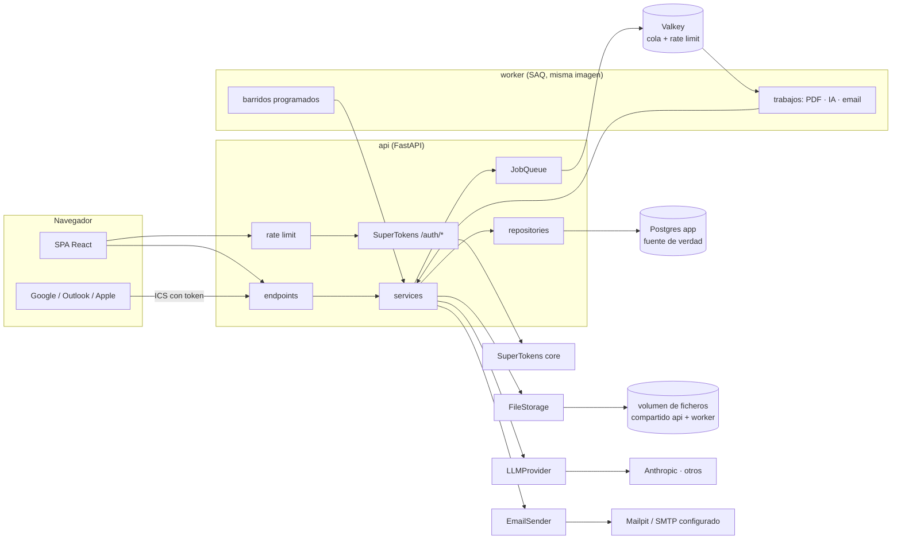
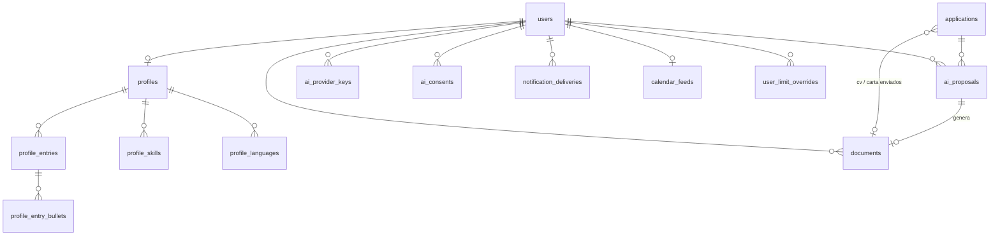

# Arquitectura de la v2

> Estado: **borrador** · Fecha: 2026-09-24 · Depende de la [especificación](../producto/especificacion.md) (fases F9–F17) · Nada de esto está construido todavía

Este documento amplía la [arquitectura de la v1](index.md) sin repetirla: todo lo que allí se decidió (capas, transacciones, propiedad de los datos, aislamiento, fechas…) sigue vigente. Las decisiones continúan la numeración (A18 en adelante). El detalle de los temas con más superficie está en documentos propios: [trabajo en segundo plano y emails](segundo-plano.md), [ficheros y PDF](ficheros.md), [IA](ia.md), [límites y abuso](limites-y-abuso.md) y la [ampliación de autenticación](autenticacion.md#8-ampliacion-de-la-v2-verificacion-y-recuperacion).

## 1. Decisiones

| # | Decisión | Elección | Alternativa descartada y por qué |
|---|---|---|---|
| A18 | Trabajo en segundo plano | **SAQ sobre Valkey**, con un servicio `worker` que usa la misma imagen que `api` con otro comando. Valkey es el fork con licencia BSD de Redis, compatible en protocolo | **ARQ** (la elección inicial de este borrador): en modo solo mantenimiento desde octubre de 2025; SAQ es su heredero natural, asíncrono, con tareas programadas y reintentos, y activo. **`BackgroundTasks` de FastAPI**: muere con el proceso que atiende la petición, sin reintentos ni tareas programadas. **Celery**: pensado para código síncrono, con un `beat` aparte. **SAQ sobre Postgres** (evita un servicio): considerado y descartado por el usuario a favor de Valkey, que sirve también al rate limiting (A28); SAQ cambia de uno a otro con la URL de la cola, así que la puerta sigue abierta. |
| A19 | Programación de avisos | **Barridos periódicos** (tareas programadas de SAQ) que buscan en la BD lo que toca enviar | **Encolar un trabajo diferido al crear cada recordatorio o entrevista**: se desincroniza en cuanto el usuario edita la fecha, completa el recordatorio o borra la entrevista, y hay que cancelar trabajos. El barrido lee el estado actual en cada pasada y se autorrepara. |
| A20 | "Nunca dos veces" (RF-87) | **Reclamar antes de enviar**: una fila en `notification_deliveries` con clave única por (usuario, tipo, motivo) se inserta y **confirma** antes de hablar con el SMTP | **Enviar y después registrar**: si el proceso muere entre ambas cosas, el reintento vuelve a enviar. **Marcar "enviado" en la misma transacción que el envío**: el SMTP no participa en la transacción. Ver [§5](#5-flujos). |
| A21 | Almacén de ficheros | **Disco local**: un volumen de Docker compartido por `api` y `worker`, detrás de una interfaz `FileStorage`. Un S3 (gestionado o autoalojado) será una segunda implementación cuando haga falta | **MinIO** (la elección inicial de este borrador): su edición comunitaria está archivada desde abril de 2026 y Docker Hub retiró sus imágenes en septiembre de 2026. **Garage, SeaweedFS o RustFS**: S3 autoalojado viable, pero cada uno es un servicio más con su propio arranque (claves, bucket, layout) para guardar PDFs de 5 MB en un único servidor, donde `api` y `worker` comparten disco de todos modos. La copia de seguridad es copiar el volumen junto al `pg_dump`. |
| A22 | Descarga de ficheros | **A través de la API** (`FileResponse`/`StreamingResponse`), comprobando la propiedad en cada petición | **Servir el volumen directamente desde Nginx**: se saltaría la comprobación de propiedad. **URLs prefirmadas** (si algún día hay S3): una URL filtrada sirve hasta que caduca. Con PDFs de 5 MB como mucho, pasar por la API no cuesta nada. |
| A23 | Ruta de cada fichero | `users/{user_id}/documents/{document_id}.pdf` **relativa a la raíz del almacén**, generada por el servidor. `FileStorage` rechaza cualquier ruta que, resuelta, salga de esa raíz | **Usar el nombre original del fichero**: inyección de rutas (`../`), colisiones y nombres con datos personales en disco. El nombre original se guarda saneado en la BD solo para mostrarlo. |
| A24 | Generación de PDF | **WeasyPrint** a partir de plantillas **HTML + CSS con Jinja2**, en el `worker` | **Chromium sin interfaz (Playwright)**: cientos de MB más en la imagen y mucha memoria en un VPS pequeño. **react-pdf en el navegador**: el `worker` no podría generar (IA, regenerar) y las plantillas quedarían atadas al frontend. **Typst o LaTeX**: buen resultado, pero un lenguaje de plantillas que nadie más del proyecto usa. WeasyPrint necesita librerías de sistema: es justo lo que valida F9 (R9). |
| A25 | Plantillas de CV | Una carpeta por diseño (`templates/cv/<diseño>/`) con HTML, CSS y un `manifest` (nombre, idiomas, si es apto para ATS) | **Plantillas en la BD**: editar CSS en una base de datos es incómodo y no se revisa en un diff. Un diseño nuevo es una carpeta nueva (RF-104). |
| A26 | Modelo del perfil | **Tablas normalizadas**: `profiles` (1:1 con el usuario), `profile_entries` (experiencia, formación, proyecto y certificación, con un `kind`), `profile_entry_bullets` (logros), `profile_skills`, `profile_languages` | **Un único documento JSONB**: más simple de editar, pero pierde las restricciones de la BD (límites, orden, fechas) y los identificadores estables de cada elemento, que la validación de la IA necesita (A31). **Una tabla por sección**: seis tablas casi iguales; `kind` las agrupa sin perder nada. |
| A27 | Documento generado | Guarda una **foto fija** de lo que se renderizó en `documents.content` (JSONB) | **Regenerar desde el perfil cada vez**: el CV que se envió cambiaría al editar el perfil, y RF-105 dice que es fijo. La foto también permite regenerar el PDF con otro diseño sin volver a llamar a la IA. |
| A28 | Rate limiting | Librería **`limits`** con **Valkey** (A18), detrás de una dependencia propia `rate_limit(...)`; un middleware aplica los límites por IP y por email a las rutas `/auth/*` de SuperTokens | **Solo Nginx**: no distingue usuarios ni emails, y no existe en desarrollo ni en pruebas. **En memoria del proceso**: cada réplica de uvicorn tendría su propio contador. |
| A29 | Límites por usuario | Valores globales en la configuración + tabla `user_limit_overrides`; un `LimitService` calcula consumo y restante | **Columnas de límite en `users`**: una migración por cada límite nuevo. **Planes o niveles**: lógica comercial `[C]`. |
| A30 | Cuotas con coste (almacenamiento, IA gratuita) | Se comprueban con la **fila del usuario bloqueada** (`SELECT … FOR UPDATE`) en la misma transacción que consume | **Comprobar y después insertar sin bloqueo** (como las cuotas de la v1): dos subidas simultáneas podrían pasarse del límite. Con solicitudes da igual pasarse en una; con dinero o disco, no. |
| A31 | Llamada a la IA | Interfaz propia `LLMProvider` con **un adaptador por proveedor** (SDK oficial dentro del adaptador). **Salida estructurada** validada con Pydantic, en la que cada experiencia y logro propuestos **referencian por id** un elemento del perfil | **Texto libre que se analiza después**: imposible comprobar qué se inventó. **Un SDK que unifique proveedores**: añade una dependencia opaca justo donde más control hace falta (formato de salida y errores de cada proveedor). |
| A32 | Validación de "no inventar" (RF-111) | Tres capas: **esquema** (la respuesta tiene la forma pedida), **referencias** (todo id existe en el perfil del usuario; si no, la propuesta queda `invalid`) y **revisión humana** (RF-113, RF-118) | **Confiar en el prompt**: un modelo sigue instrucciones casi siempre, y "casi" no basta. **Validar semánticamente el texto reformulado con otra llamada**: duplica el coste y sigue siendo probabilístico. Las exageraciones de redacción las detecta la persona, no el código (§8 de la especificación). |
| A33 | Versionado de prompts | Los prompts viven en ficheros del repositorio con una **versión explícita**; cada propuesta guarda proveedor, modelo y versión | **Prompts en la BD o editables en caliente**: cambian sin revisión ni pruebas, y no se puede reproducir por qué salió un CV. |
| A34 | Claves de API de usuario | **Fernet** (`cryptography`, en su variante `MultiFernet`) con una clave maestra en variable de entorno; se guarda el texto cifrado y los últimos 4 caracteres | **`pgcrypto` en la BD**: la clave maestra viajaría en las consultas SQL y podría acabar en logs. **Vault o un KMS**: otro servicio que operar en un VPS pequeño. `MultiFernet` permite rotar la clave maestra sin perder las claves guardadas. |
| A35 | Estado de un trabajo visible en la interfaz | En la **fila de dominio** (`documents.status`, `ai_proposals.status`); el frontend consulta ese recurso cada pocos segundos mientras esté pendiente | **Un endpoint genérico de trabajos que lee SAQ**: Valkey pasaría a ser fuente de verdad, y comprobar la propiedad de un trabajo exigiría otra tabla. Con el estado en Postgres, perder Valkey solo pierde trabajos en vuelo, que un barrido reencola. |
| A36 | Envío de emails | Plantillas **Jinja2** (HTML + texto plano) por tipo e idioma, enviadas con **`aiosmtplib`** desde el `worker`; SMTP configurado por variables de entorno (RNF-34) | **SDK de un proveedor (Resend, SES…)**: ata la instalación a ese proveedor, justo lo que RNF-34 descarta. **MJML**: un paso de compilación más para emails sencillos. |
| A37 | Emails de SuperTokens (verificación, recuperación) | Se **sustituye su entrega** (`EmailDeliveryInterface`) para que pasen por el mismo `EmailSender`: mismas plantillas, idiomas y cola | **La entrega SMTP integrada de SuperTokens**: segunda configuración SMTP, otras plantillas y otro idioma que mantener. |
| A38 | Verificación de email | Receta `EmailVerification` en modo **`OPTIONAL`**; las funciones con coste dependen de `require_verified_email`, que comprueba el *claim* en el backend | **Modo `REQUIRED`**: bloquearía toda la app sin verificar, contra lo decidido (RF-06). **Comprobarlo solo en la interfaz**: no protege nada. |
| A39 | Zona horaria | `users.timezone` con un nombre IANA (`Europe/Madrid`), validado contra `zoneinfo`; el frontend la envía si está vacía. **[construido en F11]**, con el paquete `tzdata` de Python (ver la trampa de abajo) | **Un desfase numérico (`+02:00`)**: se rompe dos veces al año con el horario de verano. |
| A40 | Calendario ICS | Endpoint **público** `GET /calendar/{token}.ics`; en la BD solo se guarda el **hash** del token; generado con la librería `icalendar` | **Token en claro en la BD**: una fuga de la base expondría todos los calendarios. **Un JWT firmado**: no se puede revocar sin guardar una lista, que es lo que ya se hace. |
| A41 | Tablero Kanban | Endpoint ligero `GET /applications/board` (tarjetas mínimas agrupadas por estado, con total y las primeras 50 de cada columna); el arrastre usa el cambio de estado existente. **dnd-kit** en el frontend | **Reutilizar el listado paginado**: máximo 100 por página y sin agrupar. **Arrastrar y soltar nativo de HTML5**: sin soporte táctil ni de teclado (RF-123). |
| A42 | Documentación de producción | **Docusaurus** en `manual/`, con i18n (es, en) y la referencia de la API generada desde `docs/referencia/openapi.json`. MkDocs sigue para desarrollo. Revisa A17: ver [decisión 0010](../decisiones/0010-docusaurus-para-la-documentacion-de-produccion.md) | **MkDocs para los dos públicos** (con un plugin de i18n): viable, pero mezcla en un sitio al usuario final y a quien programa. A17 descartó Docusaurus por meter "un segundo ecosistema Node", pero el frontend ya es Node y ahora el público y las necesidades son otras. |

## 2. Vista general

- El `worker` **reutiliza los services**: un trabajo es una función fina que abre su propia sesión de BD, llama a un service y confirma, igual que un endpoint. No hay lógica de negocio en los trabajos.
- La API **no** llama a la IA ni genera PDFs dentro de una petición (RNF-12): crea la fila en estado pendiente, encola y responde `202`.

## 3. Consistencia entre almacenes

La v2 pasa de dos almacenes a cinco (Postgres de la app, SuperTokens, el volumen de ficheros, Valkey y el SMTP). La regla general es que **Postgres manda y todo lo demás es derivado o transitorio**.

| Par | Quién manda | Orden de escritura | Orden de borrado | Si algo falla a medias |
|---|---|---|---|---|
| Postgres ↔ volumen de ficheros | **Postgres** | Primero el fichero (escrito a un temporal y renombrado, con una ruta generada con un UUID nuevo) y después la fila, en una transacción | Primero la fila (commit) y después el fichero | Quedan **ficheros huérfanos** (sin fila), nunca filas que apuntan a nada. Un barrido diario borra los ficheros sin fila con más de una hora. |
| Postgres ↔ Valkey (cola) | **Postgres** | La fila en estado `pending` se confirma **antes** de encolar | — | Si Valkey pierde el trabajo o el encolado falla tras el commit, un barrido reencola las filas `pending` o `running` con más de N minutos. Encolar dos veces es inocuo porque el trabajo comprueba el estado de la fila al empezar. |
| Postgres ↔ Valkey (rate limit) | **Valkey**, pero es desechable | — | Caduca solo | Perder Valkey reinicia los contadores: se acepta. |
| Postgres ↔ SuperTokens | **SuperTokens** para identidad y verificación | Igual que la v1 | BD propia → SuperTokens → ficheros del usuario (RNF-41) | Igual que la v1; los ficheros huérfanos los limpia el barrido. |
| Postgres ↔ SMTP | **Postgres** (el reclamo) | Reclamo confirmado → envío → marcar como enviado | — | Ver el flujo de notificaciones (§5): mejor perder un email que enviarlo dos veces. |

> **Trampa — encolar dentro de la transacción.** Si el service encola el trabajo antes del `commit` y la transacción falla, el `worker` recibe un trabajo sobre una fila que no existe. Y si el `worker` es más rápido que el `commit`, lee la fila antes de que se confirme y no la ve. Se encola siempre **después** del `commit`, y el barrido cubre el caso contrario (commit hecho, encolado fallido).

## 4. Modelo de datos (ampliación)

Se mantienen las convenciones de la v1: UUID, `created_at` con `clock_timestamp()`, enumerados con `CHECK` (A5), `user_id` en las tablas raíz y FKs compuestas `(id, user_id)` entre raíces (A9).

### Las tablas que hay que acertar a la primera

**`documents`**. La biblioteca (RF-90…94) y el resultado de generar y de la IA.

| Columna | Tipo | Notas |
|---|---|---|
| `user_id` | `uuid NOT NULL` | FK `users` `ON DELETE CASCADE`; `UNIQUE (id, user_id)` |
| `kind` | `varchar(20) NOT NULL` | `CHECK IN ('cv','cover_letter')` |
| `origin` | `varchar(20) NOT NULL` | `CHECK IN ('uploaded','generated','ai_tailored')` |
| `status` | `varchar(20) NOT NULL` | `CHECK IN ('pending','ready','failed')`. Un subido nace `ready`; uno generado, `pending` (A35). |
| `name` | `varchar(200) NOT NULL` | Nombre visible; el original del fichero, saneado |
| `storage_key` | `varchar(300)` | `NULL` mientras está `pending`. `CHECK (status <> 'ready' OR storage_key IS NOT NULL)` |
| `size_bytes` | `integer` | Suma del almacenamiento usado (§10 de la especificación) |
| `sha256` | `char(64)` | Integridad y detección de duplicados |
| `template` / `language` | `varchar(50)` / `varchar(2)` | Solo en los generados |
| `content` | `jsonb` | **Foto fija** de lo renderizado (A27). `NULL` en los subidos. |
| `ai_proposal_id` | `uuid` | FK compuesta a `ai_proposals`, solo en `origin = 'ai_tailored'` |
| `archived_at` | `timestamptz` | RF-93: archivar en vez de borrar |

**`applications`** (columnas nuevas):

| Columna | Tipo | Notas |
|---|---|---|
| `job_description` | `text` | `CHECK (char_length(job_description) <= 20000)` (RF-27) |
| `cv_document_id` | `uuid` | FK compuesta `(cv_document_id, user_id) → documents(id, user_id)` **`ON DELETE RESTRICT`** (RF-93) |
| `cover_letter_document_id` | `uuid` | Igual que la anterior |

El `kind` correcto (que el CV sea un CV) lo valida el service: una FK no puede comprobar una columna de la fila referenciada.

**`ai_proposals`**. Cada uso de la IA. También es el **registro de consumo**: la cuota gratuita y el tope global se calculan a partir de esta tabla, sin contadores aparte que puedan desincronizarse.

| Columna | Tipo | Notas |
|---|---|---|
| `user_id`, `application_id` | `uuid NOT NULL` | FK compuesta a `applications` `ON DELETE CASCADE` |
| `kind` | `varchar(20) NOT NULL` | `cv` o `cover_letter` |
| `status` | `varchar(20) NOT NULL` | `queued`, `running`, `succeeded`, `invalid` (no pasó la validación de A32), `rejected` (RF-119: oferta insuficiente), `failed` |
| `key_source` | `varchar(10) NOT NULL` | `platform` o `user`. Solo `platform` cuenta para la cuota y el tope (RF-152). |
| `provider`, `model`, `prompt_version` | `varchar` | RF-115, A33 |
| `billable` | `boolean NOT NULL DEFAULT false` | `true` en cuanto el proveedor devolvió una respuesta: **eso es lo que consume un uso**, pase o no la validación. Un fallo antes de llamar no consume. |
| `input_tokens`, `output_tokens`, `cost_micros` | `integer`, `integer`, `bigint` | Coste estimado con los precios de la configuración |
| `proposal` / `gaps` | `jsonb` | Propuesta validada y carencias (RF-112) |
| `error_code` | `varchar(50)` | Código estable que se traduce en la interfaz |

Índices: `(user_id, key_source) WHERE billable` para la cuota y `(created_at) WHERE key_source = 'platform' AND billable` para el tope global mensual.

**`notification_deliveries`**. Lo que hace posible RF-87.

| Columna | Tipo | Notas |
|---|---|---|
| `user_id` | `uuid NOT NULL` | FK con cascade |
| `kind` | `varchar(30) NOT NULL` | `reminder_due`, `interview_upcoming`, `weekly_digest`, `stale_application` |
| `dedupe_key` | `varchar(200) NOT NULL` | Qué hace único el motivo: `reminder:<id>`, `interview:<id>:<scheduled_at>`, `digest:<año>-W<semana>`, `stale:<application_id>:<last_activity_at>` |
| `status` | `varchar(20) NOT NULL` | `claimed`, `sent`, `failed` (falló **antes** de entregarse al SMTP: se puede reintentar), `unknown` (no se sabe si salió: **no** se reintenta) |
| `attempts` | `smallint NOT NULL DEFAULT 0` | |
| `sent_at` | `timestamptz` | |

`UNIQUE (user_id, kind, dedupe_key)`. Incluir `scheduled_at` o `last_activity_at` en la clave hace que, si el usuario **mueve** la entrevista o la solicitud vuelve a tener actividad y a quedarse quieta, el aviso nuevo sea otro motivo, y no un duplicado bloqueado.

### Resto de tablas

- **`profiles`**: `user_id` (UNIQUE), `full_name`, `headline`, `contact_email`, `phone`, `location`, `links` (JSONB: lista de `{label, url}`), `summary` (`text`, máximo 2 000 caracteres).
- **`profile_entries`**: `profile_id`, `kind` (`experience`, `education`, `project`, `certification`), `title`, `organization`, `location`, `start_date`, `end_date`, `is_current`, `description`, `position` (orden). `CHECK (is_current OR end_date IS NULL OR end_date >= start_date)`.
- **`profile_entry_bullets`**: `entry_id`, `text` (máximo 500), `position`. Son los logros que la IA reformula y referencia.
- **`profile_skills`**: `profile_id`, `name`, `category`, `level` (opcional, enumerado), `position`. Único `(profile_id, lower(name))`.
- **`profile_languages`**: `profile_id`, `language`, `level` (enumerado MCER + nativo), `position`.
- **`ai_provider_keys`**: `user_id`, `provider` (enumerado de los soportados), `ciphertext` (`bytea`), `last4`, `validated_at`. `UNIQUE (user_id, provider)`.
- **`ai_consents`**: `user_id`, `provider`, `text_version`, `granted_at`, `revoked_at`. El consentimiento vigente es el último sin revocar para ese proveedor **y** la versión actual del texto (RF-154, [IA §8](ia.md#8-consentimiento-rf-116-rf-154)).
- **`calendar_feeds`**: `user_id` (UNIQUE), `token_hash` (`char(64)`, UNIQUE), `enabled`, `last_accessed_at`.
- **`user_limit_overrides`**: `user_id`, `limit_key` (enumerado), `value` (`integer`). PK `(user_id, limit_key)`.
- **`users`** (columnas nuevas, preferencias como las de F8): `timezone varchar(64)`, `notify_reminder_due`, `notify_interview`, `notify_weekly_digest`, `notify_stale` (`boolean` con los valores por defecto de RF-84), `interview_notice_hours smallint DEFAULT 24`, `ai_provider varchar(30)` (qué clave propia usar; `NULL` = la de la plataforma).

## 5. Flujos

### Un trabajo en segundo plano (genérico)

| Paso | Dónde | Qué hace |
|---|---|---|
| 1 | Endpoint | Valida y llama al service |
| 2 | Service | Comprueba límites y permisos (email verificado, cuota con la fila de usuario bloqueada, A30), crea la fila `pending` y hace **commit** |
| 3 | Service | **Después** del commit, encola el trabajo con el id de la fila |
| 4 | Endpoint | Responde `202` con el recurso en estado `pending` |
| 5 | Worker | Abre sesión, carga la fila **por id y `user_id`**; si ya no está `pending`, termina sin hacer nada (idempotencia) |
| 6 | Worker | Hace el trabajo llamando al service correspondiente y deja la fila `ready`/`succeeded` o `failed` con un `error_code` |
| 7 | Frontend | Mientras la fila está pendiente, la consulta cada pocos segundos (A35) |

### Subir un documento (RF-90, RNF-05)

1. `POST /documents` (multipart). Límite de tamaño aplicado **mientras se lee** el cuerpo, no después de cargarlo entero en memoria.
2. Se comprueba la **firma** del fichero (`%PDF-`) y que se pueda abrir como PDF sin ejecutar nada. No se renderiza ni se extrae texto.
3. Con la fila del usuario bloqueada: almacenamiento usado + tamaño ≤ límite, y documentos ≤ límite.
4. Se escribe el fichero en una ruta nueva (A23), primero a un temporal y luego renombrado para que nunca quede un PDF a medias, y **después** se inserta la fila y se hace commit (§3).

### Ajuste de CV con IA (RF-110…119, RF-150…156)

| Paso | Qué hace | Cómo falla |
|---|---|---|
| 1 | `POST /applications/{id}/ai-proposals` `{kind: "cv"}` | 404 si la solicitud es ajena |
| 2 | Requisitos previos: email verificado (A38), consentimiento vigente para el proveedor que se va a usar (RF-154), perfil con al menos una experiencia, `job_description` no vacía | Códigos estables: `email_not_verified`, `ai_consent_required`, `profile_incomplete`, `job_description_missing` |
| 3 | **Elegir la clave**: si `users.ai_provider` tiene clave propia → esa, sin mirar la cuota. Si no → clave de la plataforma, comprobando con la fila de usuario bloqueada la cuota gratuita (usos `billable` con `key_source = platform`) y el tope global del mes | `ai_free_quota_exhausted` (con el enlace de RF-156), `ai_global_cap_reached` |
| 4 | Fila `queued` + commit + encolar | — |
| 5 | Worker: arma la entrada **sin datos de contacto** (RNF-06): experiencias, logros y habilidades con sus ids, y la oferta **delimitada como datos** (RNF-07) | — |
| 6 | Si la oferta es demasiado corta, el propio modelo lo señala en un campo del esquema, o se descarta antes con reglas simples | `rejected` (RF-119) |
| 7 | Llamada al adaptador; al recibir respuesta, `billable = true` | Error del proveedor → `failed` con `ai_provider_auth` / `ai_provider_quota` / `ai_provider_unavailable`. **Nunca** se reintenta con la clave de la plataforma (RF-152). |
| 8 | Validación (A32): esquema → cada id de experiencia, logro y habilidad existe en el perfil de **este** usuario | `invalid`: cuenta como uso consumido, pero no se ofrece como propuesta |
| 9 | `succeeded` con la propuesta y las carencias; el usuario la revisa y edita (RF-113) | — |
| 10 | Al confirmar: se crea un `document` `ai_tailored` en `pending` con la foto fija editada (A27) y se genera el PDF como cualquier otro | — |

### Enviar una notificación (RF-80…87, A20)

1. Un barrido programado (cada minuto) busca candidatos: recordatorios pendientes vencidos, entrevistas dentro de la antelación configurada, etc., solo de usuarios con email verificado y ese tipo activado.
2. Por cada candidato: `INSERT … ON CONFLICT (user_id, kind, dedupe_key) DO NOTHING` con `status = 'claimed'`, y **commit**. Si no se insertó, ya se reclamó antes: se salta.
3. Se envía por SMTP.
4. Según el resultado:
    - aceptado por el servidor → `sent`;
    - fallo **antes** de entregar el mensaje (no conecta, rechaza la autenticación) → `failed`: se puede reintentar (hasta 3 intentos, con espera creciente);
    - fallo **ambiguo** (se corta la conexión tras enviar los datos) → `unknown`, y no se reintenta.
5. Un reclamo que siga en `claimed` pasado un tiempo (el proceso murió a mitad) pasa a `unknown`, nunca a reenviarse.

> **Trampa — "mejor esfuerzo con reintentos" y "nunca dos veces" tiran en direcciones opuestas.** Reintentar lo que falló es justo lo que produce duplicados cuando el fallo fue ambiguo: el servidor recibió el mensaje, pero la confirmación no llegó. La salida es distinguir **dónde** falló: solo se reintenta lo que con seguridad no salió.

### Resumen semanal por zona horaria (RF-82)

El barrido corre **cada hora** y selecciona a los usuarios para los que, en su `timezone`, es lunes y ya pasó la hora de envío. La `dedupe_key` con la semana ISO **local** (`digest:2026-W40`) evita el duplicado aunque el barrido pase varias veces esa mañana. Un usuario sin `timezone` usa UTC.

### Borrado de cuenta ampliado (RNF-41)

Igual que en la v1 (BD propia → SuperTokens) y, además, **después**: se borra el directorio `users/{user_id}/` del almacén de ficheros. Si esto falla, los ficheros quedan huérfanos y el barrido diario los borra. Las claves de IA, consentimientos, propuestas, entregas y el feed ICS caen por `ON DELETE CASCADE`.

### Feed ICS (RF-132…134)

`GET /calendar/{token}.ics` fuera del router protegido: se calcula el hash del token, se busca un feed habilitado, se aplica el rate limit por token y se genera el calendario (entrevistas y recordatorios pendientes de −30 a +180 días), con título, empresa y hora. Nada de notas ni descripciones.

### Petición con coste y rate limit

`rate_limit` es una dependencia que se declara en el endpoint (`Depends(rate_limit("ai", per_user="5/minute"))`), igual que `get_current_user`. Responde `429` con `Retry-After` y el código `rate_limited`. Para `/auth/*`, que sirve SuperTokens y no pasa por nuestros endpoints, un middleware **anterior** al de SuperTokens aplica el límite por IP y, en inicio de sesión y recuperación, por email leído del cuerpo.

> **Trampa — la IP del cliente detrás de un proxy.** Detrás de Nginx, todas las peticiones llegan desde la IP del proxy, y un límite por IP pasaría a ser global. Pero confiar en `X-Forwarded-For` desde cualquier origen permite que un atacante lo falsee y esquive el límite. Solo se lee esa cabecera si la petición viene de un proxy de confianza configurado (`TRUSTED_PROXIES`).

## 6. Servicios externos (ampliación)

| Servicio | Detrás de qué | En pruebas |
|---|---|---|
| Cola de trabajos | Interfaz `JobQueue` (encolar por nombre y argumentos) | Una implementación en memoria que registra lo encolado; las funciones de trabajo se llaman directamente |
| Almacén de ficheros | `FileStorage` (`put`, `open`, `delete`, `delete_prefix`, `iter_keys`); implementación `LocalFileStorage` | La misma implementación sobre un directorio temporal por prueba: el disco local no necesita doble |
| IA | `LLMProvider` con un adaptador por proveedor | **Nunca** se llama al proveedor (RNF-23): un adaptador simulado con respuestas grabadas, incluidas respuestas malformadas o que inventan ids |
| Email | `EmailSender` | Un doble que acumula los mensajes; una prueba de humo contra Mailpit |
| Rate limit | Dependencia `rate_limit` sobre `limits` + Valkey | Valkey real en `compose.test.yml` |
| Reloj | Las funciones de barrido reciben "ahora" como parámetro | Se prueban con fechas fijas, sin dormir ni congelar el reloj global |

## 7. Aislamiento entre usuarios (ampliación)

- Todo lo nuevo sigue la v1: `user_id` obligatorio en los repositories y FKs compuestas entre raíces. La prueba adversa por OpenAPI (T2/T3) cubre sola los endpoints nuevos con id.
- **Superficies nuevas que la prueba por OpenAPI no cubre**, con pruebas propias:
    - un trabajo del `worker` que recibe un id de otro usuario no lo procesa (siempre carga por id **y** `user_id`);
    - una propuesta de IA cuyos ids referencian elementos del perfil **de otro usuario** es `invalid`;
    - el feed ICS de un token solo devuelve los eventos de su dueño;
    - un enlace de baja de notificaciones firmado para un usuario no sirve para otro.
- **Endpoints públicos** (sin `get_current_user`): `health`, el feed ICS y la baja de notificaciones. Viven en una **lista blanca explícita** que la prueba T1 conoce; cualquier otro endpoint sin sesión la hace fallar.

## 8. Invariantes (ampliación)

Continúan la lista de la v1:

9. **Postgres es la única fuente de verdad.** Valkey y el volumen de ficheros son derivados o transitorios: perder Valkey solo pierde trabajos en vuelo (que el barrido reencola) y contadores de rate limit.
10. Ningún documento `ready` apunta a un fichero inexistente. Se escribe el fichero antes que la fila y se borra la fila antes que el fichero.
11. Se encola siempre **después** del `commit`, nunca dentro de la transacción.
12. Un email por (usuario, tipo, motivo): se reclama y se confirma en la BD antes de enviarlo, y un reclamo con resultado desconocido nunca se reenvía.
13. Nada llega a la IA sin pasar por el filtro de minimización (RNF-06), y nada de lo que devuelve se guarda como propuesta válida sin pasar la validación de A32.
14. Con clave propia configurada **nunca** se usa la de la plataforma.
15. Las claves de API de usuario solo existen cifradas en la BD y en claro dentro del `worker` durante una llamada: nunca en respuestas, logs ni mensajes de error.
16. Las funciones con coste comprueban el email verificado **en el backend**.
17. Las cuotas con coste (almacenamiento, IA gratuita) se comprueban con la fila del usuario bloqueada.
18. Todo endpoint sin sesión está en la lista blanca de endpoints públicos.

## 9. Entorno

Servicios nuevos en `compose.yml`: `valkey`, `worker`, `mailpit` (interfaz web en desarrollo) y `manual` (Docusaurus), más el volumen `files_data` que comparten `api` y `worker`. `compose.test.yml` añade `valkey-test`. El detalle —imágenes, puertos, volúmenes, variables— está en [Servicios y estructura](servicios-y-estructura.md#8-ampliacion-de-la-v2).

Memoria aproximada en producción (para dimensionar el VPS cuando se retome F7): Postgres ×2, SuperTokens core, api, worker, Valkey y Nginx caben en **2 GB con algo de margen**; con 4 GB, holgados. WeasyPrint y las llamadas a la IA ocurren en el `worker`, que es lo que más memoria puede pedir en picos.

## 10. Pruebas (ampliación)

| Nivel | Qué cubre de nuevo |
|---|---|
| Repositories | Restricciones nuevas (`RESTRICT` de documentos usados, unicidad de entregas, límites del perfil), consultas de los barridos |
| Services | Cuotas con bloqueo (dos consumos simultáneos no se pasan del límite), elección de clave sin *fallback*, validación de propuestas (ids inventados, de otro usuario, esquema roto), máquina de estados de las entregas |
| Worker | Cada trabajo llamado directamente: idempotencia (fila que ya no está pendiente), fallos a mitad y barridos con "ahora" fijo |
| API | Contrato, códigos de error estables, `429`, subida con ficheros que no son PDF o que superan el tamaño, endpoints públicos |
| Adversas nuevas | Claves de API que no aparecen en ninguna respuesta ni log; prompt injection grabada en la descripción que no cambia el esquema de salida; feed ICS con token inválido o de otro usuario |
| IA (evaluación manual) | Conjunto pequeño de perfiles y ofertas reales por cada proveedor habilitado, ejecutado a mano; nunca en CI (RNF-23) |
| Frontend | Estados pendientes con sondeo, revisión lado a lado (RF-118), movimiento en el tablero por teclado (RF-123) |

## 11. Orden de implementación

| Fase | En concreto |
|---|---|
| **F9** | `valkey`, `worker`, `mailpit` y el volumen de ficheros en compose. Un endpoint temporal encola un trabajo que genera un PDF de una línea con WeasyPrint, lo guarda en el volumen y envía un email a Mailpit con un enlace de descarga por la API. Imagen del backend con las dependencias de sistema de WeasyPrint. **Se desecha** al terminar; lo que queda son `JobQueue`, `FileStorage` y `EmailSender`. |
| **F10** | `manual/` con Docusaurus e i18n, servicio `manual` en compose, plugin de OpenAPI apuntando a `docs/referencia/openapi.json`, CI que construye el manual y el agente documentador ampliado a los dos sitios. |
| **F11** | Recetas de SuperTokens (`EmailVerification` y reset de contraseña) con entrega por `EmailSender`, `require_verified_email`, `users.timezone`, `user_limit_overrides` y `LimitService` con `GET /me/usage`, rate limiting (dependencia + middleware de `/auth/*`), página de uso y avisos del 80 %. |
| **F12** | `notification_deliveries`, preferencias en `users`, barridos, plantillas de email, enlaces de baja firmados (endpoint público). |
| **F13** | `documents`, subida con validación, descarga por la API, biblioteca en el frontend, columnas nuevas de `applications`, barrido de huérfanos, borrado de cuenta ampliado. |
| **F14** | Tablas del perfil, editor del perfil, plantillas (tres diseños), generación en el `worker` con foto fija. |
| **F15** | `ai_proposals`, `ai_provider_keys`, `ai_consents`, `LLMProvider` con el adaptador de la plataforma y al menos uno más, validación, revisión lado a lado, carta de presentación, cuota y tope. Antes de empezar se fijan con precios reales la cuota gratuita y el tope global (R7). |
| **F16** | `GET /applications/board` y el tablero con dnd-kit. |
| **F17** | `calendar_feeds`, feed ICS público, vista de calendario, enlaces por evento. |

## 12. Riesgos de esta arquitectura

| Riesgo | Mitigación |
|---|---|
| **Dependencias que se abandonan** (ya pasó dos veces en este diseño: ARQ y MinIO) | Todo pasa por interfaces propias (`JobQueue`, `FileStorage`, `LLMProvider`, `EmailSender`): las funciones de trabajo son funciones asíncronas normales y el disco es disco. Cambiar SAQ por otra cola o el disco por S3 no toca los services. Revisar el estado de cada dependencia al empezar su fase. |
| **El disco local ata `api` y `worker` al mismo servidor** | Es exactamente el despliegue previsto (un VPS). Si algún día el `worker` corre en otra máquina, se añade la implementación S3 de `FileStorage` y se cambia la configuración. |
| WeasyPrint y sus librerías de sistema en la imagen (R9) | **Resuelto en F9** ([ficheros §7](ficheros.md#fuentes)) |
| Los barridos cada minuto cargan la BD | Consultas sobre índices parciales (`WHERE status = 'pending'`), lotes acotados y sin barrer usuarios sin email verificado |
| El *claim* de verificación de SuperTokens va dentro del access token: tras verificar, el backend puede seguir viendo "sin verificar" hasta el refresco | Ver [autenticación §8](autenticacion.md#8-ampliacion-de-la-v2-verificacion-y-recuperacion): ante un "no", se vuelve a consultar al core |
| Cambios de API de los SDK de cada proveedor de IA | Cada SDK solo se importa en su adaptador; la evaluación manual por proveedor lo detecta |
| Más servicios, más memoria (§9) | Dimensionado para 2–4 GB; Valkey se puede sustituir por un Redis gestionado cambiando la URL |
| El plugin de OpenAPI de Docusaurus rompe con versiones nuevas | Versiones fijadas, igual que MkDocs (R4) |
| **Sobreingeniería (R15)** | Cada pieza nueva responde a un requisito numerado; F9 se desecha; las interfaces (`JobQueue`, `FileStorage`, `LLMProvider`, `EmailSender`) existen porque cada una tiene ya una segunda implementación real (el doble de pruebas) y no por un futuro hipotético. |
