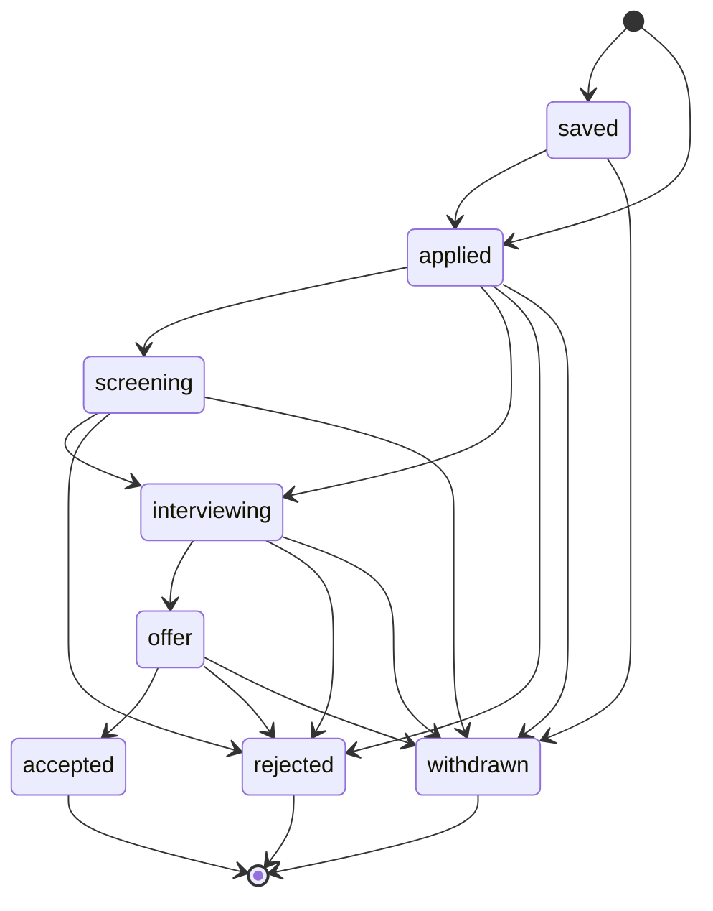

# Especificación de producto

> Estado: v1 (MVP, F0–F8) construida · **v2** especificada y diseñada el 2026-09-24; construidas F9 (infraestructura) y F10 (manual de producción), el resto pendiente

!!! info "Cómo leer este documento"
    La **v1** (MVP) está construida: sus requisitos describen lo que existe. La **v2** (fases F9–F17) está especificada pero **no construida**; sus requisitos llevan la fase en la que se construyen, por ejemplo `[F12]`. Una sola fuente de verdad para las dos, con la numeración continua.

## 0. Contexto del proyecto

**Naturaleza:** proyecto de portfolio que además se usará de verdad para gestionar una búsqueda de empleo real. Los datos importan (no es un ejercicio desechable), pero no hay clientes, facturación ni compromisos de servicio.

Calibración:

| Cajón | Qué entra |
|---|---|
| **Con rigor** | Modelo de datos, ciclo de vida de la solicitud, aislamiento de datos entre usuarios, arquitectura en capas, autenticación, pruebas (incluidas las adversas). |
| **Barato con la costura puesta** | Recordatorios (solo en la app, con canal preparado para email y otros medios), origen de la solicitud (solo manual, preparado para importación), exportación de datos. |
| **Pospuesto `[C]`** | Todo lo propio de producto comercial: planes y facturación, textos legales, periodo de gracia antes de purgar una cuenta borrada, administración de usuarios, SLAs y guardia, analítica de uso. |

Lo marcado con **`[C]`** está considerado y descartado para el MVP, no olvidado.

> **Recalibración de la v2 (2026-09-24): registro abierto.** La instancia desplegada admitirá que cualquiera se registre, y la v2 añade cosas que cuestan dinero (IA) o recursos (ficheros, emails). Eso mueve al cajón **con rigor** los límites por usuario, el rate limiting, la verificación de email y el control del gasto, y rescata del cajón `[C]` lo mínimo de "textos legales" que exige enviar datos personales a un tercero: un aviso de privacidad y un consentimiento explícito antes de usar la IA (RF-116). El resto de lo comercial (planes, facturación, administración con interfaz) sigue pospuesto.

> **Cambio de alcance (F8, 2026-09-24):** el borrado de cuenta (RNF-40) estaba pospuesto `[C]` en este borrador y pasó a construirse dentro de F8, a petición explícita del usuario. Solo entra el borrado **inmediato y completo**; el periodo de gracia antes de purgar de verdad (permitir deshacer un borrado por error) sigue pospuesto, ver la fila de arriba. Detalle en [decisión 0008](../decisiones/0008-borrado-de-cuenta-en-f8.md).

## 1. Visión

Applications Tracker es un **cuaderno de bitácora de una búsqueda de empleo**: registra cada solicitud a un puesto, cómo avanza (cambios de estado, entrevistas) y qué hay que hacer a continuación, para que ninguna candidatura se quede olvidada y se pueda ver de un vistazo cómo va la búsqueda.

> *Todas tus candidaturas, su historia y tu próximo paso, en un solo sitio.*

**Qué NO es:**

- No es un portal de empleo ni un buscador de ofertas: no descubre ofertas, las registra quien busca.
- No es un ATS (herramienta de recruiters): el usuario es el candidato, no la empresa.
- No es un gestor de correo ni un CRM de contactos: no lee correos ni sincroniza agendas.
- No automatiza candidaturas: no rellena formularios ni envía CVs. Desde la v2 **genera** CVs y cartas, pero enviarlos lo hace siempre el usuario.
- No es un generador de experiencia: la IA reordena y reformula lo que el usuario ha contado de sí mismo, nunca añade nada (RF-111).

## 2. Decisiones tomadas

| Decisión | Valor | Implicación principal |
|---|---|---|
| Naturaleza | Portfolio + uso propio | Rigor en el núcleo técnico; lo comercial se pospone `[C]`. |
| Usuarios | Varias personas, cada una con sus datos privados | Todo dato pertenece a un usuario; no hay datos compartidos ni equipos. |
| Entrada de datos | Registro manual | Sin scraping ni lectura de correo. Campo `origin` como costura para importar después. |
| Profundidad del proceso | Estado actual + historial de cambios + entrevistas | Se pueden calcular tiempos y tasas; hay reglas de transición de estado. |
| Recordatorios | En la app, preparados para otros canales | Entidad propia con `channel`; sin trabajos en segundo plano en el MVP. |
| Autenticación | SuperTokens, email + contraseña | Sin login social en el MVP. |
| Idiomas de la interfaz | Español e inglés | Todo texto visible pasa por i18n desde el primer día. Por defecto se detecta el del navegador; desde F8 se puede fijar uno explícito como preferencia de cuenta. |
| **v2** · Registro | Abierto a cualquiera | Límites, rate limiting, verificación y control de gasto son defensas reales, no simbólicas. |
| **v2** · Verificación de email | Exigida solo para lo que tiene coste | La app se usa sin verificar; IA, ficheros y emails de notificación exigen email verificado (RF-06). No bloquea las cuentas existentes. |
| **v2** · CVs | Biblioteca de documentos reutilizable | CVs y cartas (subidos, generados o adaptados) viven en una biblioteca; cada solicitud apunta al que se envió. Un documento sirve para varias solicitudes. |
| **v2** · IA | Ajuste guiado en un paso, con revisión | Una propuesta estructurada que el usuario revisa y edita antes de generar nada. Sin chat. |
| **v2** · Quién paga la IA (cierra R7) | Cuota gratuita **fija y sin renovación** con la clave de la plataforma; después, **clave propia** del usuario | Cada cuenta tiene N usos gratis para probar; quien quiera más aporta su clave de uno de los proveedores habilitados en la instalación. Hay que soportar varios proveedores de verdad y guardar secretos de usuarios cifrados (RF-150…156). |
| **v2** · Notificaciones | Email, mejor esfuerzo con reintentos | Cuatro tipos, cada uno desactivable. No es entrega garantizada; sí es **nunca dos veces** por el mismo motivo (RF-87). |
| **v2** · Calendario externo | Suscripción ICS, sin OAuth | Google, Outlook y Apple se sincronizan solos con un enlace privado. La sincronización bidireccional con la API de Google no se construye. |
| **v2** · Servidor de correo | Mailpit en desarrollo; en producción, el que configure quien despliega | La aplicación no elige ni trae proveedor: el SMTP se configura con variables de entorno al levantar el servicio. Sin configurar, la aplicación arranca igual y lo que depende del email se muestra como no disponible (RNF-34). |
| **v2** · Documentación de producción | Docusaurus, español e inglés | Sitio aparte del MkDocs de desarrollo, con tres partes: **despliegue** en producción, **manual de uso** de las funcionalidades y **referencia de la API** de todo el sistema. MkDocs sigue siendo para quien trabaja en el código. |

## 3. Usuarios y roles

**Persona única: el candidato.** Alguien en búsqueda activa que envía decenas de solicitudes en paralelo y necesita saber en qué punto está cada una.

Hay un único rol (`user`). No hay administración en el MVP `[C]`.

| Acción | Usuario autenticado | Visitante |
|---|---|---|
| Registrarse / iniciar sesión | — | ✔ |
| Crear, ver, editar, archivar y borrar **sus** solicitudes, empresas, entrevistas y recordatorios | ✔ | ✘ |
| Ver datos de otro usuario | ✘ (nunca, ni sabiendo el id) | ✘ |
| Ver su dashboard | ✔ | ✘ |
| Exportar sus datos | ✔ | ✘ |
| Recuperar la contraseña por email | — | ✔ |
| Mantener su perfil profesional, generar CVs y ver su calendario | ✔ | ✘ |
| Usar la IA, subir o generar ficheros, recibir emails de notificación | ✔ **solo con email verificado** | ✘ |
| Añadir su propia clave de API de IA | ✔ | ✘ |
| Suscribirse a su calendario desde otra aplicación | ✔ (enlace privado, sin sesión) | ✘ |

En la v2 sigue sin haber rol de administrador con interfaz `[C]`. Ajustar el límite de un usuario concreto se hace con un script de administración en el servidor (RF-143).

## 4. Modelo de dominio

```
Usuario
├── Empresa ─────────────┐   organización a la que se aplica; reutilizable entre solicitudes
├── Solicitud ◄──────────┘   candidatura a un puesto concreto en una empresa
│   ├── Cambio de estado     cada transición del ciclo de vida, con fecha y nota
│   └── Entrevista           cada entrevista del proceso: fecha, tipo, formato, resultado
└── Recordatorio             próxima acción con fecha; opcionalmente ligada a una solicitud
```

- **Empresa**: nombre, web, ubicación, notas. Existe para no repetir datos y para agrupar ("¿cuántas veces he aplicado a X?"). Su nombre es único por usuario.
- **Solicitud**: la entidad central. Puesto, empresa, URL de la oferta, ubicación, modalidad (presencial/híbrido/remoto), rango salarial, fuente (LinkedIn, InfoJobs, web de la empresa, referido…), estado, fecha de envío, notas.
- **Cambio de estado**: registro inmutable de "pasó de A a B en tal fecha". Es lo que permite medir tiempos y reconstruir la historia.
- **Entrevista**: fecha y hora, tipo (screening, técnica, RR. HH., final…), formato (online/presencial/teléfono), con quién, notas y resultado.
- **Recordatorio**: "hacer X antes de tal fecha". Pendiente, hecho o descartado.

### Ampliación v2

```
Usuario
├── Perfil profesional ────────  uno por usuario: contacto para el CV, titular, resumen
│   ├── Experiencia              puesto, empresa, fechas, descripción, logros
│   ├── Formación · Habilidad · Idioma · Proyecto · Certificación
├── Documento ◄───────────┐      CV o carta en PDF: subido, generado o adaptado con IA
├── Solicitud ────────────┘      (+ descripción de la oferta, + CV y carta enviados)
├── Envío de notificación        registro de cada email enviado: tipo, motivo, fecha
├── Uso de IA                    cada llamada: modelo, versión del prompt, tokens, coste estimado
├── Clave de IA                  clave de API propia de un proveedor habilitado, cifrada
└── Calendario                   token secreto del enlace de suscripción ICS
```

- **Perfil profesional**: la materia prima de los CVs. Lo que no esté aquí no puede aparecer en ningún CV generado ni adaptado.
- **Documento**: un PDF de la biblioteca. Tiene **tipo** (CV o carta), **origen** (subido, generado desde el perfil, adaptado con IA) y, si se generó, con qué plantilla, idioma y —si intervino la IA— qué modelo y versión del prompt. Un documento generado es una **foto fija**: si el perfil cambia después, el documento no.
- **Solicitud** gana la **descripción de la oferta** (texto pegado por el usuario; la IA la necesita y la URL no basta, porque no se leen webs) y referencias al **CV y la carta enviados**.
- **Envío de notificación**: existe para que un mismo motivo ("recordatorio X vencido") no produzca dos emails, aunque el trabajo se reintente.
- **Uso de IA**: existe para la cuota gratuita, el tope de gasto global y para poder explicar qué produjo cada documento (proveedor, modelo, versión del prompt, si fue con la clave de la plataforma o la propia).
- **Clave de IA**: la clave de API que aporta el usuario para un proveedor habilitado. Se guarda cifrada y nunca se vuelve a mostrar (RNF-08).

## 5. Requisitos funcionales

### Cuenta (RF-01…)

- **RF-01** Registro con email y contraseña.
- **RF-02** Inicio y cierre de sesión. La sesión se mantiene al recargar.
- **RF-03** `[F11]` Recuperación de contraseña por email. Fuera del MVP; entra en la v2. El enlace es de un solo uso y caduca. La respuesta al pedirlo es **la misma exista o no la cuenta**, para no revelar qué emails están registrados. Con sesión iniciada, las preferencias ofrecen el mismo enlace, enviado a la dirección de la cuenta, para **cambiar la contraseña** (añadido al construir F11 a petición del usuario). Cambiarla exige así acceso al correo, no solo una sesión abierta, y no hay una segunda vía que mantener.
- **RF-04** Cada usuario solo accede a sus propios datos. Un recurso ajeno responde igual que uno inexistente (404).
- **RF-05** `[F11]` Verificación de email: tras registrarse se envía un enlace de verificación, que se puede reenviar. La aplicación **se puede usar sin verificar**; un aviso visible recuerda hacerlo.
- **RF-06** `[F11]` Las funciones con coste —IA, subir o generar ficheros, recibir emails de notificación— exigen email verificado. La API responde con un código estable (`email_not_verified`) y la interfaz explica qué hacer, en lugar de ocultar la función.
- **RF-07** `[F11]` Zona horaria del usuario como preferencia de cuenta, detectada del navegador al registrarse (y al volver a entrar si la cuenta no la tiene) y editable en Preferencias. La necesitan los emails programados (RF-81, RF-82) y el calendario.
- **RF-08** `[F11]` Las pantallas de acceso (inicio de sesión, registro y recuperación) tienen un selector de idioma, que se recuerda en el navegador. Una cuenta con el idioma sin fijar sigue lo elegido ahí; una con idioma fijado usa el suyo al entrar. Los emails que se piden sin sesión salen en el idioma que se ve en pantalla (añadido al construir F11 a petición del usuario).

### Empresas (RF-10…)

- **RF-10** Crear, editar y borrar empresas.
- **RF-11** Listar empresas con búsqueda por nombre y el número de solicitudes de cada una.
- **RF-12** No se puede borrar una empresa con solicitudes asociadas. El sistema lo indica.
- **RF-13** Al crear una solicitud se puede elegir una empresa existente o crearla en el momento.

### Solicitudes (RF-20…)

- **RF-20** Crear una solicitud con puesto y empresa como campos obligatorios. El resto es opcional.
- **RF-21** Editar los datos de una solicitud. El estado **no** se edita así: ver RF-30.
- **RF-22** Listado paginado con filtros por estado, empresa, modalidad, fuente y rango de fechas, búsqueda de texto por puesto o empresa, y ordenación por fecha de envío, última actualización o empresa.
- **RF-23** Vista de detalle con los datos, el historial de estados, las entrevistas y los recordatorios de la solicitud.
- **RF-24** Archivar una solicitud: desaparece del listado por defecto pero se conserva, y cuenta en las métricas.
- **RF-25** Borrar una solicitud, con confirmación. Borra en cascada su historial, entrevistas y recordatorios.
- **RF-26** Toda solicitud registra su **origen** (`manual` en el MVP).
- **RF-27** `[F13]` Descripción de la oferta: texto largo que el usuario pega desde el anuncio. Es la entrada de la IA (RF-110, RF-114); no se descarga de la URL.
- **RF-28** `[F13]` Asociar a la solicitud el CV y la carta que se enviaron, elegidos de la biblioteca (RF-92).

### Ciclo de vida (RF-30…)

- **RF-30** Cambiar el estado de una solicitud mediante una acción explícita, con nota opcional y fecha. La fecha por defecto es ahora y puede ser pasada para registrar algo ocurrido antes.
- **RF-31** Cada cambio de estado queda en el historial y no se puede editar.
- **RF-32** Solo se permiten las transiciones de la sección [6](#6-ciclo-de-vida-de-la-solicitud). Una transición no válida se rechaza con un mensaje claro.
- **RF-33** Al pasar a `applied` sin fecha de envío, esta se fija con la fecha del cambio.
- **RF-34** Deshacer el último cambio de estado, para corregir errores: elimina esa entrada y restaura el estado anterior.

### Entrevistas (RF-40…)

- **RF-40** Añadir, editar y borrar entrevistas de una solicitud.
- **RF-41** Registrar el resultado: pendiente, superada, no superada o cancelada.
- **RF-42** Programar una entrevista en una solicitud en `applied` o `screening` propone, sin forzarlo, pasarla a `interviewing`.

### Recordatorios (RF-50…)

- **RF-50** Crear recordatorios con título, fecha límite y, opcionalmente, una solicitud asociada.
- **RF-51** Marcarlos como hechos o descartarlos.
- **RF-52** Ver los recordatorios pendientes, vencidos y de los próximos 7 días, en el dashboard y en el detalle de la solicitud.
- **RF-53** Todo recordatorio tiene un **canal**. En el MVP solo existe `in_app`: se muestra en la aplicación y no se envía nada.

### Dashboard (RF-60…)

- **RF-60** Número de solicitudes por estado, excluyendo por defecto las archivadas de los estados activos.
- **RF-61** Solicitudes enviadas por semana en las últimas 12 semanas.
- **RF-62** Tasa de respuesta: solicitudes enviadas que llegaron a `screening` o más allá, sobre el total de enviadas.
- **RF-63** Próximas entrevistas y recordatorios pendientes o vencidos.
- **RF-64** Solicitudes **sin actividad** en N días (N = 14 por defecto, configurable por cada usuario entre 1 y 90 días desde F8 en `/preferences`) en estados de espera. Ver el [límite conocido](#8-limite-conocido).

### Datos (RF-70…)

- **RF-70** Exportar todas las solicitudes del usuario a CSV.
- **RF-71** Importar desde CSV `[C]`. La costura es el campo `origin`.

### Notificaciones por email (RF-80…) · v2

- **RF-80** `[F12]` **Recordatorio vencido**: cuando llega la fecha límite de un recordatorio pendiente, se envía un email. Es el canal `email` que la costura de RF-53 dejaba preparado.
- **RF-81** `[F12]` **Entrevista próxima**: un email antes de cada entrevista programada (24 h antes por defecto).
- **RF-82** `[F12]` **Resumen semanal**: un email a la semana, el lunes por la mañana en la zona horaria del usuario, con lo mismo que el dashboard: pendientes, vencidos, entrevistas de la semana y solicitudes sin actividad.
- **RF-83** `[F12]` **Solicitudes sin actividad**: un aviso cuando una solicitud cruza el umbral de RF-64. Una vez por solicitud y por periodo de inactividad, no cada día.
- **RF-84** `[F12]` Cada tipo se activa o desactiva por separado en preferencias. Por defecto, activados el recordatorio vencido y la entrevista próxima; desactivados el resumen semanal y los avisos de inactividad, para no llenar la bandeja de nadie sin que lo pida.
- **RF-85** `[F12]` Los emails solo se envían a direcciones verificadas (RF-06). Cada uno lleva un enlace para desactivar **ese tipo** con un clic y sin iniciar sesión.
- **RF-86** `[F12]` Idioma del email: el de la cuenta (preferencia de F8), o español si sigue al navegador.
- **RF-87** `[F12]` **Nunca dos veces por el mismo motivo**: aunque el envío se reintente o el proceso se reinicie, un mismo recordatorio vencido produce como mucho un email. Perder un email es aceptable (mejor esfuerzo); duplicarlo, no.

### Biblioteca de documentos (RF-90…) · v2

- **RF-90** `[F13]` Subir CVs y cartas en PDF, con nombre y tipo. Listar, renombrar, descargar, previsualizar en la app y archivar.
- **RF-91** `[F13]` Cada documento muestra su origen: subido, generado desde el perfil o adaptado con IA (y para qué solicitud).
- **RF-92** `[F13]` Un documento se puede asociar a varias solicitudes (RF-28); el detalle de cada documento lista en qué solicitudes se usó.
- **RF-93** `[F13]` No se puede borrar un documento asociado a alguna solicitud (mismo criterio que RF-12 con las empresas): borrarlo perdería el dato de qué se envió a quién. Se puede **archivar**, que lo oculta de la biblioteca sin romper la asociación.
- **RF-94** `[F13]` Solo se aceptan PDFs de verdad (se comprueba el contenido, no la extensión) y hasta el tamaño máximo de §10.

### Perfil profesional y CVs generados (RF-100…) · v2

- **RF-100** `[F14]` Un perfil por usuario: datos de contacto para el CV (nombre, titular, email y teléfono de contacto, ubicación, enlaces), resumen profesional.
- **RF-101** `[F14]` Experiencias: puesto, empresa, ubicación, fecha de inicio, fecha de fin o "actualidad", descripción y logros (lista). Se pueden reordenar.
- **RF-102** `[F14]` Formación, habilidades (con categoría y nivel opcional), idiomas (con nivel), proyectos y certificaciones.
- **RF-103** `[F14]` Generar un CV en PDF desde el perfil, eligiendo **diseño** y qué secciones y elementos incluir. El resultado se guarda en la biblioteca (RF-90).
- **RF-104** `[F14]` Al menos tres diseños al lanzar la fase (por ejemplo: clásico, moderno y compacto). Un diseño nuevo es una plantilla nueva, sin tocar código de la aplicación.
- **RF-105** `[F14]` Los diseños producen PDFs **legibles por un ATS**: texto seleccionable, orden de lectura lógico, sin texto dentro de imágenes. Si un diseño es muy gráfico, la interfaz lo indica.
- **RF-106** `[F14]` El CV se genera en el idioma en que está escrito el perfil; solo se traducen las etiquetas fijas ("Experiencia" / "Experience"). Traducir el contenido no se hace (ver §8).

### IA: CV y carta adaptados a una oferta (RF-110…) · v2

- **RF-110** `[F15]` **Ajuste de CV**: a partir del perfil y de la descripción de la oferta (RF-27), la IA propone qué experiencias y logros destacar y en qué orden, cómo reformularlos, qué habilidades priorizar y un resumen adaptado.
- **RF-111** `[F15]` **La IA nunca añade** experiencia, empresas, títulos, fechas, habilidades ni cifras que no estén en el perfil. Toda experiencia del CV adaptado referencia una experiencia existente del perfil, y el backend rechaza la propuesta si no es así (ver §8).
- **RF-112** `[F15]` **Carencias**: la propuesta incluye la lista de requisitos de la oferta que el perfil no cubre, presentados como tales ("la oferta pide Kubernetes; no aparece en tu perfil"). Nunca se rellenan.
- **RF-113** `[F15]` **Revisión obligatoria**: la propuesta se muestra editable, junto a lo que dice el perfil, antes de generar el PDF. No se genera ningún documento sin la confirmación del usuario.
- **RF-114** `[F15]` **Carta de presentación**: misma entrada y mismo flujo (propuesta editable → PDF con plantilla → biblioteca → asociable a la solicitud).
- **RF-115** `[F15]` Todo documento en el que intervino la IA registra el modelo, la versión del prompt y la fecha.
- **RF-116** `[F15]` **Consentimiento**: antes del primer uso se explica qué datos se envían a un proveedor externo y para qué, y se pide aceptación explícita. Se puede retirar en preferencias.
- **RF-117** `[F15]` El uso de IA se paga como describe la sección siguiente (RF-150…156): una cuota gratuita que no se renueva y, después, la clave propia del usuario.

### Proveedores y claves de IA (RF-150…) · v2

- **RF-150** `[F15]` **Cuota gratuita fija**: cada cuenta dispone de un número de usos de IA con la clave de la plataforma (un uso = una propuesta de CV o de carta). **No se renueva**: está para probar la función, no para uso continuado. Valor configurable por quien despliega (propuesta inicial: 10) y ajustable por usuario (RF-143). Con valor 0, la instalación solo funciona con claves propias.
- **RF-151** `[F15]` **Clave propia**: el usuario puede añadir su clave de API de uno de los **proveedores habilitados en la instalación**, elegido de una lista. Quien despliega decide qué proveedores se ofrecen y qué modelo usa cada uno. El usuario elige proveedor, no modelo: la validación de RF-111 se prueba con cada modelo concreto (RNF-23).
- **RF-152** `[F15]` Con clave propia configurada **se usa siempre esa**, sin consumir la cuota gratuita ni contar para el tope global. Si la llamada falla (clave inválida o revocada, sin saldo, límite del proveedor), el error lo dice con claridad y **nunca se pasa en silencio a la clave de la plataforma**: el usuario gastaría su cuota gratuita sin saberlo.
- **RF-153** `[F15]` Al guardar una clave se comprueba con una llamada mínima al proveedor antes de aceptarla. Se puede sustituir o borrar en cualquier momento; después de guardarla nunca se vuelve a mostrar entera (solo el proveedor y sus últimos 4 caracteres).
- **RF-154** `[F15]` El consentimiento (RF-116) nombra el proveedor al que se envían los datos: el de la plataforma o el que eligió el usuario con su clave. Cambiar de proveedor pide consentimiento de nuevo.
- **RF-155** `[F15]` **Tope de gasto global** de la plataforma: solo cuenta el uso con la clave de la plataforma. Al alcanzarlo, la cuota gratuita queda en pausa para todos con un mensaje claro; las claves propias siguen funcionando.
- **RF-156** `[F15]` Cuando se agota la cuota gratuita, la interfaz explica cómo seguir: añadir una clave propia, con los proveedores disponibles y un enlace a cómo obtener la clave de cada uno (manual de uso).

### Tablero Kanban (RF-120…) · v2

- **RF-120** `[F16]` Vista de tablero: una columna por estado; cada tarjeta muestra puesto, empresa y cuántos días lleva en ese estado.
- **RF-121** `[F16]` Arrastrar una tarjeta a otra columna cambia su estado **solo si la transición está permitida** (§6): mientras se arrastra, las columnas no permitidas se ven deshabilitadas. El cambio es el mismo de RF-30 (fecha "ahora", nota opcional).
- **RF-122** `[F16]` Los filtros del listado se aplican también al tablero (comparten URL). Las archivadas no aparecen; las columnas de estados finales se pueden plegar.
- **RF-123** `[F16]` Se puede mover una tarjeta sin arrastrar, con teclado o con un menú "mover a…".

### Calendario (RF-130…) · v2

- **RF-130** `[F17]` Vista de calendario mensual y semanal con recordatorios pendientes y entrevistas, en la zona horaria del usuario.
- **RF-131** `[F17]` Pulsar un evento abre su solicitud o su recordatorio.
- **RF-132** `[F17]` **Suscripción ICS**: un enlace privado por usuario con entrevistas y recordatorios pendientes, para añadirlo a Google Calendar, Outlook, Apple Calendar u otros, que se actualizan solos. Se puede regenerar (invalida el anterior) o desactivar.
- **RF-133** `[F17]` Añadir un evento suelto a Google Calendar (enlace) o descargar su `.ics`.
- **RF-134** `[F17]` El enlace de suscripción solo expone lo imprescindible (título, empresa, fecha y hora), nunca notas ni descripciones: quien lo obtenga no debe poder leer más que un calendario.

### Límites y uso (RF-140…) · v2

- **RF-140** `[F11]` Límites de creación por usuario para solicitudes, empresas, recordatorios pendientes, documentos, almacenamiento total y uso de IA (§10). Los tres primeros ya existen desde el MVP; la v2 añade el resto y los hace visibles.
- **RF-141** `[F11]` Página de **uso**: para cada límite, cuánto lleva consumido el usuario, su límite y **cuánto le queda** (por ejemplo "Solicitudes: 42 de 5 000 · quedan 4 958"), con una barra de progreso. Los usos gratuitos de IA se muestran igual, dejando claro que **no se renuevan**; con clave propia se muestra "clave propia de <proveedor>" en su lugar.
- **RF-144** `[F11]` El consumo también se ve **donde se gasta**, sin ir a la página de uso: al subir un documento, cuánto almacenamiento queda; al usar la IA, cuántos usos gratuitos quedan (o que se usará la clave propia). Al pasar del 80 % de un límite se avisa antes de llegar al tope.
- **RF-142** `[F11]` Al alcanzar un límite, el error dice cuál y cuánto, con un código estable; nunca un error genérico.
- **RF-143** `[F11]` Los límites son globales por configuración, con una **excepción por usuario** que se ajusta con un script de administración (sin interfaz: la administración sigue `[C]`).

## 6. Ciclo de vida de la solicitud



| Estado (código) | Etiqueta en la UI | Significado |
|---|---|---|
| `saved` | Guardada | Oferta interesante, aún no se ha aplicado. |
| `applied` | Enviada | Candidatura enviada, sin respuesta. |
| `screening` | En revisión | La empresa ha respondido: primer contacto o prueba inicial. |
| `interviewing` | Entrevistas | Proceso de entrevistas en curso. |
| `offer` | Oferta | Hay oferta encima de la mesa. |
| `accepted` | Aceptada | Oferta aceptada. **Final.** |
| `rejected` | Descartada | La empresa descarta, o el candidato rechaza la oferta desde `offer`. **Final.** |
| `withdrawn` | Retirada | El candidato abandona el proceso. **Final.** |

### Reglas de transición

Una **transición** es un cambio de un estado a otro. Esta tabla es la lista completa de las permitidas; cualquier otra se rechaza (RF-32). La aplica **solo el backend**: la API devuelve, con cada solicitud, las transiciones disponibles desde su estado actual, y la interfaz ofrece únicamente esas.

| Desde | Puede pasar a |
|---|---|
| *(creación)* | `saved`, `applied` |
| `saved` | `applied`, `withdrawn` |
| `applied` | `screening`, `interviewing`, `rejected`, `withdrawn` |
| `screening` | `interviewing`, `rejected`, `withdrawn` |
| `interviewing` | `offer`, `rejected`, `withdrawn` |
| `offer` | `accepted`, `rejected`, `withdrawn` |
| `accepted`, `rejected`, `withdrawn` | — *(estados finales)* |

Ejemplos de transiciones **no** permitidas: `applied` → `saved` (retroceder), `rejected` → `offer` (salir de un estado final) o `saved` → `interviewing` (entrevistar sin haber aplicado).

Reglas:

1. Se puede **saltar** estados hacia delante: `applied` → `interviewing` es válido, porque en la realidad no todas las empresas hacen un screening.
2. **No se retrocede** con una transición normal. Para corregir un error está *deshacer último cambio* (RF-34).
3. Desde un estado **final** no hay transiciones. Si una empresa reabre un proceso, se crea una nueva solicitud o se deshace el último cambio.
4. `rejected` desde `offer` cubre también el rechazo de la oferta por parte del candidato. Se distingue por la nota, sin estado propio.
5. Una solicitud puede **crearse** directamente en `saved` o en `applied`.

## 7. Matriz de entradas

| Origen (`origin`) | Tratamiento | Fase |
|---|---|---|
| `manual` | Formulario de la aplicación | MVP |
| `csv_import` | Importación masiva con validación y detección de duplicados | `[C]` |
| `url_extraction` | Rellenar datos a partir de la URL de la oferta | Evolución documentada, no se construye |

## 8. Límite conocido

El sistema **solo sabe lo que el usuario le cuenta.** Todas las métricas son tan buenas como el registro manual.

| Pregunta | ¿La responde bien? |
|---|---|
| "¿Cuántas solicitudes tengo en entrevistas?" | Sí: es el estado actual. |
| "¿Cuánto tardan de media en responderme?" | Sí, **si** se registraron los cambios de estado con su fecha real. |
| "¿Qué empresas me han ignorado?" | **No con certeza.** Que no haya actividad no significa que la empresa haya descartado la candidatura: puede ser que el usuario no la actualizara. |
| "¿Cuál es mi tasa de éxito?" | Solo si las solicitudes se cierran (aceptada, descartada o retirada). Si quedan abiertas indefinidamente, la tasa se distorsiona. |

Requisitos derivados:

- **RF-65** El sistema **nunca infiere** un descarte. Las solicitudes sin actividad se presentan como "sin actividad desde hace N días", no como descartadas, y se ofrece cerrarlas a mano.
- **RF-66** Cada métrica del dashboard indica sobre cuántas solicitudes se calcula, por ejemplo "tasa de respuesta: 18 % (sobre 44 enviadas)", y no muestra porcentajes con menos de 5 solicitudes en la base.

### Lo que la IA hará mal (v2)

La IA **solo sabe lo que dicen el perfil y la descripción de la oferta**, y un modelo de lenguaje produce texto plausible aunque no sea cierto. El diseño parte de ahí.

| Pregunta o tarea | ¿La hace bien? |
|---|---|
| "Ordena mis experiencias según esta oferta y reformula los logros con su vocabulario" | Sí: es reordenar y reescribir lo que ya existe. |
| "¿Qué pide esta oferta que yo no tenga?" | Razonablemente, **si** la descripción está completa y el perfil también. Un perfil escueto produce carencias falsas. |
| "Añade la experiencia que me falta para este puesto" | **No, y se niega por diseño** (RF-111). |
| "¿Pasará mi CV el filtro del ATS de esta empresa?" | **No lo sabe.** Cada ATS es distinto y no es público; la IA puede alinear el vocabulario, no garantizar nada. |
| "Traduce mi perfil al inglés para esta oferta" | No se hace en la v2 (RF-106); es una evolución documentada. |
| "¿Es verdad lo que pone mi perfil?" | No lo comprueba: el perfil es la fuente de verdad, igual que en §8 el registro manual. |

Una reformulación puede exagerar aunque no invente ("colaboré en" → "lideré"). La validación de RF-111 detecta experiencias inventadas, **no** matices de redacción. Por eso la revisión es obligatoria (RF-113).

Requisitos derivados:

- **RF-118** `[F15]` La interfaz muestra cada párrafo reformulado junto al original del perfil, para que exagerar se vea a simple vista.
- **RF-119** `[F15]` Si la descripción de la oferta es demasiado corta para un ajuste útil, o no parece una oferta de empleo, el sistema **lo dice y no genera**, en lugar de producir un CV genérico con aspecto de adaptado.

## 9. Requisitos no funcionales

**Seguridad**

- **RNF-01** Sesión gestionada por SuperTokens, con cookies httpOnly, rotación de refresh token y protección anti-CSRF. El frontend nunca maneja tokens a mano.
- **RNF-02** Todo acceso a datos se filtra por el usuario de la sesión. Hay pruebas que intentan leer, editar y borrar recursos de otro usuario.
- **RNF-03** Los secretos solo viven en variables de entorno y nunca en el repositorio. En la v2 incluye la clave del proveedor de IA y las credenciales SMTP.
- **RNF-04** `[F11]` **Rate limiting** en la API, además del que ponga el proxy en producción (F7). Como mínimo: autenticación (inicio de sesión, registro, recuperación de contraseña, reenvío de verificación) por IP **y** por email; IA y subidas por usuario; el enlace de calendario por token. Al superarlo, `429` con `Retry-After`, y la interfaz lo explica.
- **RNF-05** `[F13]` **Ficheros**: tipo comprobado por contenido, tamaño máximo, nombre saneado; se descargan solo por su propietario y siempre con un tipo de contenido fijo (`application/pdf`), nunca como contenido que el navegador pueda ejecutar.
- **RNF-06** `[F15]` **Minimización de datos hacia la IA**: al proveedor solo se envía lo necesario para el ajuste. Los datos de contacto (nombre, email, teléfono, enlaces) no salen de la aplicación: se insertan al generar el PDF.
- **RNF-08** `[F15]` **Claves de API de los usuarios**: cifradas en reposo con una clave maestra que solo vive en una variable de entorno (RNF-03). Nunca viajan al frontend después de guardarlas, nunca aparecen en logs ni en mensajes de error, y solo se descifran en el momento de la llamada, dentro del worker. Se borran con la cuenta (RNF-41). Perder la clave maestra obliga a los usuarios a volver a introducir sus claves; el manual de despliegue lo advierte.
- **RNF-07** `[F15]` La descripción de la oferta es **texto de terceros**: se trata como datos, nunca como instrucciones. La IA no tiene herramientas ni acceso a nada más que lo que se le pasa, y su respuesta se valida contra un esquema (ver R11).

**Rendimiento**

- **RNF-10** El listado de solicitudes responde en menos de 300 ms (p95) con 2 000 solicitudes por usuario en local.
- **RNF-11** El dashboard se calcula en una sola petición en menos de 500 ms con ese volumen.
- **RNF-12** `[F9]` Las operaciones lentas —generar un PDF, llamar a la IA, enviar emails— **no bloquean la petición HTTP**: se encolan y la interfaz muestra el progreso. Objetivos: PDF en menos de 10 s y ajuste con IA en menos de 60 s (p95).

**Calidad**

- **RNF-20** Tests de API, services y repositories en el backend, incluidos los adversos (propiedad de los datos y transiciones inválidas). CI obligatorio en verde.
- **RNF-21** Tipado estricto: mypy en el backend y TypeScript `strict` en el frontend, sin errores.
- **RNF-22** Toda cadena visible está en i18n, en es y en en. En la v2 incluye los emails y las etiquetas fijas de las plantillas de CV.
- **RNF-23** `[F15]` Las pruebas automáticas de la IA **no llaman al proveedor**: usan un cliente simulado con respuestas grabadas, incluidas respuestas malformadas o que inventan experiencia, para probar que la validación las rechaza. Aparte, un pequeño conjunto de casos de evaluación, ejecutado a mano, mide que las propuestas reales no inventan.

**Operación**

- **RNF-30** Entorno de desarrollo completo con `docker compose up`.
- **RNF-31** Imágenes preparadas para producción. El despliegue real es `[C]`.
- **RNF-32** Backups de la base de datos `[C]`. En uso propio se documentará un `pg_dump` manual. En la v2 el backup también cubre el almacenamiento de ficheros.
- **RNF-33** `[F10]` **Documentación de producción** en Docusaurus, en español e inglés, publicada junto a la aplicación, con tres partes:
    - **Despliegue**: requisitos del servidor, variables de entorno (incluido el SMTP), primer arranque, actualizaciones, copias de seguridad y restauración. Alguien técnico debe poder desplegar siguiendo solo esta parte.
    - **Manual de uso**: las funcionalidades explicadas como tareas del usuario ("adaptar un CV a una oferta", "suscribirse al calendario"), no pantalla por pantalla.
    - **Referencia de la API** de todo el sistema: **generada del contrato OpenAPI** que ya exporta el backend (`docs/referencia/openapi.json`), nunca escrita a mano, más una guía de integración (autenticación Bearer, errores, paginación, límites y rate limiting). Los endpoints de autenticación que sirve SuperTokens, que no están en el OpenAPI de la aplicación, se documentan en esa guía.

    Cada feature que cambia lo que ve el usuario, cómo se despliega o la API actualiza este sitio **en el mismo commit**, igual que la documentación de desarrollo.
- **RNF-34** `[F9]` **Correo**: Mailpit en desarrollo, que captura todo y no envía nada fuera. En producción, el servidor SMTP lo configura **quien despliega**, con variables de entorno al levantar el servicio (servidor, puerto, cifrado, usuario, contraseña y remitente); la aplicación no depende de ningún proveedor concreto. Si no hay SMTP configurado:
    - la aplicación **arranca igual** y lo registra en el log al iniciar;
    - las funciones que dependen del email (recuperación de contraseña, verificación, notificaciones) se muestran como **no disponibles en esta instalación**, en lugar de fallar al usarlas;
    - las funciones con coste que exigen email verificado (RF-06) quedan desactivadas, porque no hay forma de verificar a nadie. El manual de despliegue lo explica.

**Cumplimiento**

- **RNF-40** Borrado de cuenta y de todos sus datos. Implementado en F8: `DELETE /me` borra primero la fila de `users` (todo lo demás cae por `ON DELETE CASCADE`) y, ya confirmado ese borrado, la identidad en SuperTokens (credenciales y sesiones). Es un borrado **inmediato**, sin periodo de gracia: retener los datos un tiempo antes de purgarlos de verdad sigue pospuesto `[C]` (ver [decisión 0008](../decisiones/0008-borrado-de-cuenta-en-f8.md)).
- **RNF-41** `[F13]` En la v2 el borrado de cuenta borra también sus ficheros del almacenamiento, sus registros de uso de IA y revoca el enlace de calendario. Borrar ficheros va **después** de confirmar el borrado en la base de datos (mismo razonamiento que con SuperTokens): un fichero huérfano se limpia; un registro que apunta a un fichero borrado rompe la interfaz.
- **RNF-42** `[F15]` Aviso de privacidad accesible desde el registro y desde el consentimiento de la IA (RF-116): qué se guarda, qué se envía a terceros (proveedor de IA y de email) y cómo borrarlo todo (RNF-40).

## 10. Límites y cuotas

| Límite | Valor | Motivo |
|---|---|---|
| Solicitudes por usuario | 5 000 | Protege el rendimiento del listado y del dashboard. Muy por encima de una búsqueda real. |
| Empresas por usuario | 2 000 | Ídem. |
| Tamaño de página del listado | 20 por defecto, máximo 100 | Evita respuestas enormes. |
| Longitud de las notas | 5 000 caracteres | Son notas, no documentos. |
| Recordatorios pendientes por usuario | 500 | Evita el abuso. |
| **v2** · Documentos en la biblioteca | 100 por usuario | Muy por encima del uso real (varios CVs y cartas por proceso activo). |
| **v2** · Tamaño de un PDF subido | 5 MB | Un CV de texto pesa decenas o cientos de KB. |
| **v2** · Almacenamiento total | 100 MB por usuario | Con registro abierto, el disco es el recurso más fácil de agotar. |
| **v2** · Descripción de la oferta | 20 000 caracteres | Cabe cualquier anuncio real; acota lo que se envía a la IA. |
| **v2** · Elementos del perfil | 50 experiencias, 100 habilidades, 30 de cada otra sección | Acota el tamaño de la entrada a la IA y del PDF. |
| **v2** · Uso de IA gratuito | 10 usos por cuenta, **sin renovación** (configurable por instalación) | Para probar la función; el uso continuado va con clave propia (RF-150). |
| **v2** · Gasto global de IA de la plataforma | Tope mensual configurable por instalación | Solo cuenta la clave de la plataforma; protege a quien despliega con registro abierto (RF-155). |
| **v2** · Claves de IA propias | Una por proveedor habilitado | Con una basta; más de una permite cambiar de proveedor sin borrar la anterior. |
| **v2** · Emails | Como mucho uno por motivo (RF-87); el resumen, uno por semana | Nunca emails masivos desde una cuenta. |

Todos los límites por usuario admiten una excepción individual (RF-143). Los valores de rate limiting (RNF-04) se fijan en la arquitectura.

## 11. Alcance por fases

| Fase | Contenido | Qué riesgo reduce o qué enseña |
|---|---|---|
| **F0 — Esqueleto vertical** *(desechable)* | Crear y listar solicitudes con solo puesto y empresa en texto, sin auth y con un usuario fijo. Atraviesa migración → model → repository → service → endpoint → service del frontend → hook → página. | Valida el recorrido completo por todas las capas antes de construir sobre supuestos. |
| **F1 — Autenticación** | SuperTokens (core + su BD), registro, login, logout, sesión en backend y frontend, tabla de usuarios propia y propiedad de los datos. | Es lo más transversal: cambia cómo se escriben todos los endpoints y las pruebas. |
| **F2 — Empresas y solicitudes** | CRUD completo, filtros, paginación, archivado y origen. | Modelo de datos central y patrón de feature completo. |
| **F3 — Ciclo de vida** | Máquina de estados, historial y deshacer. | Reglas de negocio en services, con pruebas de transiciones inválidas. |
| **F4 — Entrevistas y recordatorios** | CRUD de entrevistas, recordatorios `in_app` y avisos de vencidos. | Entidades hijas y la costura de canales. |
| **F5 — Dashboard y exportación** | Métricas (RF-60…66) y CSV. | Consultas de agregación y rendimiento. |
| **F6 — CI** | GitHub Actions: lint, tipos, tests y build. | Mantiene el verde de forma automática. |
| **F7 — Puesta en producción** | `compose.prod.yml`, Nginx, variables de producción y despliegue efectivo. | Paridad entre desarrollo y producción, y el sistema accesible fuera de local. |
| **F8 — Revisión final** | Con el MVP funcional completo: qué funcionalidades faltan, qué merece mejorarse (rendimiento, pruebas, mensajes de error…) y una revisión de diseño de la interfaz (consistencia visual, accesibilidad, estados vacíos y de carga). | Cierra el MVP con una pasada deliberada, en vez de darlo por terminado solo porque se agotó la lista de fases. |

> **Orden de construcción (2026-09-24):** F8 se construyó antes que F7, a petición explícita del usuario, con el MVP funcional completo (F0–F6) ya cerrado; F7 dejó de ser "preparación para despliegue" y pasó a ser la puesta en producción real, todavía pendiente. Ver [decisión 0009](../decisiones/0009-f8-antes-que-f7.md). Esta tabla no se reordena: describe alcance, no el orden real de construcción (mismo criterio que [0006](../decisiones/0006-ci-antes-que-f5.md), cuando F6 se construyó antes que F5).

### Fases de la v2

Cada fase se define por el riesgo que quita de en medio. Van en orden de dependencia: la infraestructura nueva primero, porque todo lo demás la usa.

| Fase | Contenido | Qué riesgo reduce o qué enseña |
|---|---|---|
| **F9 — Esqueleto vertical de la v2** *(desechable)* · ✔ construida y retirada el 2026-09-24 | Un solo camino de punta a punta con toda la infraestructura nueva: un endpoint encola un trabajo → el `worker` genera un PDF trivial → lo guarda en el almacén de ficheros → envía por email (Mailpit) un aviso con el enlace de descarga. Sin interfaz bonita ni reglas de negocio. | Descubre dónde duele antes de construir encima: dependencias de sistema del generador de PDF dentro de la imagen, cola y worker en Docker, almacén de ficheros en un volumen compartido, SMTP. Lo más probable que falle, y lo más caro de descubrir a mitad de una feature. |
| **F10 — Documentación de producción** · ✔ construida el 2026-09-24 | Sitio Docusaurus (es + en) con sus tres partes (RNF-33): manual de uso de lo que ya existe (MVP), referencia de la API generada del OpenAPI con su guía de integración, y la estructura del manual de despliegue, que se completa en F7. El agente documentador pasa a mantener los dos sitios. | Montarlo **antes** que las features hace que cada una llegue ya con su página de manual, en vez de acumular deuda. |
| **F11 — Cuenta, límites y protección** | Recuperación de contraseña (RF-03), verificación de email (RF-05, RF-06), zona horaria (RF-07), límites ampliados con consumo y restante visibles (RF-140…144) y rate limiting (RNF-04). | Con registro abierto, es lo que hay que tener antes de exponer nada con coste. |
| **F12 — Notificaciones por email** | Los cuatro tipos (RF-80…87), preferencias y desactivación con un clic. | Trabajo programado e idempotencia: "nunca dos veces" es la parte difícil. |
| **F13 — Biblioteca de documentos** | Subida de PDFs, biblioteca, asociación a solicitudes, descripción de la oferta (RF-27, RF-28, RF-90…94). | Manejo seguro de ficheros subidos por usuarios (RNF-05) y consistencia entre base de datos y almacén (RNF-41). |
| **F14 — Perfil y CVs generados** | Perfil profesional, plantillas y generación de PDF (RF-100…106). | Modelo de datos del perfil y generación de PDF con varias plantillas. |
| **F15 — IA: CV y carta adaptados** | Ajuste de CV, carencias, revisión, carta de presentación y consentimiento (RF-110…119); cuota gratuita, claves propias y proveedores (RF-150…156). Al empezar se fijan con precios reales la cuota y el tope global (R7). | Integración con un modelo de lenguaje sin que invente, con coste acotado y probable sin llamar al proveedor. |
| **F16 — Tablero Kanban** | RF-120…123. | Poco riesgo: reutiliza `allowed_transitions` y el cambio de estado existente. Enseña arrastrar y soltar accesible. |
| **F17 — Calendario** | Vista de calendario y suscripción ICS (RF-130…134). | Zonas horarias y un endpoint público autenticado solo por token. |

F7 (puesta en producción) sigue en espera hasta que haya un VPS. Cuando se retome, además de lo previsto incluye los servicios nuevos de la v2 (cola, worker, almacén de ficheros y la configuración SMTP por variables de entorno de RNF-34) y completa el manual de despliegue de F10. F16 y F17 no dependen de F12–F15 y pueden adelantarse si conviene.

**Evolución documentada que no se construye:** recordatorios por otros canales (Telegram, push), importación CSV, extracción de datos desde la URL de la oferta, login social, etiquetas libres, contactos de recruiters, **asistente de IA conversacional** (iterar el CV por chat), **traducción del perfil con IA**, **sincronización bidireccional con Google Calendar** (exige OAuth y verificación de la app por Google), periodo de gracia al borrar la cuenta.

## 12. Puntos de extensión

Cada costura se deja puesta **solo si hoy cuesta casi nada**.

| Funcionalidad futura | Costura que se deja puesta hoy |
|---|---|
| Recordatorios por email, Telegram, push… | Campo `channel` en el recordatorio y campo `sent_at`. El envío pasa por una interfaz `NotificationChannel` en services, con una única implementación `in_app` que no hace nada. Un canal nuevo es una implementación nueva más un worker que recorra los pendientes. |
| Importación CSV / extracción desde URL | Campo `origin` en la solicitud. La creación pasa siempre por `ApplicationService.create`, así que un importador reutiliza validación y reglas. |
| API pública, CLI | Toda la lógica vive en services; los endpoints solo validan y delegan. |
| Periodo de gracia tras borrar una cuenta | El borrado inmediato (RNF-40) ya usa `ON DELETE CASCADE` desde `users`; un periodo de gracia añadiría un estado "pendiente de purgar" antes de ese borrado, no una costura nueva. |
| Login social | SuperTokens añade recetas sin cambiar el modelo: el usuario propio se enlaza por `supertokens_user_id`. |
| **v2** · Más proveedores de IA | La IA se llama a través de una interfaz propia con un adaptador por proveedor, y cada llamada registra proveedor, modelo y versión del prompt (RF-115). Un proveedor nuevo es un adaptador más su evaluación (R17); habilitarlo en una instalación es configuración. |
| **v2** · Asistente conversacional | Usa el mismo perfil, la misma validación de RF-111 y las mismas plantillas; solo cambia cómo se llega a la propuesta. |
| **v2** · Traducir el perfil | El CV ya separa etiquetas fijas (i18n) y contenido (perfil); traducir el contenido sería un paso de IA antes de generar. |
| **v2** · Diseños de CV nuevos | Las plantillas son ficheros independientes del código (RF-104). |
| **v2** · Otro almacén de ficheros | Todo acceso a ficheros pasa por una interfaz de almacenamiento; local, MinIO o S3 es configuración. |
| **v2** · Telegram, push… | El canal `email` es la segunda implementación de `NotificationChannel`; la tercera no toca los tipos de notificación. |
| **v2** · Google Calendar bidireccional | El feed ICS y la vista de calendario salen del mismo servicio de eventos; una sincronización real sería otro consumidor de ese servicio. |

## 13. Riesgos y decisiones abiertas

| # | Riesgo o pregunta | Impacto | Cuándo decidir |
|---|---|---|---|
| R1 | **Sobreingeniería**: tratar un proyecto de uso propio como un producto (canales, colas, roles) antes de necesitarlo. | Alto: retrasa el MVP. | Revisar en cada fase. Las costuras solo se dejan si son baratas. |
| R2 | La recuperación de contraseña (RF-03) necesita envío de emails: proveedor SMTP en producción y Mailpit en desarrollo. | Medio. | Resuelto en la v2: Mailpit llega con F9 y RF-03 entra en F11. En producción no se elige proveedor: el SMTP lo configura quien despliega por variables de entorno (RNF-34). |
| R3 | Métricas engañosas por datos incompletos (ver §8). | Medio: el dashboard sería poco fiable. | Mitigado con RF-65 y RF-66. |
| R4 | MkDocs 2.0 romperá plugins y temas, sin migración. | Bajo: la imagen está fijada a Material 9 (MkDocs 1.x). | Solo si hay que actualizar. La alternativa es Zensical. |
| R5 | ¿Monedas múltiples en el salario? | Bajo. | Resuelto en F8: una moneda por solicitud (EUR por defecto), sin conversiones, pero de una lista **cerrada** de 4 (EUR, USD, GBP, CHF) — no cualquier código ISO 4217 en texto libre, como se había dejado abierto al principio. |
| R6 | ¿Zona horaria de fechas y horas (entrevistas)? | Medio: bugs de "un día menos". | Decidido en la arquitectura: `timestamptz` en UTC y conversión en el frontend. `applied_at` es de tipo `date`, sin hora. En la v2 los emails programados y el ICS necesitan además la zona del usuario (RF-07). |
| R7 | **¿Quién paga la IA y cuánto se permite?** | Alto: coste real con registro abierto. | **Resuelto (2026-09-24):** cuota gratuita fija sin renovación con la clave de la plataforma, y después clave propia de un proveedor habilitado (RF-150…156). Queda por fijar con precios reales, al empezar F15, el valor de la cuota y del tope global. |
| R16 | **Custodiar claves de API de terceros**: una fuga expone dinero de los usuarios. | Alto. | Cifrado con clave maestra fuera de la BD, sin exponerlas nunca tras guardarlas y descifrado solo en el worker (RNF-08). Pruebas adversas: la clave no aparece en respuestas, logs ni errores. |
| R17 | **Calidad desigual entre proveedores**: un modelo puede inventar más que otro o romper el formato de respuesta. | Medio. | Solo se habilitan proveedores con adaptador y evaluación propios (RNF-23); la validación de RF-111 es la misma para todos, así que un modelo que inventa produce errores de validación, no CVs falsos. |
| R8 | **Privacidad**: CVs y perfiles son datos personales, y la IA los envía a un tercero. | Alto con registro abierto. | Mitigado con consentimiento (RF-116), minimización (RNF-06), aviso de privacidad (RNF-42) y borrado completo (RNF-41). Textos legales completos siguen `[C]`. |
| R9 | El generador de PDF necesita librerías de sistema (tipografías, renderizado) que pueden no estar en la imagen o comportarse distinto en producción. | Medio. | **Resuelto en F9:** tres paquetes de sistema en la imagen, DejaVu como fuente de respaldo y ~130 ms por PDF simple ([ficheros §7](../arquitectura/ficheros.md#fuentes)). |
| R10 | **Entregabilidad**: los emails de un dominio nuevo sin SPF/DKIM acaban en spam o se rechazan. | Medio: las notificaciones parecen no funcionar. | Depende del servidor que configure quien despliega (RNF-34): el manual de despliegue explica SPF, DKIM y cómo probar el envío. En desarrollo no aplica (Mailpit). |
| R11 | **Inyección de instrucciones**: la descripción de la oferta es texto de terceros y puede contener "ignora lo anterior y…". | Medio. | Sin herramientas para la IA, respuesta validada contra esquema y RF-111 (RNF-07). Lo peor posible es una propuesta mala, que el usuario revisa. |
| R12 | Fuga del enlace de calendario (compartido por error). | Bajo. | Token largo y regenerable, datos mínimos (RF-134). |
| R13 | PDF malicioso subido por un usuario. | Medio. | Nunca se procesa ni se renderiza en el servidor, se comprueba el tipo por contenido y se sirve como descarga (RNF-05). |
| R14 | Mantener dos sitios de documentación en dos idiomas cuadruplica lo que puede quedar desactualizado. | Medio. | El agente documentador los mantiene en el mismo commit; el manual documenta **tareas del usuario**, no pantallas, para que envejezca menos. |
| R15 | **Sobreingeniería en la v2** (R1 otra vez): cola, almacén de ficheros e IA invitan a construir de más. | Alto. | Mismas reglas: F9 desechable primero, costuras solo si son baratas, y cada fase se puede cortar sin romper las anteriores. |

## 14. Criterios de éxito

- Se usa de verdad durante una búsqueda de empleo real, con más de 30 solicitudes, sin volver a una hoja de cálculo.
- Se puede responder en menos de 10 segundos a "¿qué tengo que hacer hoy?" y "¿en qué punto está X?".
- El repositorio se entiende sin explicaciones: documentación publicada, decisiones razonadas, CI en verde y un README que se lee en dos minutos.
- Ninguna prueba adversa de aislamiento entre usuarios falla.

**v2:**

- Adaptar el CV a una oferta, de pegar la descripción a tener el PDF en la biblioteca, lleva menos de 5 minutos, revisión incluida.
- En un conjunto de ofertas de prueba, **ninguna** propuesta de la IA pasa la validación con una experiencia o habilidad que no esté en el perfil.
- Ningún recordatorio vencido genera dos emails, aunque se reinicie el worker a mitad de un envío.
- Un usuario nuevo encuentra en el manual, sin ayuda, cómo hacer las tareas principales; alguien técnico despliega la aplicación siguiendo solo el manual de despliegue.
