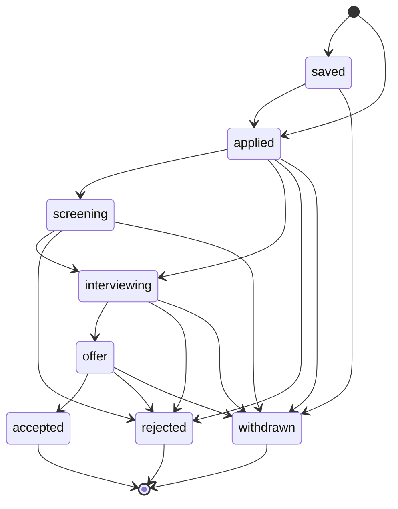

# Especificación de producto

> Estado: **borrador v1** · Fecha: 2026-09-21 · Primer documento del diseño

## 0. Contexto del proyecto

**Naturaleza:** proyecto de portfolio que además se usará de verdad para gestionar una búsqueda de empleo real. Los datos importan (no es un ejercicio desechable), pero no hay clientes, facturación ni compromisos de servicio.

Calibración:

| Cajón | Qué entra |
|---|---|
| **Con rigor** | Modelo de datos, ciclo de vida de la solicitud, aislamiento de datos entre usuarios, arquitectura en capas, autenticación, pruebas (incluidas las adversas). |
| **Barato con la costura puesta** | Recordatorios (solo en la app, con canal preparado para email y otros medios), origen de la solicitud (solo manual, preparado para importación), exportación de datos. |
| **Pospuesto `[C]`** | Todo lo propio de producto comercial: planes y facturación, textos legales, borrado de cuenta con retención, administración de usuarios, SLAs y guardia, analítica de uso. |

Lo marcado con **`[C]`** está considerado y descartado para el MVP, no olvidado.

## 1. Visión

Applications Tracker es un **cuaderno de bitácora de una búsqueda de empleo**: registra cada solicitud a un puesto, cómo avanza (cambios de estado, entrevistas) y qué hay que hacer a continuación, para que ninguna candidatura se quede olvidada y se pueda ver de un vistazo cómo va la búsqueda.

> *Todas tus candidaturas, su historia y tu próximo paso, en un solo sitio.*

**Qué NO es:**

- No es un portal de empleo ni un buscador de ofertas: no descubre ofertas, las registra quien busca.
- No es un ATS (herramienta de recruiters): el usuario es el candidato, no la empresa.
- No es un gestor de correo ni un CRM de contactos: no lee correos ni sincroniza agendas.
- No automatiza candidaturas: no rellena formularios ni envía CVs.

## 2. Decisiones tomadas

| Decisión | Valor | Implicación principal |
|---|---|---|
| Naturaleza | Portfolio + uso propio | Rigor en el núcleo técnico; lo comercial se pospone `[C]`. |
| Usuarios | Varias personas, cada una con sus datos privados | Todo dato pertenece a un usuario; no hay datos compartidos ni equipos. |
| Entrada de datos | Registro manual | Sin scraping ni lectura de correo. Campo `origin` como costura para importar después. |
| Profundidad del proceso | Estado actual + historial de cambios + entrevistas | Se pueden calcular tiempos y tasas; hay reglas de transición de estado. |
| Recordatorios | En la app, preparados para otros canales | Entidad propia con `channel`; sin trabajos en segundo plano en el MVP. |
| Autenticación | SuperTokens, email + contraseña | Sin login social en el MVP. |
| Idiomas de la interfaz | Español e inglés | Todo texto visible pasa por i18n desde el primer día. |

## 3. Usuarios y roles

**Persona única: el candidato.** Alguien en búsqueda activa que envía decenas de solicitudes en paralelo y necesita saber en qué punto está cada una.

Hay un único rol (`user`). No hay administración en el MVP `[C]`.

| Acción | Usuario autenticado | Visitante |
|---|---|---|
| Registrarse / iniciar sesión | — | ✔ |
| Crear, ver, editar, archivar y borrar **sus** solicitudes, empresas, entrevistas y recordatorios | ✔ | ✘ |
| Ver datos de otro usuario | ✘ (nunca, ni sabiendo el id) | ✘ |
| Ver su dashboard | ✔ | ✘ |
| Exportar sus datos | ✔ | ✘ |

## 4. Modelo de dominio

```
Usuario
├── Empresa ─────────────┐   organización a la que se aplica; reutilizable entre solicitudes
├── Solicitud ◄──────────┘   candidatura a un puesto concreto en una empresa
│   ├── Cambio de estado     cada transición del ciclo de vida, con fecha y nota
│   └── Entrevista           cada entrevista del proceso: fecha, tipo, formato, resultado
└── Recordatorio             próxima acción con fecha; opcionalmente ligada a una solicitud
```

- **Empresa**: nombre, web, ubicación, notas. Existe para no repetir datos y para agrupar ("¿cuántas veces he aplicado a X?"). Su nombre es único por usuario.
- **Solicitud**: la entidad central. Puesto, empresa, URL de la oferta, ubicación, modalidad (presencial/híbrido/remoto), rango salarial, fuente (LinkedIn, InfoJobs, web de la empresa, referido…), estado, fecha de envío, notas.
- **Cambio de estado**: registro inmutable de "pasó de A a B en tal fecha". Es lo que permite medir tiempos y reconstruir la historia.
- **Entrevista**: fecha y hora, tipo (screening, técnica, RR. HH., final…), formato (online/presencial/teléfono), con quién, notas y resultado.
- **Recordatorio**: "hacer X antes de tal fecha". Pendiente, hecho o descartado.

## 5. Requisitos funcionales

### Cuenta (RF-01…)

- **RF-01** Registro con email y contraseña.
- **RF-02** Inicio y cierre de sesión. La sesión se mantiene al recargar.
- **RF-03** Recuperación de contraseña por email. Fuera del MVP, ver [riesgos](#13-riesgos-y-decisiones-abiertas).
- **RF-04** Cada usuario solo accede a sus propios datos. Un recurso ajeno responde igual que uno inexistente (404).

### Empresas (RF-10…)

- **RF-10** Crear, editar y borrar empresas.
- **RF-11** Listar empresas con búsqueda por nombre y el número de solicitudes de cada una.
- **RF-12** No se puede borrar una empresa con solicitudes asociadas. El sistema lo indica.
- **RF-13** Al crear una solicitud se puede elegir una empresa existente o crearla en el momento.

### Solicitudes (RF-20…)

- **RF-20** Crear una solicitud con puesto y empresa como campos obligatorios. El resto es opcional.
- **RF-21** Editar los datos de una solicitud. El estado **no** se edita así: ver RF-30.
- **RF-22** Listado paginado con filtros por estado, empresa, modalidad, fuente y rango de fechas, búsqueda de texto por puesto o empresa, y ordenación por fecha de envío, última actualización o empresa.
- **RF-23** Vista de detalle con los datos, el historial de estados, las entrevistas y los recordatorios de la solicitud.
- **RF-24** Archivar una solicitud: desaparece del listado por defecto pero se conserva, y cuenta en las métricas.
- **RF-25** Borrar una solicitud, con confirmación. Borra en cascada su historial, entrevistas y recordatorios.
- **RF-26** Toda solicitud registra su **origen** (`manual` en el MVP).

### Ciclo de vida (RF-30…)

- **RF-30** Cambiar el estado de una solicitud mediante una acción explícita, con nota opcional y fecha. La fecha por defecto es ahora y puede ser pasada para registrar algo ocurrido antes.
- **RF-31** Cada cambio de estado queda en el historial y no se puede editar.
- **RF-32** Solo se permiten las transiciones de la sección [6](#6-ciclo-de-vida-de-la-solicitud). Una transición no válida se rechaza con un mensaje claro.
- **RF-33** Al pasar a `applied` sin fecha de envío, esta se fija con la fecha del cambio.
- **RF-34** Deshacer el último cambio de estado, para corregir errores: elimina esa entrada y restaura el estado anterior.

### Entrevistas (RF-40…)

- **RF-40** Añadir, editar y borrar entrevistas de una solicitud.
- **RF-41** Registrar el resultado: pendiente, superada, no superada o cancelada.
- **RF-42** Programar una entrevista en una solicitud en `applied` o `screening` propone, sin forzarlo, pasarla a `interviewing`.

### Recordatorios (RF-50…)

- **RF-50** Crear recordatorios con título, fecha límite y, opcionalmente, una solicitud asociada.
- **RF-51** Marcarlos como hechos o descartarlos.
- **RF-52** Ver los recordatorios pendientes, vencidos y de los próximos 7 días, en el dashboard y en el detalle de la solicitud.
- **RF-53** Todo recordatorio tiene un **canal**. En el MVP solo existe `in_app`: se muestra en la aplicación y no se envía nada.

### Dashboard (RF-60…)

- **RF-60** Número de solicitudes por estado, excluyendo por defecto las archivadas de los estados activos.
- **RF-61** Solicitudes enviadas por semana en las últimas 12 semanas.
- **RF-62** Tasa de respuesta: solicitudes enviadas que llegaron a `screening` o más allá, sobre el total de enviadas.
- **RF-63** Próximas entrevistas y recordatorios pendientes o vencidos.
- **RF-64** Solicitudes **sin actividad** en N días (N = 14 por defecto) en estados de espera. Ver el [límite conocido](#8-limite-conocido).

### Datos (RF-70…)

- **RF-70** Exportar todas las solicitudes del usuario a CSV.
- **RF-71** Importar desde CSV `[C]`. La costura es el campo `origin`.

## 6. Ciclo de vida de la solicitud



| Estado (código) | Etiqueta en la UI | Significado |
|---|---|---|
| `saved` | Guardada | Oferta interesante, aún no se ha aplicado. |
| `applied` | Enviada | Candidatura enviada, sin respuesta. |
| `screening` | En revisión | La empresa ha respondido: primer contacto o prueba inicial. |
| `interviewing` | Entrevistas | Proceso de entrevistas en curso. |
| `offer` | Oferta | Hay oferta encima de la mesa. |
| `accepted` | Aceptada | Oferta aceptada. **Final.** |
| `rejected` | Descartada | La empresa descarta, o el candidato rechaza la oferta desde `offer`. **Final.** |
| `withdrawn` | Retirada | El candidato abandona el proceso. **Final.** |

### Reglas de transición

Una **transición** es un cambio de un estado a otro. Esta tabla es la lista completa de las permitidas; cualquier otra se rechaza (RF-32). La aplica **solo el backend**: la API devuelve, con cada solicitud, las transiciones disponibles desde su estado actual, y la interfaz ofrece únicamente esas.

| Desde | Puede pasar a |
|---|---|
| *(creación)* | `saved`, `applied` |
| `saved` | `applied`, `withdrawn` |
| `applied` | `screening`, `interviewing`, `rejected`, `withdrawn` |
| `screening` | `interviewing`, `rejected`, `withdrawn` |
| `interviewing` | `offer`, `rejected`, `withdrawn` |
| `offer` | `accepted`, `rejected`, `withdrawn` |
| `accepted`, `rejected`, `withdrawn` | — *(estados finales)* |

Ejemplos de transiciones **no** permitidas: `applied` → `saved` (retroceder), `rejected` → `offer` (salir de un estado final) o `saved` → `interviewing` (entrevistar sin haber aplicado).

Reglas:

1. Se puede **saltar** estados hacia delante: `applied` → `interviewing` es válido, porque en la realidad no todas las empresas hacen un screening.
2. **No se retrocede** con una transición normal. Para corregir un error está *deshacer último cambio* (RF-34).
3. Desde un estado **final** no hay transiciones. Si una empresa reabre un proceso, se crea una nueva solicitud o se deshace el último cambio.
4. `rejected` desde `offer` cubre también el rechazo de la oferta por parte del candidato. Se distingue por la nota, sin estado propio.
5. Una solicitud puede **crearse** directamente en `saved` o en `applied`.

## 7. Matriz de entradas

| Origen (`origin`) | Tratamiento | Fase |
|---|---|---|
| `manual` | Formulario de la aplicación | MVP |
| `csv_import` | Importación masiva con validación y detección de duplicados | `[C]` |
| `url_extraction` | Rellenar datos a partir de la URL de la oferta | Evolución documentada, no se construye |

## 8. Límite conocido

El sistema **solo sabe lo que el usuario le cuenta.** Todas las métricas son tan buenas como el registro manual.

| Pregunta | ¿La responde bien? |
|---|---|
| "¿Cuántas solicitudes tengo en entrevistas?" | Sí: es el estado actual. |
| "¿Cuánto tardan de media en responderme?" | Sí, **si** se registraron los cambios de estado con su fecha real. |
| "¿Qué empresas me han ignorado?" | **No con certeza.** Que no haya actividad no significa que la empresa haya descartado la candidatura: puede ser que el usuario no la actualizara. |
| "¿Cuál es mi tasa de éxito?" | Solo si las solicitudes se cierran (aceptada, descartada o retirada). Si quedan abiertas indefinidamente, la tasa se distorsiona. |

Requisitos derivados:

- **RF-65** El sistema **nunca infiere** un descarte. Las solicitudes sin actividad se presentan como "sin actividad desde hace N días", no como descartadas, y se ofrece cerrarlas a mano.
- **RF-66** Cada métrica del dashboard indica sobre cuántas solicitudes se calcula, por ejemplo "tasa de respuesta: 18 % (sobre 44 enviadas)", y no muestra porcentajes con menos de 5 solicitudes en la base.

## 9. Requisitos no funcionales

**Seguridad**

- **RNF-01** Sesión gestionada por SuperTokens, con cookies httpOnly, rotación de refresh token y protección anti-CSRF. El frontend nunca maneja tokens a mano.
- **RNF-02** Todo acceso a datos se filtra por el usuario de la sesión. Hay pruebas que intentan leer, editar y borrar recursos de otro usuario.
- **RNF-03** Los secretos solo viven en variables de entorno y nunca en el repositorio.

**Rendimiento**

- **RNF-10** El listado de solicitudes responde en menos de 300 ms (p95) con 2 000 solicitudes por usuario en local.
- **RNF-11** El dashboard se calcula en una sola petición en menos de 500 ms con ese volumen.

**Calidad**

- **RNF-20** Tests de API, services y repositories en el backend, incluidos los adversos (propiedad de los datos y transiciones inválidas). CI obligatorio en verde.
- **RNF-21** Tipado estricto: mypy en el backend y TypeScript `strict` en el frontend, sin errores.
- **RNF-22** Toda cadena visible está en i18n, en es y en en.

**Operación**

- **RNF-30** Entorno de desarrollo completo con `docker compose up`.
- **RNF-31** Imágenes preparadas para producción. El despliegue real es `[C]`.
- **RNF-32** Backups de la base de datos `[C]`. En uso propio se documentará un `pg_dump` manual.

**Cumplimiento**

- **RNF-40** Borrado de cuenta y de todos sus datos `[C]`. La costura es que todos los datos cuelgan del usuario con `ON DELETE CASCADE`.

## 10. Límites y cuotas

| Límite | Valor | Motivo |
|---|---|---|
| Solicitudes por usuario | 5 000 | Protege el rendimiento del listado y del dashboard. Muy por encima de una búsqueda real. |
| Empresas por usuario | 2 000 | Ídem. |
| Tamaño de página del listado | 20 por defecto, máximo 100 | Evita respuestas enormes. |
| Longitud de las notas | 5 000 caracteres | Son notas, no documentos. |
| Recordatorios pendientes por usuario | 500 | Evita el abuso. |

## 11. Alcance por fases

| Fase | Contenido | Qué riesgo reduce o qué enseña |
|---|---|---|
| **F0 — Esqueleto vertical** *(desechable)* | Crear y listar solicitudes con solo puesto y empresa en texto, sin auth y con un usuario fijo. Atraviesa migración → model → repository → service → endpoint → service del frontend → hook → página. | Valida el recorrido completo por todas las capas antes de construir sobre supuestos. |
| **F1 — Autenticación** | SuperTokens (core + su BD), registro, login, logout, sesión en backend y frontend, tabla de usuarios propia y propiedad de los datos. | Es lo más transversal: cambia cómo se escriben todos los endpoints y las pruebas. |
| **F2 — Empresas y solicitudes** | CRUD completo, filtros, paginación, archivado y origen. | Modelo de datos central y patrón de feature completo. |
| **F3 — Ciclo de vida** | Máquina de estados, historial y deshacer. | Reglas de negocio en services, con pruebas de transiciones inválidas. |
| **F4 — Entrevistas y recordatorios** | CRUD de entrevistas, recordatorios `in_app` y avisos de vencidos. | Entidades hijas y la costura de canales. |
| **F5 — Dashboard y exportación** | Métricas (RF-60…66) y CSV. | Consultas de agregación y rendimiento. |
| **F6 — CI** | GitHub Actions: lint, tipos, tests y build. | Mantiene el verde de forma automática. |
| **F7 — Preparación para despliegue** | `compose.prod.yml`, Nginx y variables de producción. | Paridad entre desarrollo y producción. |

**Evolución documentada que no se construye:** recordatorios por email y otros canales, importación CSV, extracción de datos desde la URL de la oferta, login social, etiquetas libres, adjuntos (CV y carta por solicitud), contactos de recruiters.

## 12. Puntos de extensión

Cada costura se deja puesta **solo si hoy cuesta casi nada**.

| Funcionalidad futura | Costura que se deja puesta hoy |
|---|---|
| Recordatorios por email, Telegram, push… | Campo `channel` en el recordatorio y campo `sent_at`. El envío pasa por una interfaz `NotificationChannel` en services, con una única implementación `in_app` que no hace nada. Un canal nuevo es una implementación nueva más un worker que recorra los pendientes. |
| Importación CSV / extracción desde URL | Campo `origin` en la solicitud. La creación pasa siempre por `ApplicationService.create`, así que un importador reutiliza validación y reglas. |
| API pública, CLI | Toda la lógica vive en services; los endpoints solo validan y delegan. |
| Borrado de cuenta (RGPD) | Todo cuelga de `user_id` con `ON DELETE CASCADE`. |
| Login social | SuperTokens añade recetas sin cambiar el modelo: el usuario propio se enlaza por `supertokens_user_id`. |

## 13. Riesgos y decisiones abiertas

| # | Riesgo o pregunta | Impacto | Cuándo decidir |
|---|---|---|---|
| R1 | **Sobreingeniería**: tratar un proyecto de uso propio como un producto (canales, colas, roles) antes de necesitarlo. | Alto: retrasa el MVP. | Revisar en cada fase. Las costuras solo se dejan si son baratas. |
| R2 | La recuperación de contraseña (RF-03) necesita envío de emails: proveedor SMTP en producción y Mailpit en desarrollo. | Medio. | En F1. Propuesta: fuera del MVP y, al añadirla, llega con Mailpit. |
| R3 | Métricas engañosas por datos incompletos (ver §8). | Medio: el dashboard sería poco fiable. | Mitigado con RF-65 y RF-66. |
| R4 | MkDocs 2.0 romperá plugins y temas, sin migración. | Bajo: la imagen está fijada a Material 9 (MkDocs 1.x). | Solo si hay que actualizar. La alternativa es Zensical. |
| R5 | ¿Monedas múltiples en el salario? | Bajo. | En F2. Propuesta: una moneda por solicitud (EUR por defecto), sin conversiones. |
| R6 | ¿Zona horaria de fechas y horas (entrevistas)? | Medio: bugs de "un día menos". | Decidido en la arquitectura: `timestamptz` en UTC y conversión en el frontend. `applied_at` es de tipo `date`, sin hora. |

## 14. Criterios de éxito

- Se usa de verdad durante una búsqueda de empleo real, con más de 30 solicitudes, sin volver a una hoja de cálculo.
- Se puede responder en menos de 10 segundos a "¿qué tengo que hacer hoy?" y "¿en qué punto está X?".
- El repositorio se entiende sin explicaciones: documentación publicada, decisiones razonadas, CI en verde y un README que se lee en dos minutos.
- Ninguna prueba adversa de aislamiento entre usuarios falla.
